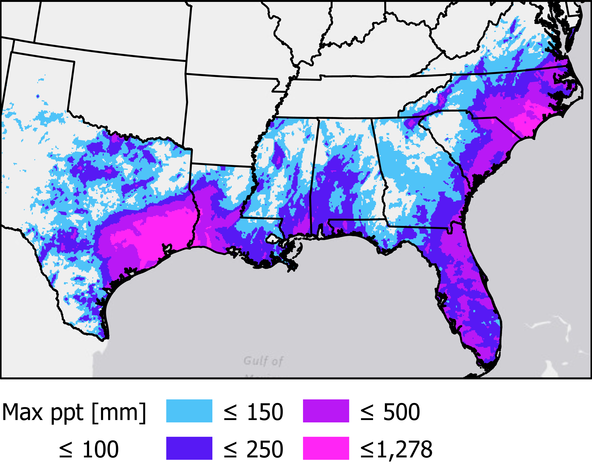

class: inverse, center, middle
background-image: url('HurricaneSpace.png')
background-size: cover

# Coupling Surface-Groundwater Connectivity and Extreme Precipitation Events Using Active and Passive Remote Sensing Data Products.


<br>
.large[<br><br><br>Andrew Murray | University of North Carolina - Chapel Hill]

???

Hello to all of you hopefully future colleagues. My name is Andrew Murray, I'm a 3rd year PhD student here in the department and I'm excited share just a little bit of my research with you today. You may notice that I am in fact on a distant tropical island, enjoying the sun and breeze. There is no COVID-19 here and everything is fine.(sigh) Sadly this is just a virtual background and I am stuck in my house with a 4 year old, two cats, a dog and my lovely partner who I am trying not to push to the edge, but I digress. I am a physical geographer / hydrologist and as you can see from the title here, we're talking about about the effects of extreme precipitation on connectivity and how we measure it using remote sensing. 
---
exclude: true

```{r setup, echo=FALSE}
knitr::opts_chunk$set(fig.retina = 3, warning = FALSE, message = FALSE, eval = TRUE)


```

```{r, load_refs, include=FALSE, cache=FALSE}
library(RefManageR)
BibOptions(check.entries = FALSE,
           bib.style = "authoryear",
           cite.style = "alphabetic",
           style = "markdown",
           hyperlink = FALSE,
           dashed = FALSE)
myBib <- ReadBib("./mybib.bib", check = FALSE)
```
---
<video width="100%" height="100%" controls id="my_video">
    <source src="/mp4/florenceSmall.mp4" type="video/mp4" preload>
</video>

???
Now , connectivity is just what hydrologists call it when the soil becomes saturated and surface water begins to intermingle with groundwater, which is what happens when we have bad floods. Here is an extreme example of connectivity from Hurricane Florence. This is a video I took myself just down the street in Chapel Hill. But these systems can connect without serious flooding too... maybe there isn't any noticable flooding at all. I care about this because when surface and groundwater become connected, like they do after extreme rainfall, contaminants on the surface can mobilize and move into groundwater. Think of things like gasoline, or industrial waste, or even agricultural runoff from factory farms. Depending where you are, the contaminants change. 

- Cyclones can have devastating impacts in various ways
  - Wind
  - Water
  - Homelessness
  - Food Security
  - Sickness

---

## .center[Tropical Cyclones in the United States since 2015]

.pull-left[
```{r table, echo=FALSE, eval=TRUE}
library(plotly)
library(dplyr)
library(here)
library(kableExtra)
library(lubridate)
storms <- read.csv(here::here("static/data/statsByStorm.csv"))%>%
  mutate(Form = mdy(Form), Lf = mdy(Lf), Dis=mdy(Dis))

strmSel <- storms%>%
  select(Name,Lf,MaxCat)
#knitr::kable(strmSel,'html')
library(htmlTable)
strmSel2 <- cbind(strmSel[1:10, ],strmSel[11:20, ])
colnames(strmSel2) <- c("Name","Landfall","Max Cat","Name","Landfall","Max Cat")
kable(strmSel2)%>%
  kable_styling(font_size = 17)
```
]

.pull-right[

Maximum precipitation greater than 100 mm experienced during a single tropical cyclone event since the start of the 2015 tropical cyclone season.

]

???
So what do I mean by 'extreme precipitation'? Well, there are many definitions and it depends on who you ask, but for my work, I'm focusing on tropical cyclones that have made landfall in the United States since 2015. The reason for stopping at 2015 is because that was the year the satellite I'm using was launched. Check out the table on the left. It may surprise some of you to see that the southeastern United States has been hit by twenty tropical cyclones since 2015. Most folks only focus on the really devestating hurricanes like Matthew, Harvey, Florence etc... but the truth is that we get hit by these storms all the time and they can have significant impacts on all sorts of things from public health to food supply through crop yields. This map on the right side of your screen shows the maximum amount of rainfall experienced by a single tropical cyclone since 2015 greater than 100mm, which is about 4 inches. The areas of brightest pink saw more than 20" of rainfall in a single event! Notice that landfalls range from May to late October, which is important because depending on the time of year, the landscape wil react differently to receiving this amount of rain.

---
## .center[Cyclone Precipitation a Function of Wind speed?]

.pull-left[
####<br> - There is no correlation between storm wind speed and either rainfall distribution or intensity

####<br> - Try to predict **max** rainfall from wind speed at landfall: $p = .25$ / $r^{2}=.019$

####<br> - Try to predict **mean** rainfall from wind speed at landfall: $p=.06$ / $r^{2}=.065$

]


.pull-right[
```{r stormPts,echo=FALSE, message=FALSE,warning=FALSE, fig.cap="Wind speed at landfall plotted against maximum total rainfall experienced at a single point per cyclone event and colored by average mean precipitation experienced over the impacted land area ", out.height = '350px'}

# Set up Fonts for Plots
# Axis font
xaxisFont <- list(
  family = "Arial, sans-serif",
  size = 18,
  color = "black"
)

yaxisFont <- list(
  family = "Arial, sans-serif",
  size = 18,
  color = "black"
)

labelFont <- list(
  family = "Arial, sans-serif",
  size = 18,
  color = "black"
)


# Color palette
pal <- colorRampPalette(c("green","yellow","orange","red", "purple"))


## Plot of wind speed at landfall vs. Max ppt amount
storms%>%
  plot_ly()%>%
  add_markers(x=~LfWsKts, y=~maxPpt, 
              marker = list(line = list(color = 'rgb(0, 0, 0)',
                                        width = 2)),color =~meanPpt, colors = pal(50) , size=20, hoverinfo = "text",
              text = ~paste("Storm: ", Name,"<br>",
                            "Landfall: ",Lf,"<br>",
                            "Max ppt: ",round(maxPpt,1)," mm","<br>",
                            "Mean ppt: ", round(meanPpt,1)," mm","<br>",
                            "Area Receiving Rain: ",rainArea, "km<sup>2"))%>%
  colorbar(title = "Mean ppt [mm]")%>%
  layout(
    xaxis = list(
      title = "Wind speed at Landfall [Kts]", titlefont = labelFont,
      showticklabels = TRUE,
      tickangle = 0,
      tickfont = xaxisFont,
      zeroline = TRUE,
      showline = TRUE,
      mirror = "ticks",
      gridcolor = toRGB("gray50"),
      gridwidth = 1,
      zerolinecolor = toRGB("black"),
      zerolinewidth = 1,
      linecolor = toRGB("black"),
      linewidth = 1),
    title = "Storm Wind Intensity vs Precipitation",
    yaxis = list(title = "Max ppt at Single Point [mm] ", titlefont = labelFont,
                 showticklabels = TRUE,
                 tickangle = 0,
                 tickfont = yaxisFont,
                 zeroline = TRUE,
                 showline = TRUE,
                 mirror = "ticks",
                 gridcolor = toRGB("gray50"),
                 gridwidth = 1,
                 zerolinecolor = toRGB("black"),
                 zerolinewidth = 1,
                 linecolor = toRGB("black"),
                 linewidth = 1),
    showlegend=T,
    legend = list(x = 100, y = 1.5))
```
]

???
Here is another way of looking at this. Many people associate the intensity of a tropical storm with it's windspeed. We like to get caught up in what 'category' a storm will be when it makes landfall, and while windspeed is important for things like damage to structures, the spatial impacts of windspeed are often concentrated to relatively small areas when compared to rainfall. This plot on the right shows windspeed on the x-axis and maximum rainfall at a single pint on the y-axis. Let's take a look at some of these points. Hurricane Michael is on the bottom right. This storm was characterized by very high winds, it was fast moving, and it didn't actually drop that much rain. If you were impacted by Michael, you may recall that it really only lasted a couple of hours in the Carolinas. Tropical Storm Imelda, which you'll find at the top-left on the other hand was never a hurricane and was only a tropical storm by about 2 mph, however it dropped a tremendous amount of rain over eastern Texas and western Louisiana. Hurricane Harvey, top right, was just an all around absolute monster in every sense of the word, slow-moving, high wind, high precipitation

---
###.center["Waterborne disease outbreaks in the United States between 1948 and 1998 were **immediately preceded** by precipitation .red[events above the 80th percentile], with a two-month lag in groundwater"]
.right[-Curriero et al., 2001 ]

###.center["Public water systems in large metropolitan areas have substantial portions of their customer base at risk for a waterborne outbreak .red[during a flooding event]"]
.right[-Exum et al., 2018 ]


###.center["There is an increased risk for GI illness among consumers whose drinking water source may be impacted by combined sewer overflows (CSOs) .red[after extreme precipitation.]"]
.right[-Jagai et al., 2015 ]


???

Is there evidence to link public health, drinking water and extreme rainfall? YES! Lot's of studies have linked extreme rainfall to contamination of groundwater and in turn public health. Did you know that there are over 60 million people in the United States who self supply drinking water from privately owned wells? and that these wells are totally unregulated, meaning they don't need to be tested. Additionally, if you want to get your water tested for chemicals such as benzene, which is a carcinogenic component of gasoline, the test can cost more than $500? The safe drinking water act protects us from these contaminants by mandating that public water utilities conduct regular testing. So I pose this question to you... If you lived in a house in eastern North Carolina, where your water came from a well in your back yard, and you went through Hurricane Florence, would you pay $500 to get your water tested? Most people wodln't and you can't blame them, that's a lot of money. You might point out to me that a lot of states offer free testing after these evetns but often they don't even know where groundwater contamination is likely to occur. I hope that my research will lead to emergency responders being more informed as to where contamination may be more likely.


---
.center[
<div class="centered">
<video width="900" height="550" controls autoplay>
  <source src="/img/Florence.mp4" type="video/mp4">
</video>
</div>


]

???
One key to predicting how the landscape will respond to extreme precipitation is knowing how saturated the soil is before the storm hits. So let's take a look at how soil moisture actually does change during an extreme rainfall event, in this case, Hurricane Florence. The units here are cubic meters of water per cubic meter so light blue is dry and purple/pink is saturated. The Carolinas were saturated prior to landfall of Florence. Note how long drying takes to occur and the variance across the state
---
##Patterns from SMAP are Evident


???

You may not have noticed just by looking at the animation, but take a look at these side by side maps of wetting and drying. On the left side, we can see wetting, which is the increase in soil moisture caused by Hurricane Florence. The map on the right shows us drying, which is the change in soil moisture after Hurricane Florence. We can see that wetting closely mirrors precipitation, but drying is much more spatially complex. Deconstructing why and how this is happening is the crux of my dissertation research. There are lots of factors that go into this that I don't have time to get into now.

AND...
---
.center[
## Summary
]

.big[
- Extreme precipitation can lead to waterborne illness
]

.big[
- Over 60 Million Americans obtain water from private wells
]

.big[
- Improvement on a dated vulnerability index is needed
]

.big[
- Substantial data is available for the establishment of relationships between landscape and extreme precipitation
]

.big[
- The success of this research may help in response efforts to extreme precipitation events and benefit public health
]


???


As much as I would like to drone on and on about all of this for hours, let's quickly bring it back to the main points of my research. 
We know that extreme precipitation can leadd to waterborne illness. 
We know that over 60 million people in the United States self supply water from private wells and that not only do they rarely test their water, but testing can be prohibitively expensive.
There are indices that exist for quantifying vulnrability but they need to be updated, there is a lot of data out there that would allow us to update it.
Finally, Succeeding in establishing these relationships between soil moisture and surface/groundwater connectivity may help to inform the public, as well as emergency responders of where groundwater resources are most vulnerable to contamination following extreme precipitation events. This would allow responders to direct testing kits to areas likely to be vulnerable to contamination with a science based approach as opposed to more subjective political approaches.

---

.center[ 
## References

Caldwell, Martyn M, and James H Richards. 1989. “Hydraulic Lift: Water Efflux from Upper Roots Improves Effectiveness of Water Uptake by Deep Roots.” Oecologia 79 (1): 1–5.

Exum, Natalie G., et al. "Extreme precipitation, public health emergencies, and safe drinking water in the USA." Current environmental health reports 5.2 (2018): 305-315.

Jagai, Jyotsna S., et al. "Extreme precipitation and emergency room visits for gastrointestinal illness in areas with and without combined sewer systems: an analysis of Massachusetts data, 2003–2007." Environmental health perspectives 123.9 (2015): 873-879.

Rushton, KR, VHM Eilers, and RC Carter. 2006. “Improved Soil Moisture Balance Methodology for Recharge Estimation.” Journal of Hydrology 318 (1-4): 379–99.

Vereecken, H, J Maes, and J Feyen. 1990. “Estimating Unsaturated Hydraulic Conductivity from Easily Measured Soil Properties.” Soil Science 149 (1): 1–12.
]

???

As usual, there is much more to this story and if anyone is interested please reach out. I will leave you with one quick plug for the department which is to say that while I am in no way overly seasoned, I have been in one other geography department and know of many others and I can say with confidence I have not observed a stronger community of people who care and support one another in the way we do here regardless of our wide swath of passions and research interests. Thanks for taking the time to listen and I hope to meet all of you in person sometime soon!