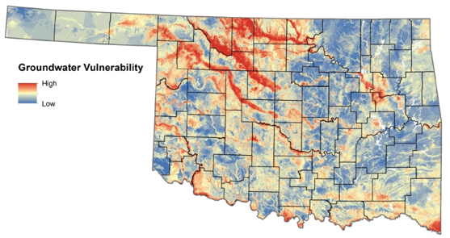

class: inverse, center, middle
background-image: url('HurricaneSpace.png')
background-size: cover

# Coupling Groundwater Vulnerability to Contamination and Extreme Precipitation Events Using Active and Passive Remote Sensing Data Products

### Dissertation Proposal

.large[<br>Andrew Murray | University of North Carolina - Chapel Hill | February 17, 2020]

---
exclude: true

```{r setup, echo=FALSE}
knitr::opts_chunk$set(fig.retina = 3, warning = FALSE, message = FALSE, eval = TRUE)


```

```{r, load_refs, include=FALSE, cache=FALSE}
library(RefManageR)
BibOptions(check.entries = FALSE,
           bib.style = "authoryear",
           cite.style = "alphabetic",
           style = "markdown",
           hyperlink = FALSE,
           dashed = FALSE)
myBib <- ReadBib("./mybib.bib", check = FALSE)
```
---
<video width="100%" height="100%" controls id="my_video">
    <source src="/mp4/florenceSmall.mp4" type="video/mp4" preload>
</video>

???
- Cyclones can have devestating impacts in various ways
  - Wind
  - Water
  - Homelessness
  - Food Security
  - Sickness

---

## .center[Tropical Cyclones in the United States since 2015]

.pull-left[
```{r table, echo=FALSE, eval=TRUE}
library(plotly)
library(dplyr)
library(here)
library(kableExtra)
library(lubridate)
storms <- read.csv(here::here("static/data/statsByStorm.csv"))%>%
  mutate(Form = mdy(Form), Lf = mdy(Lf), Dis=mdy(Dis))

strmSel <- storms%>%
  select(Name,Lf,MaxCat)
#knitr::kable(strmSel,'html')
library(htmlTable)
strmSel2 <- cbind(strmSel[1:10, ],strmSel[11:20, ])
colnames(strmSel2) <- c("Name","Landfall","Max Cat","Name","Landfall","Max Cat")
kable(strmSel2)%>%
  kable_styling(font_size = 17)
```
]

.pull-right[

]


---
## .center[Cyclone Precipitation a Function of Windspeed?]

.pull-left[
####<br> - There is no correlation between storm windspeed and either rainfall distribution or intensity

####<br> - Try to predict **max** rainfall from windspeed at landfall: $p = .25$ / $r^{2}=.019$

####<br> - Try to predict **mean** rainfall from windspeed at landfall: $p=.06$ / $r^{2}=.065$

So why do we obsess over storm category when the real danger lies in the water?

]

.pull-right[
```{r stormPts,echo=FALSE, message=FALSE,warning=FALSE, fig.cap="Wind speed at landfall plotted against maximum total rainfall experienced at a single point per cyclone event and colored by average mean precipitation experienced over the impacted land area ", out.height = '350px'}

# Set up Fonts for Plots
# Axis font
xaxisFont <- list(
  family = "Arial, sans-serif",
  size = 18,
  color = "black"
)

yaxisFont <- list(
  family = "Arial, sans-serif",
  size = 18,
  color = "black"
)

labelFont <- list(
  family = "Arial, sans-serif",
  size = 18,
  color = "black"
)


# Color palette
pal <- colorRampPalette(c("green","yellow","orange","red", "purple"))


## Plot of wind speed at landfall vs. Max ppt amount
storms%>%
  plot_ly()%>%
  add_markers(x=~LfWsKts, y=~maxPpt, 
              marker = list(line = list(color = 'rgb(0, 0, 0)',
                                        width = 2)),color =~meanPpt, colors = pal(50) , size=20, hoverinfo = "text",
              text = ~paste("Storm: ", Name,"<br>",
                            "Landfall: ",Lf,"<br>",
                            "Max ppt: ",round(maxPpt,1)," mm","<br>",
                            "Mean ppt: ", round(meanPpt,1)," mm","<br>",
                            "Area Receiving Rain: ",rainArea, "km<sup>2"))%>%
  colorbar(title = "Mean ppt [mm]")%>%
  layout(
    xaxis = list(
      title = "Wind speed at Landfall [Kts]", titlefont = labelFont,
      showticklabels = TRUE,
      tickangle = 0,
      tickfont = xaxisFont,
      zeroline = TRUE,
      showline = TRUE,
      mirror = "ticks",
      gridcolor = toRGB("gray50"),
      gridwidth = 1,
      zerolinecolor = toRGB("black"),
      zerolinewidth = 1,
      linecolor = toRGB("black"),
      linewidth = 1),
    title = "Storm Wind Intensity vs Precipitation",
    yaxis = list(title = "Max ppt at Single Point [mm] ", titlefont = labelFont,
                 showticklabels = TRUE,
                 tickangle = 0,
                 tickfont = yaxisFont,
                 zeroline = TRUE,
                 showline = TRUE,
                 mirror = "ticks",
                 gridcolor = toRGB("gray50"),
                 gridwidth = 1,
                 zerolinecolor = toRGB("black"),
                 zerolinewidth = 1,
                 linecolor = toRGB("black"),
                 linewidth = 1),
    showlegend=T,
    legend = list(x = 100, y = 1.5))
```
]
---
###.center["Waterborne disease outbreaks in the United States between 1948 and 1998 were **immediately preceded** by precipitation .red[events above the 80th percentile], with a two-month lag in groundwater"]
.right[-Curriero et al., 2001 ]

###.center["Public water systems in large metropolitan areas have substantial portions of their customer base at risk for a waterborne outbreak .red[during a flooding event]"]
.right[-Exum et al., 2018 ]


###.center["There is an increased risk for GI illness among consumers whose drinking water source may be impacted by combines sewer overflows (CSOs) .red[after extreme precipitation.]"]
.right[-Jagai et al., 2015 ]


???
- Connectivity
- What data is available... here it is public water utilities in Harris County, ER visits

---
.pull-left[### Studies are only as good as their data...

- I estimate that over **60 million people** in the United States obtain their water from privately owned, 'domestic' wells.


### This is important because...

- We still don't fully understand where all of these wells are
  - Public Utilities don't disclose service areas
  - Even if they did, there are over 150,000<br><br>
- Private Wells are not regulated under the Safe Drinking Water Act
  - Very few testing requirements
  - Contamination sources are often unknown
]

???
So we know that increased rainfall is linked to increased risk of getting sick from water
But what do we not know?


---

.center[

```{r img1, echo=FALSE, out.width='600px'}
knitr::include_graphics('wellsUS.png')
```

]
---

```{r pptWellsBar,echo=FALSE,eval=TRUE, fig.cap="Estimated private wells in areas impacted by greater than 100mm of precipitation in a single event. Only tropical cyclone events since 2015 considered here.", out.width= "100%"}
df <- read.csv(here::here("static/data/pptWellsBar.csv"))

# Set up Fonts for Plots
# Axis font
xaxisFont <- list(
  family = "Arial, sans-serif",
  size = 16,
  color = "black"
)

yaxisFont <- list(
  family = "Arial, sans-serif",
  size = 12,
  color = "black"
)

labelFont <- list(
  family = "Arial, sans-serif",
  size = 18,
  color = "black"
)

df%>%
  arrange(Name)%>%
  plot_ly(y=~Wells,x=~pptVal, color = ~Name, hoverinfo = "text",
          text = ~paste("State: ",Name,"<br>",
                        format(round(Wells),big.mark=",")," wells were impacted by <br> at least ", pptVal," mm of precipitation"))%>%
  add_bars()%>%
  layout(barmode = 'stack')%>%
  layout(
    xaxis = list(
      title = "Precipitation Received [mm]", titlefont = labelFont,
      showticklabels = TRUE,
      tickangle = 0,
      tickfont = xaxisFont),
    title = "Number of Wells in Areas Defined by <br> Minimum Received Precipitation",
    yaxis = list(title = "Estimated Private Wells",titlefont = labelFont,
                 showticklabels = TRUE,
                 tickangle = 0,
                 tickfont = yaxisFont,
                 tickformat= ","),
    showlegend=T,
    legend = list(x = 100, y = 0.5))
```

???
I calculated precipitation accross census block groups

---

## Main Points

--

- ### Extreme Precipitation &#8594; Increase in Waterborne Disease
--

- ### Extreme Precipitation does not necesarrily come from Hurricanes
  - But Tropical cyclones, in general, bring extreme precipitation to the southeastern U.S. and we have a lot of data for them
--

- ### 16.5% of the United States gets water from wells
  - Most people do not test their wells regularly
--

- ### It is important to understand where people are at risk of waterborne disease

---
class: center, middle

---
### A Groundwater Vulnerability Index
.left-column[
.big[**D**].med[epth to water table]

.big[**R**].med[echarge]

.big[**A**].med[quifer Media]

.big[**S**].med[oil Media]

.big[**T**].med[opography]

.big[**I**].med[mpact of the Vadose Zone]

.big[**C**].med[onductivity]
]

.right-column[

]

???

The DRASTIC Index was a big project completed by the National groundwater well association and EPA in 1983.

- It has largely gone unchanged since it's creation
- It assumes conditions are static.
- It ignores potentially significant inputs

---
###.center[ The Good, The Bad & The Missing]

.pull-left[
.med[Data that already exists:

- Aquifer Media
- Soil Media
- Vadose Zone
- Topography

Data I need to create:

- Depth to Water Table
- Rate of Recharge
- Hydraulic Conductivity
]]

.pull-right[
.med[Probably Missing from the DRASTIC Index:

- Land Cover / Land Use
  - NLCD
  - Imperviousness
- Advanced Topography
  - Slope
  - Contributing Area
- Spatial Characterization of Vegetation
  - Leaf Area Index (LAI)
- Antecedent Soil Moisture Conditions
]]

---

### <br>Hypothesis:

<br><br>.med[Geophysical landscape features, temporal variability of soil moisture, and land cover are major drivers of groundwater vulnerability to contamination. Extreme precipitation events such as **tropical cyclones overwhelm and impose changes to each of these variables in measurable ways**. Investigating the relationships and the ways in which to measure these impacts will enable future forecasting of vulnerability and better inform disaster response efforts, directly and positively affecting human health.]

---

### Research Goal: Establish an updated index for groundwater vulnerability, which is dynamic and more inclusive of both physical and social factors present in the southeastern United States.

.pull-left[
### Chapter 1:
.med[Linking soil moisture, precipitation and Landcover / Vegetation]
### Chapter 3:
.med[Creation and application of DRASTIC+]
]
.pull-right[
### Chapter 2:
.med[SMAP assisted estimation of hydraulic conductivity, recharge, and water table height]
]
---
## Soil Moisture Change from SMAP:
**Hurricane Florence:**

.left-column[.left[
<br>
- ####The Carolinas were saturated prior to landfall of Florence
<br><br>
- ####Note how long drying takes to occur and the variance accross the state
]]

.right-column[
<div class="centered">
<video width="800" height="450" controls autoplay>
  <source src="/img/Florence.mp4" type="video/mp4">
</video>
</div>
]

---

---
References
Exum, Natalie G., et al. "Extreme precipitation, public health emergencies, and safe drinking water in the USA." Current environmental health reports 5.2 (2018): 305-315.

Jagai, Jyotsna S., et al. "Extreme precipitation and emergency room visits for gastrointestinal illness in areas with and without combined sewer systems: an analysis of Massachusetts data, 2003–2007." Environmental health perspectives 123.9 (2015): 873-879.