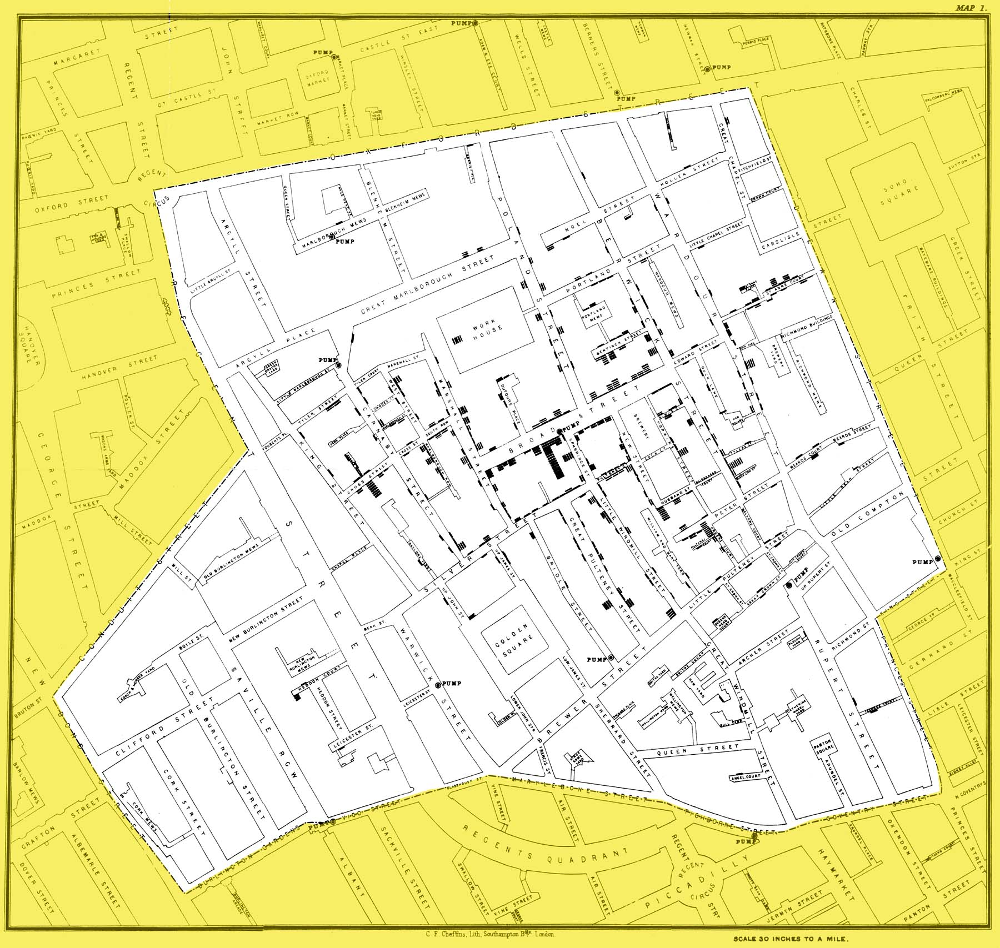
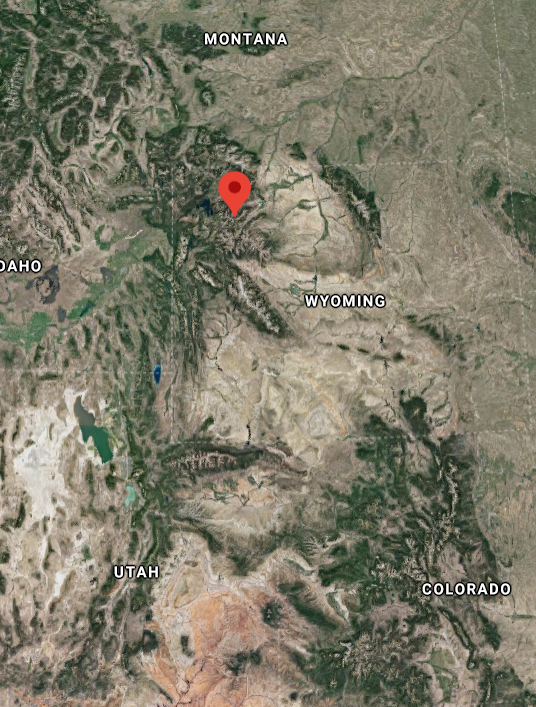
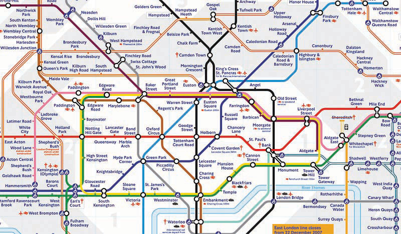

```{r setup, include=FALSE}
knitr::opts_chunk$set(echo = TRUE)
```

<br><br>
.center[
## Introduction to Geographic Information
### Lecture 2
.mb[
Spatial Thinking & Concepts
]
<br><br>
Andrew Murray | University of North Carolina - Chapel Hill
]

---

### A few notes

.med[
- Office Hours: Wednesdays & Fridays 2:00 3:00 or [by appointment](https://calendly.com/armurray-1/office-hours?month=2020-06)

   - Office Hours will be held on zoom at this permanent link: https://unc.zoom.us/j/97092252432 
   
Office Hours: A time where I am availabe to talk about anything. No issue is too small and in this virtual class I especially urge you to use them so that I can help you get the most out of this class.

- My website has been temporarily moved from Amurraygeo.com to Murraygeo.com so please use that url instead. Here is the link to the course page: https://murraygeo.com/courses/geog_info/
]

<audio controls>
  <source src="/slides/intro_geographic_information/Day02/audio/d02s02.mp3" type="audio/mpeg">
  <p>Your browser doesn't support HTML5 audio.</p>
</audio>

---
### Everything has a place...

.med[
- Everything exists in space

- Understanding the 'where' helps us understand the what/when/how

- However, 'where' is just the starting point.

### GIS...

- Allows us to leverage location into an infinite number of applications

- The last few decades have seen GIS technologies evolve exponentially

- A simple spatial analysis that took an hour ten years ago takes only seconds now
]

<audio controls>
  <source src="/slides/intro_geographic_information/Day02/audio/d02s03.mp3" type="audio/mpeg">
  <p>Your browser doesn't support HTML5 audio.</p>
</audio>

???

If you signed up for this class then I can only assume that you have an interest in the role that location plays in our everyday lives. From designing the layout of a grocery store to planning a city to understanding global climate change, geography and GIS are everywhere. Literally, the positions of items at grocery stores are decided very deliberately based on spatial information. Have you ever noticed that necessities like milk and eggs are at the back of the store? You have to walk through the whole store just to get there, which increases your chances of buying something you may not need. Some uses are more obvious, like the planning of the now doscontinued light rail project that was meant to connect Chapel Hill and Durham. Weaving a new rail system into two already developed urban areas takes a lot of knowledge about spatil information. What is the shortest route? Who owns what, and where can we build? Where should stations be located so we can serve the community in the most useful way? Are there animal populations already at risk that we need to condier? How will the noise from the trains affect the communities closest to the rails? There are hundreds of geographically based questions that go into conceptualizing a project like that. GIS allows us to tackle these questions and it is getting increasingly easy to do so. Thanks to the increased evolution of computer technology, there are things that take seconds or minutes now that used to take hours or days. My personal feelings are that in today's world and most certainly in the future, being data and geographically literate are going to be essential to success in the workplace. Learning GIS will absolutely make you a more attractive candidate for most fields, and it is more and more in demand.

---
.pull-left[
### Where did GIS start?

.med[
```{r echo=FALSE, out.height= 200, out.width= 200}
knitr::include_graphics("snow.PNG")
```

John Snow

- Epidemiologist
- 1854 Cholera outbreak in London
- 616 people killed
- Cholera was thought to spread through the air
- Snow's map lead to the discovery that it was actually the water
]
]
.pull-right[
```{r echo=FALSE, out.height= 600, out.width= 600}

```
]

<audio controls>
  <source src="/slides/intro_geographic_information/Day02/audio/d02s04.mp3" type="audio/mpeg">
  <p>Your browser doesn't support HTML5 audio.</p>
</audio>

???
So where did GIS start? Many point to John Snow, an english epidemiologist who was trying to find the source of the 1854 Cholera outbreak in London. Originally thought to be an airborne disease that people were contracting simply by breathing, John Snow mapped the disease in an attempt to associate it spatially with other potential sources. What he found was that deaths were occuring close to the water pumps, and so hypothesized that it was ion fact the water which was mobilizing the bacteria causing cholera. John Snow is widely considered a pioneer in the field of epidemiology but you can clearly see the foundations of GIS here as well. 

---
.center[
<video width="80%" height="80%" controls id="my_video">
    <source src="/mp4/day2zoom.mp4" type="video/mp4" preload>
</video>

.mb[[link](http://yalemaps.maps.arcgis.com/apps/PublicInformation/index.html?appid=d7deb67f810d46dfacb80ff80ac224e9)]
]


---
<iframe width="100%" height="640px" src="https://yalemaps.maps.arcgis.com/apps/PublicInformation/index.html?appid=d7deb67f810d46dfacb80ff80ac224e9" frameborder="0" scrolling="no"></iframe>

---

## Mental Maps

.med[
In chapter 1 we read about mental maps.

- When you give directions, do you use North / East / South /West?
  - Do you use landmarks?

- If you asked everyone in your family to draw a mpa of your neighborhood, would they look the same?
]
.center[
```{r echo=FALSE, out.height= 300, out.width= 800}
knitr::include_graphics("LA.png")
```
]

<audio controls>
  <source src="/slides/intro_geographic_information/Day02/audio/d02s07.mp3" type="audio/mpeg">
  <p>Your browser doesn't support HTML5 audio.</p>
</audio>

???

In chapter 1, we learned about mental maps, and I hope you have given some real thought to this concept. Our daily experiences shape the way that we view and interact with the world. This is espcially true of spatial thought. I sometimes think about how I interact with the space around my home now, as opposewd to when I was kid. Now I am busy, and I am mobile. I have responsibilities like getting my son to daycare, getting to to campus (well not at the moment obviously). I use a variety of transportation modes such as driving, biking, taking the bus and walking. The total amount of space that I travle through in a given day is pretty large. I start in Carrboro, go to Durham, back to Chapel Hill, back to Durham and back to Carrboro again on an average weekday. My mental maps revolve around the routes that I take and travel times. I know if traffic is backed up to a certain point at the first traffic light, its probably going to take me an addtional 10-15 minutes to get to daycare. When I was a kid, my mental maps revolved entirely around my home and I was intimately familiar with the makeup of my neighborhood. Where were the alley's I could cut trhough riding my bike? Which yards were the ones to stay away from. Where I felt safe... It occured to me that my experience of my neighborhood as a kid was uniquely mine, and if I asked anyone else to draw their mental map of that same neighborhood I'm sure it would be much different. 

---

### Mental Maps vs 'real' maps

.mb[
- Mental maps are how we reproduce our view of reality
  - They are unique to each individual
  
- When we use GIS to create maps, we use geometry to duplicate real-world positions of people/places/things etc...

  - At it's core, GIS is all about geometry... shapes / distances / relative locations...
  
]

<audio controls>
  <source src="/slides/intro_geographic_information/Day02/audio/d02s08.mp3" type="audio/mpeg">
  <p>Your browser doesn't support HTML5 audio.</p>
</audio>

???
So what is the difference between a mental map and a 'real' map... well it mostly comes down to math and physical location. Mental maps are very real, and they are how we give directions to people. However, in GIS we are concerned with accuracy of location on the physical surface of the globe. This is equally important, as we are creating maps and identifying relationships that may have a serious impact on something like a policy decision. At it's core, GIS is all about geometry. We use shapes and distances to determine relationships. Those shapes have attributes tied to them and we can use those attributes to infer things about them.

---
.center[
## Location
]
.pull-left[
### What is location?

```{r echo=FALSE, out.height= 350, out.width= 300}
knitr::include_graphics("oldwell.png")
```
]

.pull-right[
.med[

**The Old well is located at:**

- 35.912050 degrees north, 79.051237 degrees west.
- On East Cameron Ave.
- Chapel Hill
- Orange County
- Earth...

### These are all correct...

<audio controls>
  <source src="/slides/intro_geographic_information/Day02/audio/d02s09.mp3" type="audio/mpeg">
  <p>Your browser doesn't support HTML5 audio.</p>
</audio>

]]
???

What is a location? There are all sorts of answers that could satisfy this question. How about a set of coordinates? Sure, but what coordinate system did they use? How many decimals are there and how accurate does that make it? 35.9 N 79.05 W is not the same as 35.912050 degrees north
79.051237 west, or is it? The old well is not just here... it is also on east cameron ave, it is also in Chapel Hill, It is also in Orange County, it is also on the planet Earth. All of these are true, yet what we define as it's location depends on the context. 
---

### The old well is an example of a place which can be accurately represented by a single point.
.pull-left[
**What about...?**
.med[
- the Rocky Mountains

- The Mississippi river

- The Atlantic Ocean

]]

.pull-right[
```{r echo=FALSE, out.height= 350, out.width= 300}

```

The google maps location of the Rocky mountains
]

<audio controls>
  <source src="/slides/intro_geographic_information/Day02/audio/d02s10.mp3" type="audio/mpeg">
  <p>Your browser doesn't support HTML5 audio.</p>
</audio>

???
What about places that can't or should not be represented by a single point? They still occupy space and thus still have a location. Think about mountain ranges, lakes, oceans. Even really large buildings arguably. How do we define their locations? For example if you were planning to walk from UNC to Carrboro, where would you set your starting and end points? it could take anywhere from 15 minutes to an hour. Searching for the Rocky mountains on google maps returns this point on the map. What is the purpose of that point? why is it there of all places?

---

### Global Positioning System
.pull-left[
```{r echo=FALSE, out.height= 450, out.width= 450}
knitr::include_graphics("gps.jpg")
```
]

.pull-right[
.mb[
- A set of 24 sattelites in constant orbit around the earth.

- Linking to at least **three** of them can give you a location on the planet

- Linking to **four** gives you altitude as well
]
]

<audio controls>
  <source src="/slides/intro_geographic_information/Day02/audio/d02s11.mp3" type="audio/mpeg">
  <p>Your browser doesn't support HTML5 audio.</p>
</audio>

???
So how do we find precise locations? well... GPS of course. The global positioning system is made up of 24 sattelites that constantly orbit the earth. Other countries, like Russia have also created their own positioning systems. Like a lot of our technology, GPS was originally created for military use but has evolved considerably through civilian use. A GPS enabled device can locate these sattelites and triangulate a position on the earths surface. As you might imagine from the word 'triangulate', a minimum of three sattelites is required to locate your position on the planet. An additional sattelite, so a total of four connections, will also give you your altitude. 

---

.pull-left[
### Direction
.med[
The three norths

- Magnetic North
- True North
- Grid North

For most maps we use true north as the benchmark for direction.

However, we can also use landmarks as benchmarks
  - The movie theater is two blocks north of city hall

]]

.pull-right[
```{r echo=FALSE, out.height= 400, out.width= 400}
knitr::include_graphics("direction.jpg")
```
]

<audio controls>
  <source src="/slides/intro_geographic_information/Day02/audio/d02s12.mp3" type="audio/mpeg">
  <p>Your browser doesn't support HTML5 audio.</p>
</audio>

???
Direction is obviously a key component of GIS and spatial information. Which north is north? there three norths! We typically refert to north as 'true north' which is where the axis of the earths rotation meets the earths surface. Magnetic north is not at this loaction and can actually change position. A compass, which uses magnetic north to give direction is accurate enough to navigate on most of the planet, but you may have trouble if you are close to the north pole, where magnetic north can actually point you south.
---

### Distance
.pull-left[

```{r echo=FALSE, out.height= 350, out.width= 550}
knitr::include_graphics("greatcircle.png")
```

]

.pull-right[
.med[
- We measure distance all sorts of ways
  - Miles
  - Kilometers
  - Days
  - Number of flights

- What is the shortest distance?
  - straight line
  - great circle route
]
]

<audio controls>
  <source src="/slides/intro_geographic_information/Day02/audio/d02s13.mp3" type="audio/mpeg">
  <p>Your browser doesn't support HTML5 audio.</p>
</audio>

???

How do we measure distance? We can use units of length like miles, kilometers, lightyears... We can also use time. How far away is the city? two-days drive... What about the shortest path? I may be only twenty miles from downtown Raleigh, but I have to drive thirty miles to get there. If you've ever flown on a plane where they show your location, you may be familiar with an image that looks like this. The bottom line is a straight line connecting two points, however it is not the shortest distance. REmember we are looking at a flat map. The earth is a sphere (sort-of) and so once you show those lines on a globe, the top line actually becomes shorter. This is what we call a 'great-circle' route. We'll talk more about this when we discuss projections.

---

### Space
.pull-left[
```{r echo=FALSE, out.height= 200, out.width= 300}

```

```{r echo=FALSE, out.height= 250, out.width= 300}

```
]

.pull-right[

.med[
*Space* might be the most ambiguous term we use in geography. 

- Space can refer to anything from a classroom to the universe (multiverse?)

- But typically we are talking about topological space 

*topological space is concerned with the nature of relationships and the connectivity of locations within a given space.*
]
]

<audio controls>
  <source src="/slides/intro_geographic_information/Day02/audio/d02s14.mp3" type="audio/mpeg">
  <p>Your browser doesn't support HTML5 audio.</p>
</audio>

???
Space is probably the most ambiguous term geographers use and can refer to just about anything. Classrooms are a 'space'... academic institutions are spaces, fields are spaces... In GIS however, we are typically referring to 'space' as topological space, which is basically shapes. This map shows the london underground and it simplifies the 'space; of londoni and how to navigate it. It shows connections between spaces represented by stations along the network. It looks simple, but there is actually a lot going on in this map. space must be accurately represented so that a tourist can estimate how far away two points along the network are from eachother, but simplified enough so that the complex nature of space in the real world is not overwhelming and confusing.

---
### Navigation
.pull-left[
*Navigation is the destination-oriented movement through space.*

```{r echo=FALSE, out.height= 250, out.width= 300}
knitr::include_graphics("prime_air.jpg")
```
]

.pull-right[
.med[

- Discovering ancient Maya civilizations!

- Modern network routing!

- Getting to the grocery store!
]
]

<audio controls>
  <source src="/slides/intro_geographic_information/Day02/audio/d02s15.mp3" type="audio/mpeg">
  <p>Your browser doesn't support HTML5 audio.</p>
</audio>

???

That brings us to navigation, which is the destination-oriented movement through space. If you have ever ordered something from amazon and received it in two days, you might consider what went into that delivery. You clicked a button and a chain-reaction was activated that delivered your package as quickly as possible. This delivery may have involved a plane, multiple trucks and facilities and many people. The locations of every step of the shipping process are carefully designed to minimze delivery times and transport space as efficiently as possible. Researchers using drones in central america have discovered ancient civilizations previously unknown by knowing where to look and what to look for. a couple of years ago thousands of mayan structures were discovered without even setting foot into the jungle. 

---

## For Tomorrow...

.med[
We are starting our first lab, so make sure you can login to [ArcGIS Online](https://www.arcgis.com/home/index.html)

- Click 'Sign in'
- Under enterprise login enter 'UNC'
- Then use your ONYEN

More instructions tomorrow!

]

<audio controls>
  <source src="/slides/intro_geographic_information/Day02/audio/d02s16.mp3" type="audio/mpeg">
  <p>Your browser doesn't support HTML5 audio.</p>
</audio>

???
Tomorrow we'll start working on our first lab so please make sure you can log in to arcgis online. If you are having trouble with anything, make sure to post it in Piazza and we will work through it.