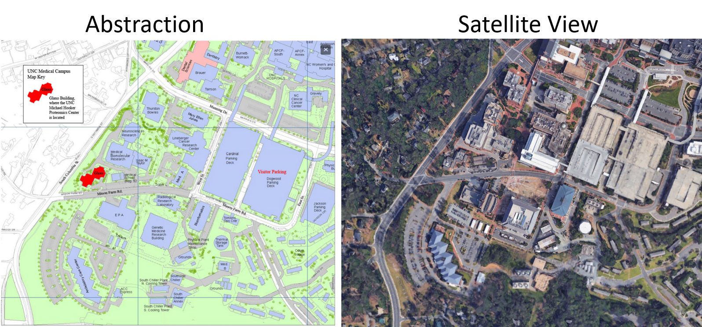
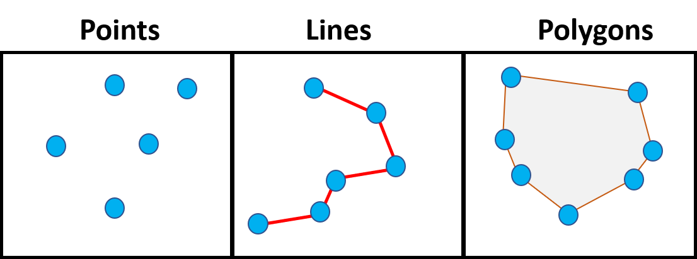

```{r setup, include=FALSE}
knitr::opts_chunk$set(echo = TRUE)
```

<br><br>
.center[
## Introduction to Geographic Information
### Lecture 5
.mb[
Map Abstracton<br>
+<br>
Lab #2

<br>

Andrew Murray | University of North Carolina - Chapel Hill

June 24, 2020
]]

---

.center[
```{r echo=FALSE, out.height= 400, out.width= 900}

```
]

<audio controls>
  <source src="/slides/intro_geographic_information/Day03/audio/d05s02.mp3" type="audio/mpeg">
  <p>Your browser doesn't support HTML5 audio.</p>
</audio>

???

Abstraction is the process of converting the real world into a map. Obviously, one of these would be easier to use to give directions or to locate a specific building. The choices we make in the abstraction or map making process are essential in order for other people to know what they are looking at and to be able to use your map succesfully.

---
.center[
## Types of Features
]

.med[
Discrete Features:
  - points and places
  - roads, buildings, trails
  - Points / Lines are usually discrete features

Continuous Features:
  - water bodies
  - Forests
  - Mountain ranges
  - Geologic formations
  - Typically shown using polygons
]

<audio controls>
  <source src="/slides/intro_geographic_information/Day03/audio/d05s03.mp3" type="audio/mpeg">
  <p>Your browser doesn't support HTML5 audio.</p>
</audio>

???

When it comes to features, it is important to remember that there are two main types of data that we use in GIS: Vecttors and Rasters. Now we aren't diving into vectors and Rasters just yet but I do want to at least mention them. Vectors are features, made up of geometric shapes. All vectors are made up of points. points are like the atomic building blocks of GIS. YEs we use points, lines and polygons but both lines and polygons are made up of groups of points. Rasters on the other hand are continuous surfaces. They are made up of pixels, just like your computer or TV has pixels. All pixels within a raster are the same size within a given raster and they are always rectangular in shape. Right now we're just focused on vectors and remember that the vectors we use almost exclusively are points, lines and polygons. The two types of features we use vectors to display in maps are discrete features and continuous features. Discrete features are typically fixed objects with definitive boundaries. Thinki buildings, roads, places etc... Most things we use points and lines to display are discrete feature, though they can also be represented by polygons. Continuous features are bigger, more fluid features Thinki forests, water bodies, geologic formations. We typically use polygons to delineate continuous features, although that didn't seem to stop google from displaying the entire Rocky mountain range as a single point but go figure.

---
.center[
### The Composition of Vectors
]
.med[
- Everything is made out of points
- Points are simply made up of an x and a y coordinate
- Every Projection has it's own origin(0,0) point and then uses X,Y coordinates to draw shapes.
- Units can vary (meters, feet, decimal degrees...)
- lines are simply points with a route and different start and end points
- Polygons are simply points with a route and identical start and end points
]
.center[
```{r echo=FALSE, out.height= 350, out.width= 900}

```

]


???

Something you need to consider is that all of GIS, at it's most basic level, is executed using code. Within ArcGIS you may use a mouse to point and click but every time you execute a spatial operation you are really telling your computer to execute some code. I bring this up because at it's very foundation, vectors are made up of points, as I just mentioned. Every vector is simply manufactured out of points, which are simply a number representing an x coordinate and a nother number representing a y coordinate. The way these coordinates are placed depends on the projection. 

---
.center[
## QUIZ #1
]

.med[
You have a quiz to complete covering the material from this week which includes the slides and the first two chapters. 

- The quiz has no time limit but is due by midnight
- It is open book
- You only have one attempt so be sure you have a good internet connection and do not close out of the tab while you are taking the quiz. 

- Lab #2 has been postponed until Monday due to technical issues which I am still working through with the University. I will assign it on Monday and the due date will be adjusted accordingly. 
  - Lab #2 will involve connecting ArcGIS Pro to ArcGIS online so if you want to get ahead, I suggest downloading ArcGIS Pro or testing out the connection through the VCL: [Instructions Here](https://guides.lib.unc.edu/software/software)

- Lab #1 is still due tonight at midnight so make sure to turn it in on Sakai.

]