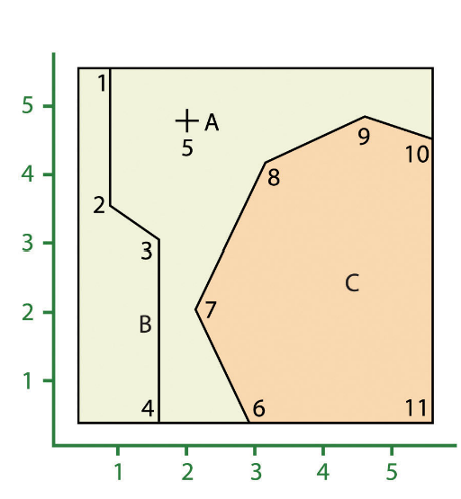
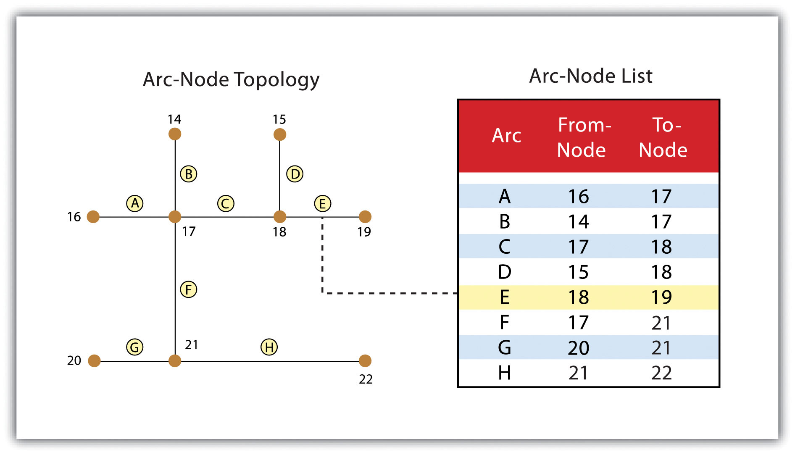
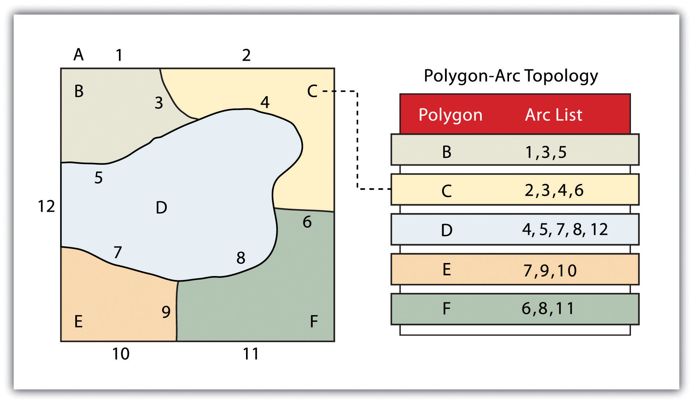
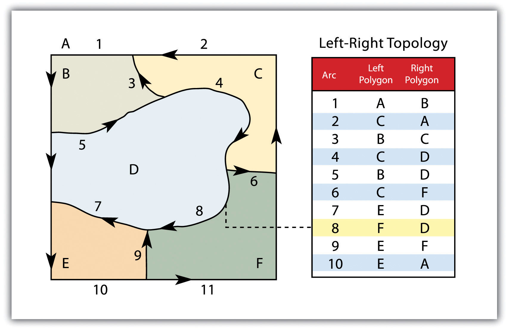
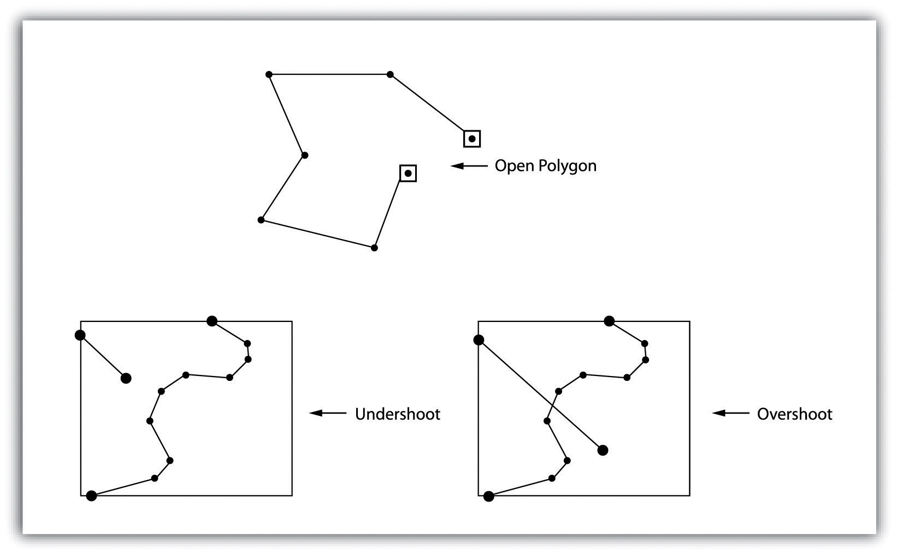

```{r setup, include=FALSE}
knitr::opts_chunk$set(echo = TRUE)
```

<br><br>
.center[
## Introduction to Geographic Information
### Lecture 8
.mb[
Data Models for GIS: Vectors<br>


<br>

Andrew Murray | University of North Carolina - Chapel Hill

July 1, 2020
]]


---

.pull-left[
## Vectors
<br>
```{r echo=FALSE, out.height= 450, out.width= 450}
knitr::include_graphics("vectors.jpg")
```
]

.pull-right[
.med[
Vectors are constructed from points. We generally have three types of vectors:
- Points
- Lines
- Polygons

(But they are all really just points stored different ways)
]

<br><br>

<audio controls>
  <source src="/slides/intro_geographic_information/Day08/audio/d08s02.mp3" type="audio/mpeg">
  <p>Your browser doesn't support HTML5 audio.</p>
</audio>
]

???

Yesterday we talked about rasters and also a bit about vectors in order to contrast the two but let's take a bit of a deeper look into vectors and why the way they are constrcuted is important. Vectors are always constructed from coordinate pairs which make up points. The way that these points are written to a data file impacts the way they will be drawn by a program like ArcGIS. There are all sorts of ways to store and draw vectors, and the creation of them really falls within the areas of GIS development and GIS science.

---
.center[
## Types of Vector Models
.med[

.pull-left[
**Spaghetti Model**

```{r echo=FALSE, out.height= 400, out.width= 450}

```
]

.pull-right[
**Topology Model**

```{r echo=FALSE, out.height= 300, out.width= 450}

```

Representation of the connectivity definition

<audio controls>
  <source src="/slides/intro_geographic_information/Day08/audio/d08s03.mp3" type="audio/mpeg">
  <p>Your browser doesn't support HTML5 audio.</p>
</audio>

]
]
]

<audio controls>
  <source src="/slides/intro_geographic_information/Day08/audio/d08s03.mp3" type="audio/mpeg">
  <p>Your browser doesn't support HTML5 audio.</p>
</audio>

???

The book really get's into detail about the differences between the spaghetti model and the topological model which certainly is important to keep in the back of your mind but it is not likely that you will ever need to dive that deep into it. I will however show some exmaples of when this can be really important. The spaghetti model was originally created by Jack Dangermon in 1982. This was the basis for his company ESRI and he has grown that into the biggest GIS company in the world. To this day ESRI has developed all sorts of data storage models. They created the shapefile and the geodatabase also. The important thing you need to remember about vectors is that we used to store vectors as a set of unique points that could not be associated with eachother., We have now moved to much more efficient data storage structures where we can associate features with eachother and sotre points only once. This sort of behavior is really important for a lot of spatial operations which I will demo for you later on in the lecture. Also I want to point out that figure 4.10 and 4.11 in the book seem to be incorrectly labeled. In figure 4.10 which is the righthand image on this slide, the author describes arcs 1,2 and 3 being connected by node 11. Instead, consider that Arc A, B and C are connected by node 17

---

## Polygons

.pull-left[
```{r echo=FALSE, out.height= 320, out.width= 550}

```
.center[
Representation of the 'area definition'
]
]

.pull-right[
.med[
Using the topology model let's us draw lines once and then associate other features with them. This allows us to do things like:
- Find neighboring polygons

- Create connected models like road networks

- Efficiently store large amounts of data

 
]
]

<audio controls>
  <source src="/slides/intro_geographic_information/Day08/audio/d08s04.mp3" type="audio/mpeg">
  <p>Your browser doesn't support HTML5 audio.</p>
</audio>

???

I'll walk through a few examples but consider something such as a cursory analysis of counties that are just outside of cities. For example, you might want to investigate how demographics shift from Wake County (where Raleigh is) and it's neighbors. To do this you would want to isolate the counties that wake county 'touches'.

---

### The Three Topological Precepts

.pull-left[
.med[
- Connectivity
  - Nodes exist to help connect arcs and build networks

- Area
  - Arcs that connect to surround an area define a polygon

- Contiguity
  - From / To directions are used to define which polygons are touching / share a border
]
]

.pull-right[
```{r echo=FALSE, out.height= 320, out.width= 550}

```
]

<audio controls>
  <source src="/slides/intro_geographic_information/Day08/audio/d08s05.mp3" type="audio/mpeg">
  <p>Your browser doesn't support HTML5 audio.</p>
</audio>

???

The three precepts described in your book are Connectivity, Are and Contiguity. You have seen Connectivity and Area on the previous slides and here you can see contiguity. Again, it appears the description of this figure in the book is incorrect, the author must have swapped the figure but they state that arc 6 is bound by polygons B and C when in reality it is bound by C and F. Most of these are things you won't have to define yourself, as GIS software have these capabilities built in by default.

---

### Topological Errors

.pull-left[
.med[
Topological errors usually occur in the drawing process when nodes are not correctly attached or polygons are not properly closed.

Common Errors:

**Sliver:**
  - when two polygon borders should be identical but a small space exists between them
  
**Undershoot:**
  - When an arc stops short of the node it should be connected to

**Overshoot:**
  - Opposite of an undershoot!
]
]

.pull-right[
```{r echo=FALSE, out.height= 320, out.width= 550}

```
]

<audio controls>
  <source src="/slides/intro_geographic_information/Day08/audio/d08s06.mp3" type="audio/mpeg">
  <p>Your browser doesn't support HTML5 audio.</p>
</audio>

???

Topological errors usually happen during the drawing process and in the demo later on in the lecture I will show you how to avoid them. These three common errors can all be avoided by making sure you activate a few settings within ArcGIS which I will demonstrate. Slivers are more common in older data when spaghetti models were more common. You are not likely to see an open polygon as ArcGIS will not allow you to create one... an open polygon after all is a line.

---

## Pros and Cons of the Vector Model
.med[
.pull-left[
**Pros:**

- More accurately represents reality
- More visually pleasing at small spatial scales
- Typically smaller file sizes than raster (though this is not always true)
- Allows for advanced topology based operations
]

.pull-right[
**Cons:**

- Data structure is much more complex than raster
- Small errors are capable of throwing off your analysis
- Processing can be VERY computationally intensive
]
]

<audio controls>
  <source src="/slides/intro_geographic_information/Day08/audio/d08s07.mp3" type="audio/mpeg">
  <p>Your browser doesn't support HTML5 audio.</p>
</audio>
???

As with raster models there are pros and cons for working with vectors but again this is usually dictated by your needs. Vectors are typically more accurate rrepresentations of reality. Of course this is not true 100% of the time. You could have a single polygon for the United States that has a population attribute of 328 million. That would not be that informative. In general however more advanced spatial operations can be done on vectors than on rasters. Sometimes spatial operations on vectors can become very computationally intensive but that is because they are more complicated. Usually with rasters you are sticking to simple math, like adding cells from one raster to another or multiplying etc...

---
### Common Vector Geoprocessing Tools

.pull-left[
.center[
.mb[
**Joins**
]
]
.med[
- Table join
  - A table join merges two tables together using a unique ID. Each feature (row) has it's own ID and by matching IDs with another table, adds attribute data.

- Spatial Join
  - A spatial join on the other hand is done when you want to associate features with eachother that do not have unique IDs but might overlap spatially or be within a certain distance. 

]
]

.pull-right[
.venter[
.mb[
**Selections**
.med[
- Select by Attributes
  - Allows you to filter a layer by it's attributes by writing a query.

- Select by Location
  - Allows you to select certain features within a layer by making use of a variety of spatial operations
]
]
]
]

<audio controls>
  <source src="/slides/intro_geographic_information/Day08/audio/d08s08.mp3" type="audio/mpeg">
  <p>Your browser doesn't support HTML5 audio.</p>
</audio>

???

Two of the most important operations in GIS are joins and selections and although they are very basic, they are also very powerful and learning how to use them correctly will save you tremendous amounts of time down the road. A join is the process of combining two datasets. This can be done using a tabular join, which requires the use of a Unique ID shared between two tables, or a spatial join, which requires known geographic information to determine a spatial relationship between two features. Likewise, a selection can be accomplished using either a tabular query or a spatial operation. Both of these are vital to GIS as they allow us to combine and filter datasets based on our spatially based questions. 

---
### Vector Demo
.mb[
.pull-left[
Drawing Vectors:
- Points
- Lines
- Polygons

Running Operations:
- Joins
- Selections
]

.pull-right[
Identification:
- Spotting Errors
- Networks


[Demo Link Here](https://unc.zoom.us/rec/share/ucooMOntqzNLQafszhHGGbYFQJjqaaa8hyRN_qAPyh3dEYQKAT-BIjWzwZ5g1wzo?startTime=1593568327000)


]

]

<audio controls>
  <source src="/slides/intro_geographic_information/Day08/audio/d08s09.mp3" type="audio/mpeg">
  <p>Your browser doesn't support HTML5 audio.</p>
</audio>

???

In the demo for today I am going to show you how to draw vectors of different types, run joins and selections, and investigate topologies for errors, including looking at a road networks in GIS.