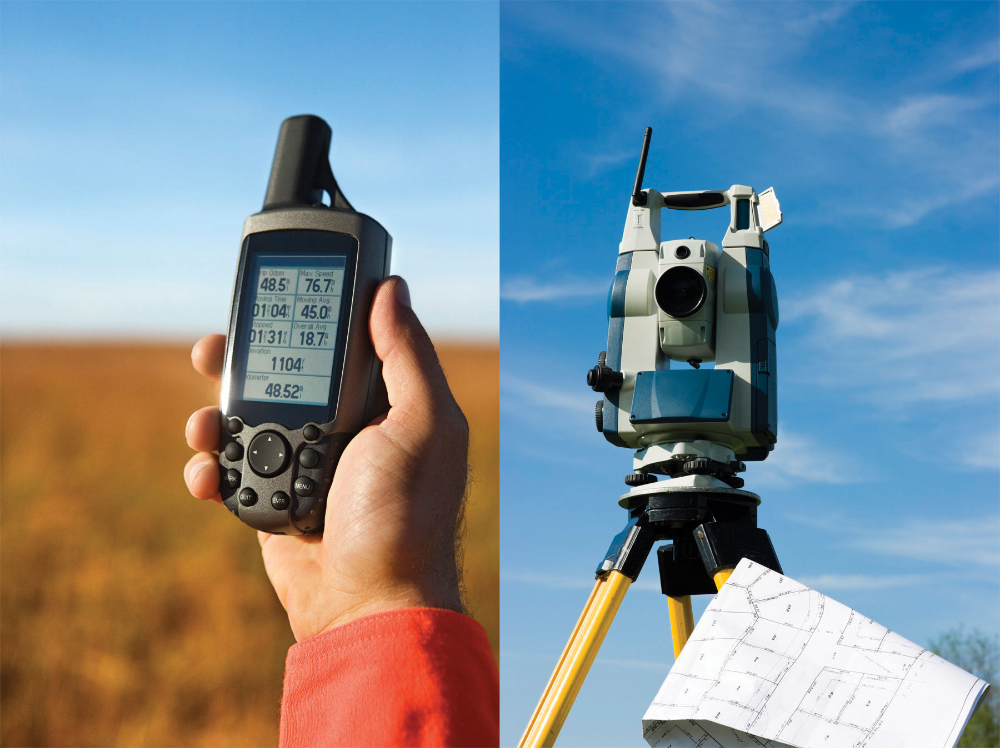
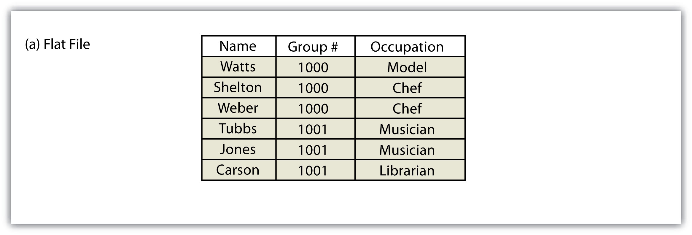
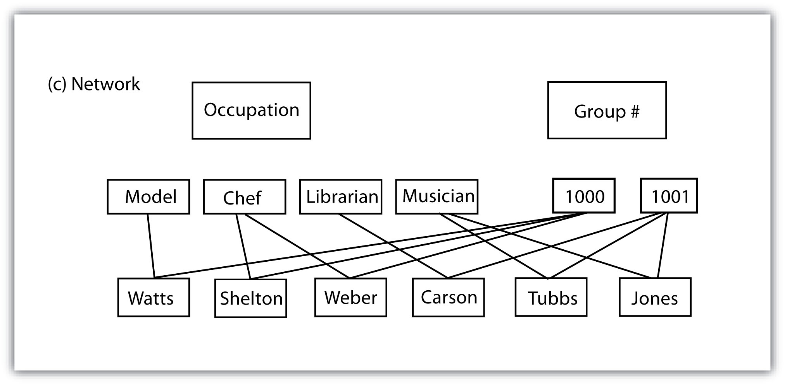

```{r setup, include=FALSE}
knitr::opts_chunk$set(echo = TRUE)
```

<br><br>
.center[
## Introduction to Geographic Information
### Lecture 10
.mb[
Geospatial Data Management<br>


Andrew Murray | University of North Carolina - Chapel Hill

July 6, 2020

.red[LAB 3 DUE TONIGHT + QUIZ 2 is still available!]
]]

---
.center[
## Data Types
]
.med[
.pull-left[

**Alphanumeric Strings**

- Uses letters and or numbers, often simply referred to as a 'string' or 'text'.
- Strings can technically be just numbers, but when you try to use them to do math, they will fail.
- An example would be the join field I mentioned from the U.S. Census which can have leading 0's
]

.pull-right[

**Numbers**
- Integer: No decimal places
   - Short Integer: −32,768 to 32,767
   - Long Integer: −2,147,483,648 to 2,147,483,647 **or** from 0 to 4,294,967,295
- Float / Double / Decimal

[These basically refer to different levels of precision:](http://net-informations.com/q/faq/float.html#:~:text=The%20Decimal%2C%20Double%2C%20and%20Float,bit%20floating%20point%20data%20type.)
  - Float is least precise and Decimal is most precise
  
  


  
]
]

<audio controls>
  <source src="/slides/intro_geographic_information/Day10/audio/d10s02.mp3" type="audio/mpeg">
  <p>Your browser doesn't support HTML5 audio.</p>
</audio>

???

Understanding data types is one of the more boring, but important things to master within a foundational understanding of GIS. Data types refer to the makeup of different types of data. For example. When you are working in an excel spreadsheet, you can change the settings for a column to show that column as things like a Date, currency, a percentage or others. This is essentially changing the data type of the column and telling excel how to interpret the raw data within each cell. This is the same within GIS. Attached to each vector is an attribute table where all of the attribute data is stored. Each column within the attribute table represents a different attribute and needs to have a data type associated with it. As I mentioned when joining data from the U.S. Census we need a unique identifier to create a tabular join between two sets of features or two tables. Our ability to join two tables together will depend on there being a column in both attribute tables which have identical values that are of the same data type. For example, if I had one table with Census IDs in a column that was an integer type, it would drop the leading 0. If I then tried to join it to another feature that had that same ID filed, but had a string data type, it would retain that leading 0 and the join would fail. Rasters also have data types, which refer to the type of data each cell contains. Integer type rasters are common, such as the National landcover data set but are not precise enough for high resolution elevation data. Higher precision data types mean bigger file sizes which mean longer compute times for analyses. If I were studying a small area near the ocean for example, I could use a smaller file size for elevation data as I would not have any big values. However if I was studying the Rocky Mountains, I would need something larger to account for the large fluctutations in elevation. 

---

.center[
## [More on Numeric Data Types](https://desktop.arcgis.com/en/arcmap/latest/manage-data/geodatabases/arcgis-field-data-types.htm)
]

|Data type|Storable range|Size (Bytes)|Applications|
|---------|--------------|------------|------------|
|Short integer|-32,768 to 32,767|2|Numeric values without fractional<br> values within specific range; coded values|
|Long integer|-2,147,483,648 to 2,147,483,647|4|Numeric values without fractional<br> values within specific range|
|Float (single-precision<br> floating-point number)|approximately -3.4E38 to 1.2E38|4|Numeric values with<br> fractional values within specific range|
|Double (double-precision<br> floating-point number)|approximately -2.2E308 to 1.8E308|8|Numeric values with fractional values<br> within specific range|

.med[
.center[
**Considerations of how you are storing data matter because:**
]
- Smaller files lead to better performace
- But they need to be large enough to handle the data you are using!
- Using the wrong data type can throw a wrench into your analysis and it may not be immediately clear what is wrong.

]

<audio controls>
  <source src="/slides/intro_geographic_information/Day10/audio/d10s03.mp3" type="audio/mpeg">
  <p>Your browser doesn't support HTML5 audio.</p>
</audio>

???

Here is a simplified table of the numeric data types you are likely to encounter within ArcGIS. As you can see, you might be inclined to think you could just use the most detailed data type and then never worry about it, but consider the effect of quadrupling the size of your files, especially when you might be conducting an analysis over a large geographic area like an entire state or even the whole United States. So when creating data you should always consider your requirements and go with the smallest possible file size. Likewise, it is a good idea to look through data you download from other sources and see if you can't clean it up a bit as you will often come across data that was not produced with these coinsderations. You may also only need a spatial subset of data when downloading a larger database that can be cleaned and made smaller. Getting good at spotting data types and spending a bit of time cleaning your data before you actually start executing complex spatial operations can save you a ton of time down the road both in computation time and headaches over failing tools.
---

### A Few More Data Types

.med[The Simpler Ones...]


**Boolean**
- TRUE or FALSE (1 bit)

**Dates**

Usually stored in something called PosixCT which as a format like:
  - "YYYY-MM-DD"
  - Bit size Varies

**Binaries**

0 or 1 (1 bit)

<audio controls>
  <source src="/slides/intro_geographic_information/Day10/audio/d10s04.mp3" type="audio/mpeg">
  <p>Your browser doesn't support HTML5 audio.</p>
</audio>

???

A few more data types are boolean, which are simply TRUE or FALSE and binaries, which are similar but simply 0 or 1, basically the simplest possible data type. Dates are typically stored in a data type called PosixCT in a format like the one here. Dates must be properly stored in order to be able to use timeseries data.

---

.center[
## Measurement Scale
]

.med[

.pull-left[
**Categorical Data**

Nominal - Things that are totally different (cannot be ranked)
- Eye Color
- Last Name

Ordinal - Non-numeric but can be ranked
- Scales like Strongly dissatisfied -> Strongly sattisfied

]

.pull-right[
**Numeric Data**

- Interval: Data that can be quantified but does not refer to an amount, such as temperature or elevation (zero is not meaningful)

- Ratio: Has a meaningful zero. A common example is population density (people per square mile)

- Discrete: Only a certain number of possible values. number of trees in an acre ... number of houses in a square mile etc... 

- Continuous: Infinite possibilities, like tree heights
]
]

<audio controls>
  <source src="/slides/intro_geographic_information/Day10/audio/d10s05.mp3" type="audio/mpeg">
  <p>Your browser doesn't support HTML5 audio.</p>
</audio>

???

Measurement scale really comes into play when we are symbolizing attributes or adding aesthetics to a map. The way we visualize our data relies on the scale of the data. For example, the NLCD is categorical data where each pixel represents a discrete land use type. You cannot rank land use types. Farm land does not rank higher than wetland or forest. Therefore you would want to select an appropriate color scale, one with a wide range of colors instead of a continuous color scale. On the other hand, if you were providing someone with a map of temperatures, this would be highly confusing. You would instead want to use a color scale which ranges continuously from blue to red to denote cold to hot. For Ordinal data you may want to use frowny or smiley emojis to show satisfaction levels as colors might be meaningless all together. As opposed to data types, Measurement scale is not really a way of storing data per say. It is more about how you are interpreting and processing the data. Certainly it is possible to alter your measurement scale. For example, you can take Discrete numerical data such as student test scores and convert them to ordinal data by assigning them the grades A, B, C, D, F. Obviously however, you cannot reverse that change so be sure you never are deleting primary data, as you will often change your mind about how to display results or you may make a mistake and need to retrace your steps.

---

.center[
## Primary Data Capture
]

.med[
.pull-left[

GPS Devices:

- Handheld
- Total Station
- Phone
- Activity Tracker (watch)
- Navigation (cars / boats / planes...)

[More on accuracy here](https://www.gps.gov/systems/gps/performance/)

<audio controls>
  <source src="/slides/intro_geographic_information/Day10/audio/d10s06.mp3" type="audio/mpeg">
  <p>Your browser doesn't support HTML5 audio.</p>
</audio>

]
]

.pull-right[
```{r echo=FALSE, out.height= 400, out.width= 450}

```
]

???

GPS devices come in a variety of shapes and sizes. When GPS was originally created, it was designed for military use and for a long time, the U.S. military introduced intentional accuracy errors fearing that there could be negative outcomes in allowing civilians high accuracy positioning systems. Now however, everyone has access to precision GPS and it's how almost all surveying is done. You may have seen these total station devices in use by construction crews on the side of the road for example. The actual GPS capability may not actually be that much better than your phone, however it does other things as well like range and distance. meaning that it can tell the locations of other places within it's line of site relative to it's position. There are dual-band frequency GPS units which are highly accurate and in use by the military but they are not secret or unobtainable, just really expensive and mostly unnecesarry.

---
.center[
### Secondary Data Capture
]

.med[
Secondary data capture is the process of creating data from other data

Examples of creating secondary data:

- Tablet Digitization
  - Using a tablet and puck
- Heads up Digitization
  - Pointing and clicking on a computer screen
- Vectorization
  - Using powerful software and a VERY good scan to automatically create vectors
]

<audio controls>
  <source src="/slides/intro_geographic_information/Day10/audio/d10s07.mp3" type="audio/mpeg">
  <p>Your browser doesn't support HTML5 audio.</p>
</audio>

???

Secondary data is mostly what you will use in GIS, either creating it yourself or downloading that which others have already created. Digitization has been around as long as GIS but we don't use it as much anymore. As GIS got big in the 90's and 2000's there was a huge push to digitize existing maps, but we don't really create maps that way anymore. Now we create them digitally in the first place and you are not likely to encounter tablet digitization at all anymore. More likely you may occasionally want to convert a paper map and you will use heads up digitization through a process called georeferencing.

---


.pull-left[
```{r echo=FALSE, out.height= 180, out.width= 450}

```

```{r echo=FALSE, out.height= 180, out.width= 450}
knitr::include_graphics("hier.jpg")
```

```{r echo=FALSE, out.height= 180, out.width= 450}

```
]

.pull-right[
### Database Management
.med[
In GIS, we typically use Relational databases which help:

- Efficiently store spatial data
- Allow for the relationships of data over several different tables
- Speed up computational times

]
]

<audio controls>
  <source src="/slides/intro_geographic_information/Day10/audio/d10s08.mp3" type="audio/mpeg">
  <p>Your browser doesn't support HTML5 audio.</p>
</audio>

???

While it is not totally essential that you posess a deep understanding of database management systems, you should understand the importance of primary keys. A primary key allows us to associate features with their attributes and process computationally intensive operations efficiently while storing the data in as small a package as possible.

---
.center[
### File Formats (Vector)
]

.mb[
**The Shapefile:**
]

.med[
- Still the standard GIS file but is on the way out...
  - incapable of storing null values / annotations or network features.
  - Field names within the attribute table are limited to ten characters
  - Each shapefile can represent only point, line, or polygon feature sets. 
  - Supported data types are limited to floating point, integer, date, and text
  
**ArcInfo Coverage**
  - Your book says these are still in use today but if you come accross one, I'll be surprised. These are really old and I don't think they are even supported in ArcGIS Pro
]

<audio controls>
  <source src="/slides/intro_geographic_information/Day10/audio/d10s09.mp3" type="audio/mpeg">
  <p>Your browser doesn't support HTML5 audio.</p>
</audio>

???

There are a lot of different file types fro storing spatial data but by the far the most common is the shapefile. The shapefile has been around since the 90's and it's still how most data is delivered however it has a lot of drawbacks. The ArcInfo coverage is even older and while your book says people still use it, I haven't met any of those people and I believe that when ESRI made the switch to ArcGIS Pro, they stopped supporting it, meaning that in the flagship GIS software you couldn't even use a coverage if you had it.


---

### More File Formats

.med[
.pull-left[
**The Geodatabase**

- Created by ESRI

**The Geopackage**

- Open format based on the SQLite database
]

.pull-right[

Assignment (Participation Credit):

Have a look through the following posts and respond to the Piazza Discussion about the difference between shapefile, geodatabase and geopackage.

[Why use Geodatabase?](https://www.esri.com/news/arcuser/0309/files/9reasons.pdf)

[Switch From Shapefile](http://switchfromshapefile.org/)

[Geopackage vs. Shapefile](https://www.gis-blog.com/geopackage-vs-shapefile/)

[Piazza Forum](https://piazza.com/class/kbchpg3on0h4se)
]
]

<audio controls>
  <source src="/slides/intro_geographic_information/Day10/audio/d10s10.mp3" type="audio/mpeg">
  <p>Your browser doesn't support HTML5 audio.</p>
</audio>

???

The shapefile is the old format that people seem to still use for some reason. To be blunt, the shapefile is slow, inefficent and it is messy. It's the classic example of something that people have always used and it's what they were taught to use and so they still use it. HOwever there are other formats that are much better. Instead of droning about them, I want you to take a bit of time and look over these three posts I have linked on the slide here. Consider what is different between the shapefile, a geodatabse and the geopackage. What are the pros and cons of using them? This is not just a data related question but also a software related question. I have opened a forum on Piazza so please post a few thoughts on what you perceive the differences to be. This will be graded as participation so I am not really looking for correct answers here, but I am looking for thoughtful ones. That is it for today. Please make sure to turn in the lab by tonight and complete the quiz if you have not done so already. 