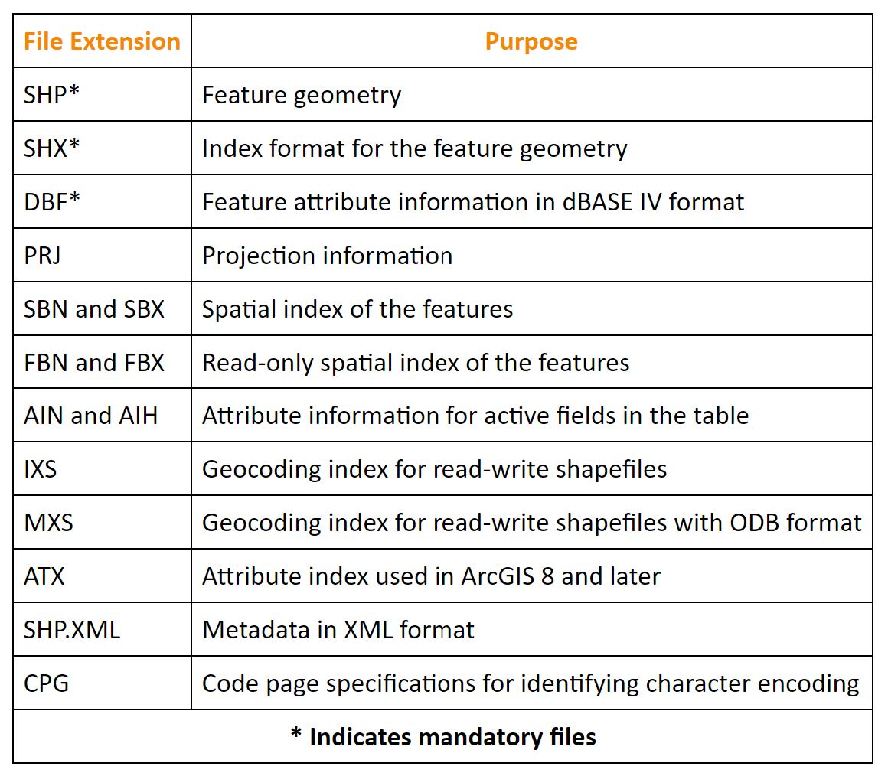
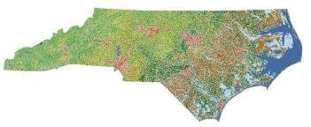

```{r setup, include=FALSE}
knitr::opts_chunk$set(echo = TRUE)
```

<br><br>
.center[
## Introduction to Geographic Information
### Lecture 11
.mb[
Geospatial Data Management (Part 2)<br>


Andrew Murray | University of North Carolina - Chapel Hill

July 7, 2020


]]

---
.pull-left[
```{r echo=FALSE, out.height= 400, out.width= 450}

```
]

.pull-right[
.med[
###Putting a Bow on Vector Files

- Shapefiles are still the most common but most agencies have also started offering downloadable geodatabases.

- Formats like TIGER/Line, DLG, or TIN may be created using different formats but most of these files are now downloaded as geodatabases.  

]
<audio controls>
  <source src="/slides/intro_geographic_information/Day11/audio/d11s02.mp3" type="audio/mpeg">
  <p>Your browser doesn't support HTML5 audio.</p>
</audio>

]

???

Just to wrap up the discussion of file formats as they relate to vectors, the book talks about several different file types but the truth is that almost all of them are still actually stored as shapefiles and more increasingly as geodatabases. It probably won't surprise you to learn that ESRI's single largest cleint is the United States Government so it should come as no surprise that they often rely on ESRI for all of their spatial data fromat and software needs.

---

## Raster File Formats
.pull-left[
.med[
The three most common raster formats are:

**JPEG**
- 8 bit

**TIFF**
- 8/16 bit

**PNG**
- 8 bit

**The Geodatabase / Geopackage**
]
]

.pull-right[
```{r echo=FALSE, out.height= 250, out.width= 600}

```

<audio controls>
  <source src="/slides/intro_geographic_information/Day11/audio/d11s03.mp3" type="audio/mpeg">
  <p>Your browser doesn't support HTML5 audio.</p>
</audio>
]

???

If you're a photographer you might be familiar with these file formats. Although you might be familiar with them for other reasons too. These are the most common raster formats and remember that a picture is just a raster. You're cameras ability to create sharp images depends not only on the ability to capture real life and convert it into data, but also on how that data is stored. These three formats, though common, are not inherintly geographic. Spatial data must be assigned by adding a file that tells us how to map the pixels onto the earths surface. the most commong file you are likely to encounter is called a geotiff. Also, you will realizer that a geodatabase is also capable of storing raster data and is being usedd more and more commonly. One thing I want to point out is the difference between a personal and a file geodatabase. Personal geodatabases are basically a microsoft access database and come with some limitations. One of the major limitations is that they do not perform well within a 64-bit environment, like the one required for ArcGIS Pro. For this reason, ArcGIS Pro no longer supports personal geodatabases. Therefore you should always assume that when I am talking about a geodatabase, I am talking about a file geodatabase. A personal geodatabse has the file extension .mdb.

---

## Lab #4

### Creating and Saving Spatial Data

.med[
For this lab, we are going to focus on the file formats we have been discussing. How do we create them? and what effects can we observe on performance? We will also see a few new spatial tools. You can find the full lab assignment and the tutorial in the links below.

[Lab Assignment](https://docs.google.com/document/d/1Od_aXHOWhD3hPI8iPV7vPMusKuYLYcvZdIpKjh9TD44/edit?usp=sharing)

[Tutorial]()
]

<audio controls>
  <source src="/slides/intro_geographic_information/Day11/audio/d11s04.mp3" type="audio/mpeg">
  <p>Your browser doesn't support HTML5 audio.</p>
</audio>

???

For lab 4, we are going to simply take a look at some different vector and raster file formats, how they are sized differently and how they perform. This will be due Thursday night at midnight EST. 