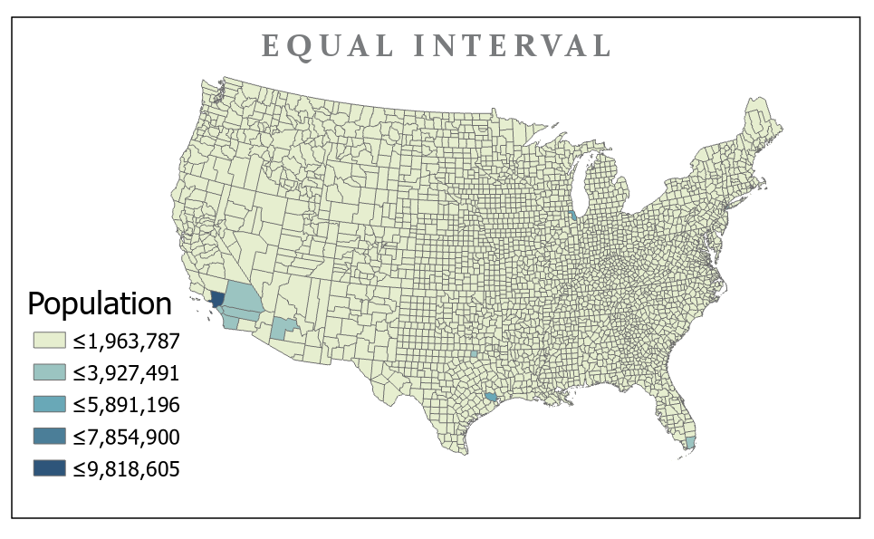
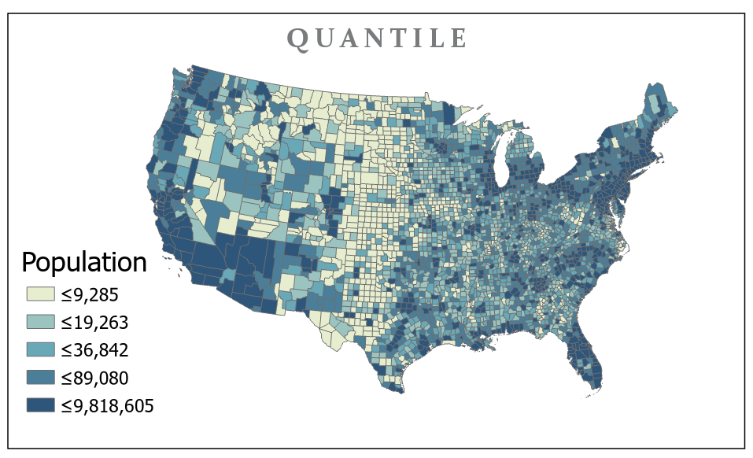
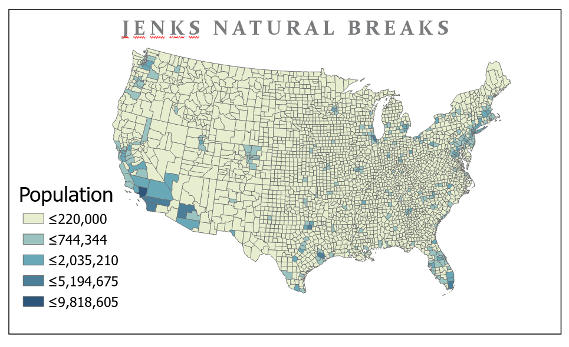
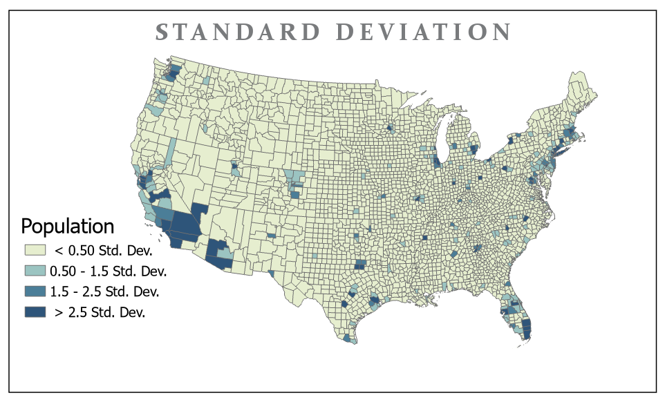
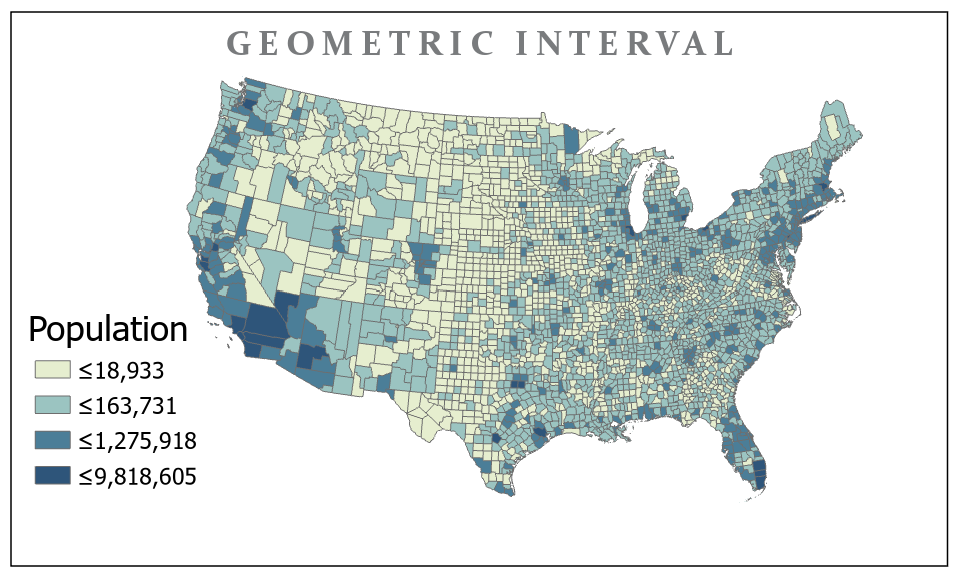
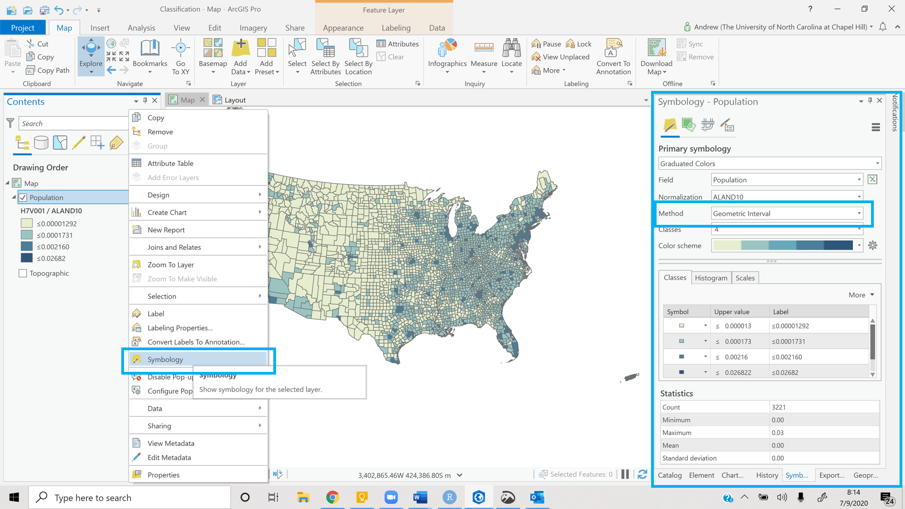

```{r setup, include=FALSE}
knitr::opts_chunk$set(echo = TRUE)
```

<br><br>
.center[
## Introduction to Geographic Information
### Lecture 13
.mb[
Data Classification<br>
<br>
.med[
Andrew Murray | University of North Carolina - Chapel Hill

July 9, 2020
]

]]

---
### Classifications

.med[
Classifications come into play in all sorts of data but for today we are focused on choropleth maps.

- A choropleth map is a shaded map (usually polygons) where each area is colored based on a value for a specific attribute.

- Classification is all about how we assign values to colors to make an informative and visually appealing map

- There are many statistical approaches but you can also create your own classes
]


<audio controls>
  <source src="/slides/intro_geographic_information/Day13/audio/d13s02.mp3" type="audio/mpeg">
  <p>Your browser doesn't support HTML5 audio.</p>
</audio>

???

Classification refers to how we assign values to things we want to use to represent them. In the case of a choropleth map, classification assigns values to colors but there are many other types of maps. You might have a road map for example where the line width of the road is represented by the maximum speed limit, or the number of lanes on the road. You could have a point where the size represents the size of a population. Today I am going to run through the classifications described in chapter 6 of the book and also one additional classification intriduced by esri. Then I will take you through ArcGIS Pro and show you how to apply them.

---
.left-column[
### Classifications
.med[
- Divides the range of attribute values into equally sized classes.
<br><br><br>
- If you take the maximum (9,818,605) value and divide it by the number of classes you will get the first class break (1,963,787)
]
]

.right-column[
```{r echo=FALSE, out.height= 500, out.width= 750}

```
]

<audio controls>
  <source src="/slides/intro_geographic_information/Day13/audio/d13s03.mp3" type="audio/mpeg">
  <p>Your browser doesn't support HTML5 audio.</p>
</audio>

???

Equal interval divides the range into equal sizes, meaning that if you take the maximum value of the attribute and divide it by the number of classes you are using, you will get the first class break as a result. This means that this sort of classiciation is susceptible to outliers, so if you have one value that is really high, it will affect the rest of the map. That is what is happening here. Los Angelas County has skewed the whole map so most of the U.S. is in the lowest class. This is not a very good classification for this map... unless your goal is to show how many people live in L.A. compared to everywhere else I guess. 

---

.left-column[
### Classifications
.med[
- Places equal numbers of observations into each class.

- Almost like adding multiple medians
<br><br><br><br><br><br><br>
<audio controls>
  <source src="/slides/intro_geographic_information/Day13/audio/d13s04.mp3" type="audio/mpeg">
  <p>Your browser doesn't support HTML5 audio.</p>
</audio>
]
]

.right-column[
```{r echo=FALSE, out.height= 500, out.width= 750}

```
]


???

Quantile on the other hand will make sure there are an equal number of observations in each class, which means if the polygons are roughly the same size you should see roughly the same amount of color for each class when looking at the map. You can see this map tells us a bit more about population variation especially in the more rural parts of the country. You can see the class breaks have lowered considerably because most counties in the Uinted states have populations of less than about 20 thousand people

---

.left-column[
### Classifications
.med[

- Utilizes an algorithm to group values in classes that are separated by distinct break points.

- Best used with data that is unevenly distributed but not skewed toward either end of the distribution. 

<audio controls>
  <source src="/slides/intro_geographic_information/Day13/audio/d13s05.mp3" type="audio/mpeg">
  <p>Your browser doesn't support HTML5 audio.</p>
</audio>
]
]

.right-column[
```{r echo=FALSE, out.height= 500, out.width= 750}

```
]

???

Jenks natural breaks uses an algorithm to detect changes within the data. This is good at showing where groups happen, but for population of the United States it does not perform very well as the data values increase at a fairly stable rate. It does show the outliers though as you can clearly see some of the counties that contain the largest cities. Here you can see L.A. San Francisco, Houston, Dallas, Miami and the northeast corridor between Washington D.C. and Boston stands out as well

---

.left-column[
### Classifications
.med[
- Forms each class by adding and subtracting the standard deviation from the mean of the dataset.

- The method is best suited to be used with data that conforms to a normal distribution.

<audio controls>
  <source src="/slides/intro_geographic_information/Day13/audio/d13s06.mp3" type="audio/mpeg">
  <p>Your browser doesn't support HTML5 audio.</p>
</audio>
]
]

.right-column[
```{r echo=FALSE, out.height= 500, out.width= 750}

```
]

???

The standard deviation is pretty self explanatory. Note that in a standard deviation plot however, max and minimum values would be shown as identical because the point is to spot the outliers. Now this is not necesarrily the case in this map because U.S. Population is not normally distributed, instead it is positively skewed, which means most counties have low populations so the mean will be higher than the mode or median. The mean population for U.S. counties is 97,000 and the standard deviation is 309,000 so since you cannot have a population less than zero, all rural counties will be within 1 standard devitation, while only the most populated counties will exist outside of them

---

.left-column[
### Classifications
.med[
- Creates class breaks based on class intervals that have a geometric series.

- Essentially a compromise between equal interval, natural breaks (Jenks), and quantile / balance highlighting changes in middle values and the extreme values.
]
]

.right-column[
```{r echo=FALSE, out.height= 500, out.width= 750}

```

<audio controls>
  <source src="/slides/intro_geographic_information/Day13/audio/d13s07.mp3" type="audio/mpeg">
  <p>Your browser doesn't support HTML5 audio.</p>
</audio>
]

???

Geometric interval is an attempt to compromise between equal interval, jenks and quantile to give a distributed classification scheme that accounts for break points that can be detected within the data. Personally, I think this is the best classification scheme for this data that we have looked at so far. 


---
.center[
### Classifications and Maps in ArcGIS Pro

.big[[VIDEO LINK](https://unc.zoom.us/rec/play/7JItJO7-qj43HtDBsQSDC6MvW469faqshiAf_aFbnUi0AHAANAbwNboRYupNLknlIYO5GNGuotLU9-c3)]

```{r echo=FALSE, out.height= 400, out.width= 700}

```
]

<audio controls>
  <source src="/slides/intro_geographic_information/Day13/audio/d13s08.mp3" type="audio/mpeg">
  <p>Your browser doesn't support HTML5 audio.</p>
</audio>

???

ArcGIS has come a long way in it's ability to customize classification settings and in the rest of this lecture, I am going to walk you through how to use some of them. I am also going to take this opportunity to show you a bit more about the statistics the classification schemes make available to you, as well as basic map creation and some additional information about how ArcGIS Pro is structured. I am showing all of this to you in ArcGIS Pro instead of ArcGIS online because as you recall, ArcGIS Online is the lightweight version and is based on ArcGIS Pro, so once you have a full understanding of how all of this is don in ArcGIS Pro, it will be much easier to figure it out in ArcGIS Online. I'll also talk a little about color selection but we'll hone in on that another day. Click the link for the video for the rest of today's class and don't forget lab 4 is due tonight. 