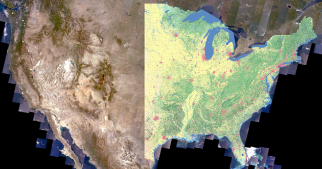
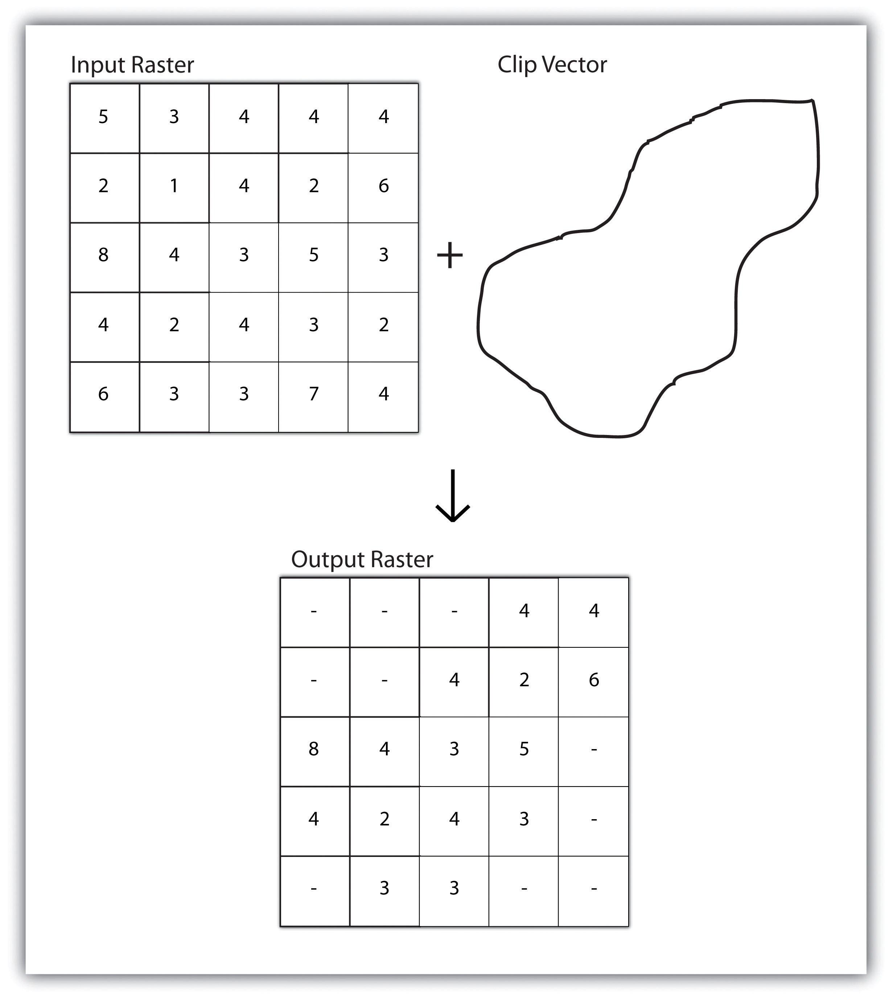

```{r setup, include=FALSE}
knitr::opts_chunk$set(echo = TRUE)
```

<br><br>
.center[
## Introduction to Geographic Information
### Lecture 16
.mb[
Geospatial Analysis: Raster Data <br>
<br>
.med[
Andrew Murray | University of North Carolina - Chapel Hill

July 14, 2020
]

]]

---
.center[
### Single vs. Multiple Layer Analysis
]

.pull-left[
.med[
**Single Layer Analysis:**

Operations conducted using a single layer
- Raster Reclassification
- Buffer
]
]

.pull-right[
.med[
**Multiple Layer Analysis:**

Operation using multiple layers
- Extractions
- Overlays
]
]

<br><br><br>
<audio controls>
  <source src="/slides/intro_geographic_information/Day16/audio/d16s02.mp3" type="audio/mpeg">
  <p>Your browser doesn't support HTML5 audio.</p>
</audio>

???

Hi everyone, today I am simply going to introduce classifications to you and get you going on lab 6. This lab will be another walkthrough with a tutrial from ESRI so it will give you very specific instructions on how to complete the tasks. By now you should be through chapter 8 in the book, and if not, make sure you have at least familiarized yourself with classification.
Much like in vector analyses, we can break down operations on rasters into categories of single vs multiple layer analyses. Reclassification is most often used to simplify overly complex rasters. We can also run buffers based on cells of a raster rather than vectors. The most common multiple layer anlyses for rasters involve extractions which is an approach for subsetting a raster and overlays which is the process of combining data from multiple rasters, like an intersection in vector analysis. 

---
.pull-left[
### Raster Reclassification
<br>

```{r echo=FALSE, out.height= 280, out.width= 450}

```
<br>
<audio controls>
  <source src="/slides/intro_geographic_information/Day16/audio/d16s03.mp3" type="audio/mpeg">
  <p>Your browser doesn't support HTML5 audio.</p>
</audio>
]

.pull-right[

### Generalization
.med[
Raster Reclassification is the process of simplifying a raster with high resolution data into more generalized data.
- The National Land Cover Dataset (NLCD) simplifies remotely sensed satellite data into land cover classifications for scientists to use for all sorts of applications.

- This requires determining which data values (specifically ranges of values) can be associated with specific spectral signals of:
  - Vegetation
  - Impervious Surfaces
  - Water
  - Much More...
]
]

???

Reclassification is the process of taking pixel values within a raster and changing them to different values based on certain criteria. A prime example of this is the creation of the national land cover dataset, which uses remotely sensed data from the landsat satellite and takes ranges of values which are associated with different landcover types. So I won't dive too deep into the world of remote sensing right now but I want to emphasize that landsat is a multiband satellite, so it creates a different raster for each range of wavelengths it measures. By combining those rasters in different combinations, scientists can detect patterns of vegetation which they validate through a process called groundtruthing (literally driving out to a field / forest / lake and using a similar sensor to the satellite on the ground and checking for differences). When they find a range of pixel values that consistently matches up with a vegetation type, they reclassify based on these values to create the NLCD. In short, they take a tremendous amount of satellite data, field work and math and boil it all down to a simplified national raster of land cover. 

---
## Extractions

.pull-left[
```{r echo=FALSE, out.height= 500, out.width= 450}

```
]

.pull-right[
.med[
<br>
Rasters often come as (spatially) large datasets and we often need to subset them to work with them

- Can be done with two rasters or a raster extracted to a vector. 

- Handy to reduce computational requirements when working in smaller areas
]
<br>
<audio controls>
  <source src="/slides/intro_geographic_information/Day16/audio/d16s03.mp3" type="audio/mpeg">
  <p>Your browser doesn't support HTML5 audio.</p>
</audio>
]

???

Extractions are all about subsetting your data. We have already talked extensively on how, when using GIS, we always want our data as small as possible. Raster data is generally very large both spatially and in file size so subsetting it to your area of interest is essential. You can do extractions two ways, with a raster or a vector. Your method will simply depend on your project. If I work for Orange county, I might be downloading a bunch of state or national data that I want to extract to the county, because that's what my project requires. If I have some aerial imagery for a small area on the coast, I may want to extract using that raster.

---
## Lab #6
.med[
For lab 6, please complete the exercise below and submit the following as a document titled YOURONYEN_Lab6 to Sakai:

1. Screenshots of June 1984, June 2001 and May 2014 (Originals)

2. Screenshot of your Iso_1984 layer with water visible and other layers turned off (Step 8/9 under Classify land cover in 1984)

3. Screenshot of your table with areas for Clean_1984 ('Determine change in area' Step 1)

4. Screenshots of your tables from step 14 (Determine change in area) **for 1984, 2001 and 2014**
]
.mb[
[Land Classification in ArcGIS Pro](https://learn.arcgis.com/en/projects/classify-land-cover-to-measure-shrinking-lakes/)
]

<audio controls>
  <source src="/slides/intro_geographic_information/Day16/audio/d16s05.mp3" type="audio/mpeg">
  <p>Your browser doesn't support HTML5 audio.</p>
</audio>

???

For lab 6, we are going to work through land classification in ArcGIS Pro and quantify change over time. This exercise looks at Lake Poyang, China's largest freshwater lake, which is shrinking as upstream water is pulled from the Yangtze River at the Three Gorges Dam. You will learn how to conduct an unsupervised classification and quantify the change in lake coverage through time. You will need to submit these items for your lab, which is due Thursday night at midnight. Just a note that today I am working on getting all of your grades in Sakai updated and I realize that some of you were curious about access to the Quiz answers and I will be posting those later today. Please follow up with me for any questions and remember to keep posting in Piazza. 