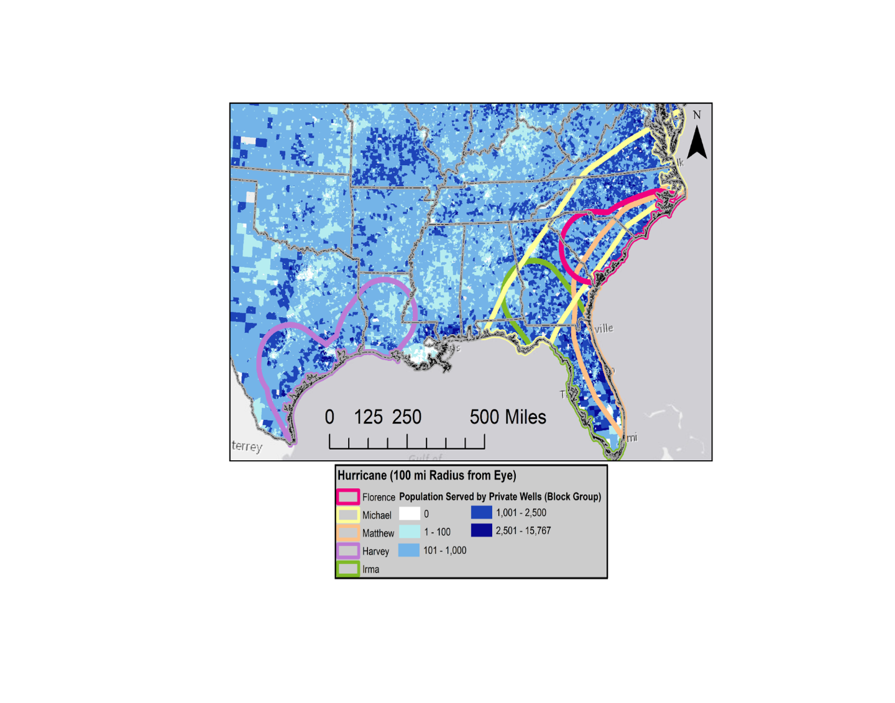

## Hurricane Florence, 2018 (Credit: NASA) {data-background="C:/Users/ARMur/OneDrive - University of North Carolina at Chapel Hill/website_rebuild/Andrews_Website/static/img/hurricane_space.jpg"}

## Overarching Question
### When extreme precipitation occurs, such as from tropical depressions and hurricanes, large volumes of water move through the landscape and have the potential to mobilize contaminants into drinking water resources. How do land use, soil moisture and other hydrogeologic variables relate to groundwater vulnerability, and specifically, privately owned drinking water wells?

## Hypothesis
### Geophysical landscape features, temporal variability of soil moisture, and land cover are major drivers of groundwater vulnerability to contamination. Extreme precipitation events such as hurricanes overwhelm and impose changes to each of these variables in measurable ways. Investigating the relationships and the ways in which to measure these impacts will enable future forecasting of vulnerability and better inform disaster response efforts, directly and positively affecting human health.

## Preliminary Outline
> - **Chapter 1: the relationship between soil moisture, precipitation and Landcover** 
*Driving Questions:* 
- Can we predict what the SMAP soil moisture reading will be before it happens?
- What is the relationship between land use, soil moisture decline, and time?
- What are the relationships between UAVSAR, SMAP/Sentinel 3km and SMAP 9km?
- How do we keep an eye on the launch of SWOT in 2021 to keep this work fresh?

> - **Chapter 2: SMAP assisted estimation of hydraulic conductivity, recharge, and water table height.**
- Hypothesis: High frequency soil moisture readings can tell us how quickly the soil is becoming saturated or drying out. With known soil data, PPT data and elevation data we can use soil moisture to estimate rates of recharge, conductivity and water table depth.

> - **Chapter 3: DRASTIC+**
- Hypothesis: the DRASTIC index can be improved by incorporating SMAP assisted recharge, conductivity and water table depth. It can be further benefited by incorporating land cover and topography.
- Using established DRASTIC variables along with methods established in chapter 1 & 2, the DRASTIC+ index can be calculated every 1.5 days (when a new SMAP capture becomes available)
- This index will be a 30m raster, corresponding to the data it uses with the finest resolution (NLCD & SSURGO).

## Hurricanes Impacting Areas Reliant on Wells
- Domestic wells are susceptible to contamination from local groundwater.
- Risk is elevated as private wells are not subject to regs like the Safe Drinking Water Act (SDWA).

---

# More to come
