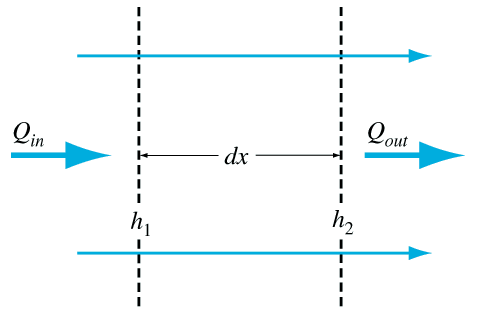
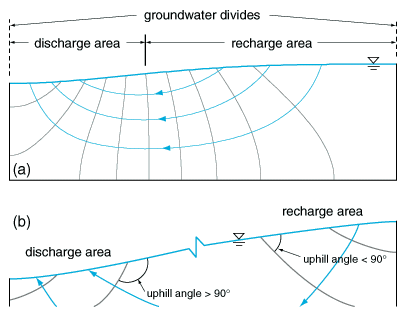
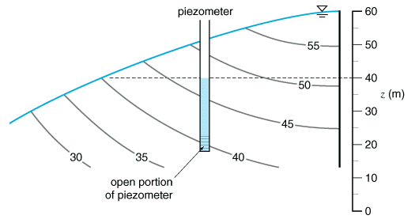
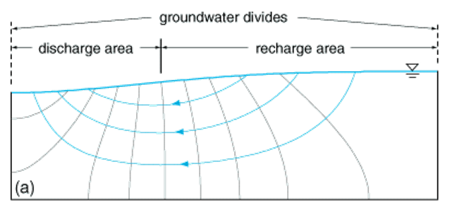
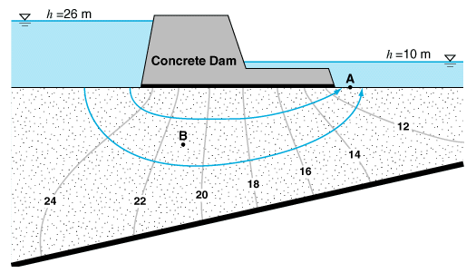
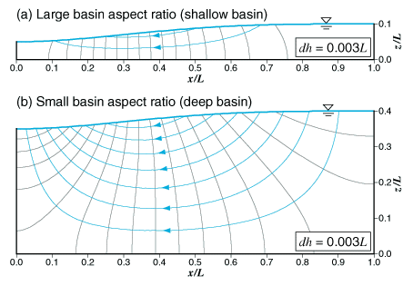
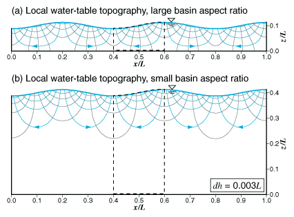
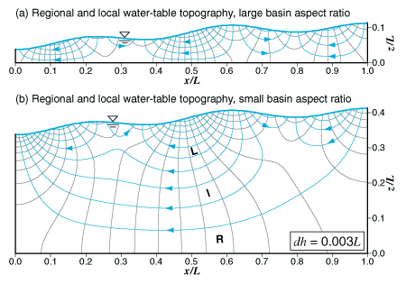
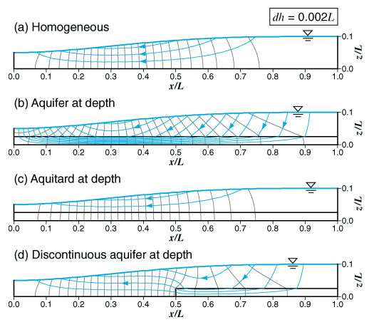
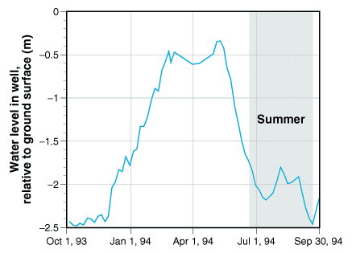

```{r setup, include=FALSE}
knitr::opts_chunk$set(echo = TRUE)
```

.center[
##Introduction to Watershed Systems:<br>Lecture 10
<br><br><br><br>
.biggray[Groundwater Hydrology]
]

<br><br><br><br><br><br><br>
.center[
.med[Andrew Murray | University of North Carolina - Chapel Hill]
]

---
.center[
## Who cares about groundwater???
]
.pull-left[
.med[
- Do you drink water? (Then you should care!)<br>
.mb[
Example: Mexico City:]
  - 20 million people
  - Aquifer is 100 - 500 m thick
  - Declining at 1-1.5 m per year

So... The aquifer will be dry somewhere between:
```{r aquifer}
paste0(round(100/1.5,1)," years and ", 500/1," years")
```

]]

.pull-right[

]
---
background-image: url(USAaquiferMAP.png)
background-size: cover

.center[.big[**Major Aquifers in the United States**]]

???
- The high plains aquifer is one of the most utilized aquifers in the united states

20% of irrigated land in the U.S. is in the high plains and 30% of groundwater used for irrigation comes from the high plains aquifer

- the high plains aquifer has declined 4 m between 1950 and 2009 and up to 45m in some places

- declines in groundwater also mean higher energy use in order to pump water greater heights.

- Global groundwater depletion is ~145.4 km<sup>3</sup> (30% of the volume of lake Erie)
---
##Flow Nets and Natural Basin Yield
.pull-left[
.med[
- We construct flow nets to model steady flow in groundwater

- The figure to the right shows a 'curvelinear square' bounded by lines of equipotential and stream lines.

- Discharge in = Discharge out and water cannot cross streamlines

- We use a combination of the conservation of mass and Darcy's law to estimate flow
]]
.pull-right[


**Figure 7.1** Definition sketch for the derivation of the steady groundwater flow equation
]
---
## Flow Nets and Natural Basin Yield
.pull-left[


**Figure 7.2** The natural pattern of groundwater flow in a simple basin (a). Equipotentials are gray and streamlines are blue. Recharge and discharge areas may be distinguished by looking at the angle that an equipotential makes with the water table (b).
]

.pull-right[
.med[Recall that areas where water moves downward through the unsaturated zone are areas of recharge and areas where water moves up and out of the ground are areas of discharge

- Remember this is because the **potentiometric surface** (The height to which water rises) may start below the surface and move above the surface.

- Areas of discharge / where the potentiometric surface is above ground are where you would find a stream.
]]
---
## Flow Nets and Natural Basin Yield
.pull-left[
.med[Take a moment to **really look** at this plot

- At the location of the piezometer, the **elevation head** is 20m

**BUT**
- The **hydraulic head** at that point is 40m because it intersects the 40m line of equipotential

**SO...**

- The **pressure head**, which is $p/pg=h-z$, is 20m

.med[]
]]
.pull-right[<br><br>


**Figure 7.3** The hydraulic head along any equipotential is equal to the elevation of its intersection with the water table.
]

---
## Flow Nets and Natural Basin Yield

.med[ So let's bring this back to two examples...]
.pull-left[


- The length of the basin is 100m
- The height of the hill on the right side is 30m
- The difference in hydraulic head betweeen equpotentials is .5m
- The hydraulic conductivity is 0.5m per day
- We will use a value of 1 for $b$, which is basin width
]

.pull-right[
The equation for specific discharge:

$Q_{s}=Kbdh$

Apply it to this hillslope:

$(0.5m/day^{-1})(1m)(0.5m)=0.25m^{3}day^{-1}$

**But Wait...** Remember that we are only calculating for 1 streamtube here, so we need to multiply by the number of streamtubes which is based on the interval of lines of equipotential:

There are 4 streamtubes so we multiply by 4!

$0.25m^{3}*4=1m^{3}day^{-1}$
]
???
- So the basin width is basically adding a 3rd dimension. if the basin was 500m wide we would just multiply by 500
---
## Let's run through an example:
.pull-left[


Formula: $Q_{S}=Kbdh$

Conductivity of the soil is $10^{-10}m s^{-1}$ (K)<br>
Distance from one side to the other: $100m$ (b)<br>
Contour Interval for Hydraulic Head: $2m$ (dh)
]

.pull-right[
```{r, eval=TRUE}
K <- 10^-10
b <- 100
dh <- 2
Qs <- K*b*dh
Qs
```

Mulitply by $3$ because that's how many streamtubes we have:
```{r eval=TRUE}
paste0("Discharge is: ",Qs*3," m^3 s^-1")
```

```{r eval=TRUE}
paste0("Discharge is: ",Qs*3*31536000," m^3 y^-1")
```
]
---
## Regional Groundwater Flow
.pull-left[


**Figure 7.4** The effect of basin aspect ratio (lenght to depth) on natural patterns of groundwater flow. The water-table profile is the same for the shallow (a) and deep (b) basins.
]
.pull-right[
.med[
As you might suspect, groundwater flow may depend on the shape of an aquifer.

a large **aspect ratio** means that the basin is wide and shallow, so a deep basin that is narrow would have a small aspect ratio.

- There is one flaw worth pointing out, which is that soil is more likely to be porpous and less compacted at the surface and less porous and compacted as you descend deeper into the aquifer
]]

---
### The Effects of Water-Table Topography
.pull-left[


**Figure 7.5** Regional groundwater flow patterns for the case of local water-table topography. The dashed boxes indicate an individual local flow system. The same equipotential spacing (dh) of 0.003L is used for both the large(a) and small (b) basin aspect ratios.
]
.pull-right[
.med[
Surface topography plays a critical role in water table topography as it provides much of the elevation head driving localized hydraulic gradients.

- A **local flow system** is where water flows from a topographic high to an adjacent low

- Likewise, a **regional flow system** occurs between a regional (non-adjacent) high and low
]]
---
## Regional Groundwater Flow
.pull-left[
.med[
- If local relief is negligible, but a regional water-table slope exists, only a regional flow system will develop.

- Conversely, if local hill-and-valley topography exists, but no regional slope, only local flow systems will develop.

- If both local and regional topography exists in a basin, all three types of flow systems (local, intermediate, and regional) will develop. As a result, precipitation infiltrating on a hilltop may eventually discharge at an adjacent low or follow a longer flow path toward a regional flow point.
]
]
.pull-right[


**Figure 7.6** Groundwater flow patterns for the case of combines regional and local water-table topography. Streamtubes labeled "L," "I," and "R" indicate the local, intermediate, and regional flow systems, respectively. The same equipotential spacing (dh) of 0.003L is used for both the large (a) and small (b) basin aspect ratios.
]
---
### The Impact of Geology
.pull-left[


**Figure 7.8**
]
.pull-right[
.med[
- So far we have been looking at homogenous aquifers with a known bottom, but geology can really complicate things

- An aquifer at depth speeds up flow due to an increase in conductivity

- An aquitard at depth essentially removes streamtubes and restricts discharge.

- A discontinuous aquifer alters streamtube shape and complicates discharge estimates.
]]
---
## Water Wells Help Inform Us
.pull-left[
.med[
What influences recharge?
- Precipitation
- Topography
- Vegetation
- Anything else?

When the water table is close to the surface, what sort of effects can plants have on daily and/or seasonal trends in the water table?
]
]
.pull-right[

]