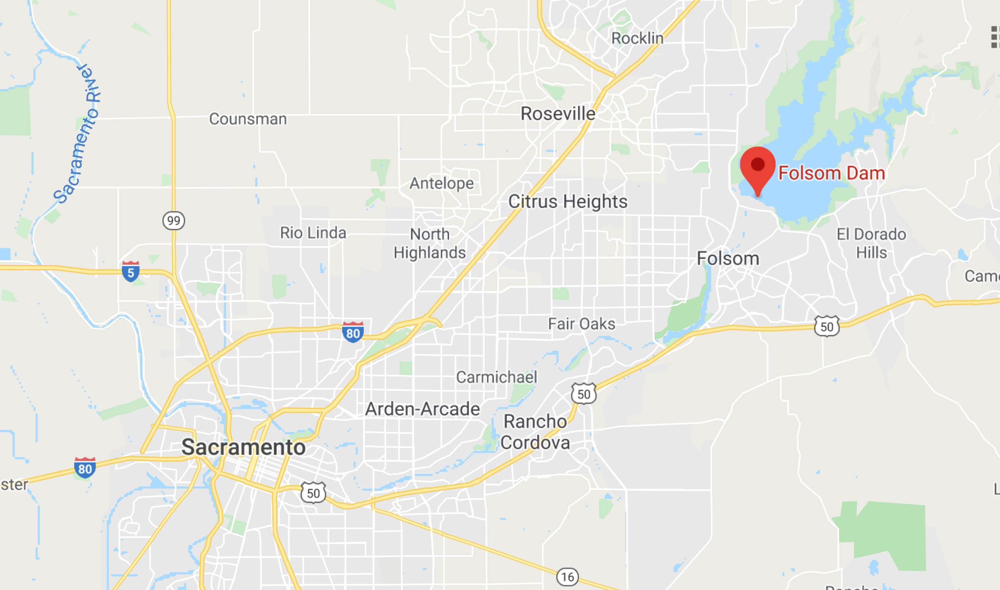
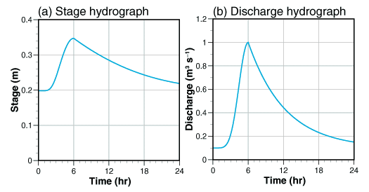
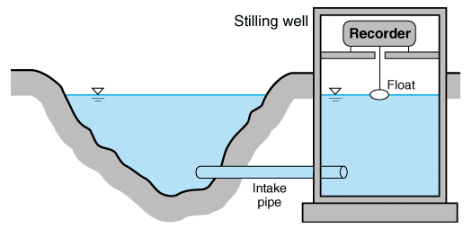
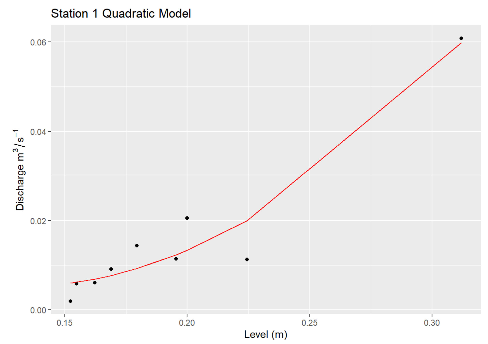
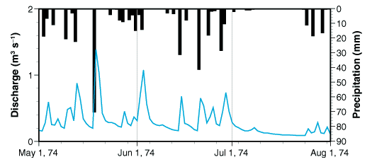
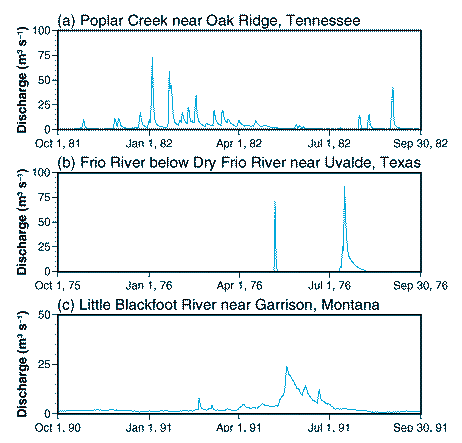
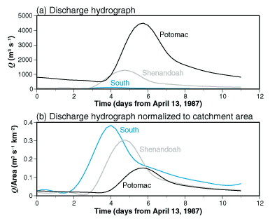
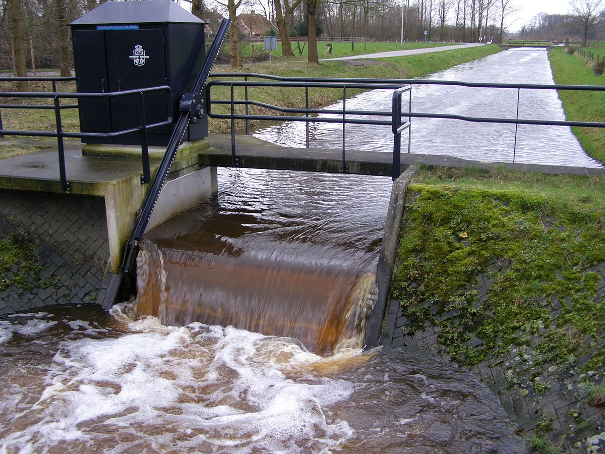
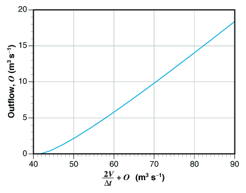

```{r setup, include=FALSE}
knitr::opts_chunk$set(echo = TRUE)
```

.center[

## Introduction to Watershed Analysis

### Geography - 441

<br><br>

.mb[**Streams and Floods**]

<br><br><br>

Andrew Murray | University of North Carolina - Chapel Hill

March 25, 2020
]

---
.center[
## Folsom Dam
]

.pull-left[
[VIDEO](https://www.kcra.com/article/5-things-to-know-about-folsom-dam-raise-project/30617937)

```{r folsom, echo=FALSE, out.width='100%'}

```
]

.pull-right[
.med[
- Basin area = ~5,000 km<sup>2</sup>

- Built in 1948 to prevent a 500 year flood

- Two major floods in 1955 and 1986 led to a reevaluation
  - Turns out it only prevented a 70 year flood!
  
- Multiple construction projects to expand protections since.
]]

???

The American River flows through Sacramento where more than one million people live. The functions of dams are many. Mainly they are there to provide water to a region in times of drought and protect downstream areas from flooding. 

---

## Hydrographs
.pull-left[
.med[
**Stage Hydrograph:** The actual height of the water from the reference point

**Discharge Hydrograph:** The volume of water passing the reference point per unit time
]

]

.pull-right[
.med[
We create discharge hydrographs by taking a lot of measurements at know river stages:
]

<blockquote class="twitter-tweet"><p lang="en" dir="ltr">Field discharge measurement at Big Spring, White County, Tennessee -155 cubic feet per second. Measuring with the <a href="https://twitter.com/SonTekYSI?ref_src=twsrc%5Etfw">@SonTekYSI</a> FlowTracker 2. <a href="https://t.co/EhQ79cYBSE">pic.twitter.com/EhQ79cYBSE</a></p>&mdash; Karst Springs (@KarstSprings) <a href="https://twitter.com/KarstSprings/status/861666455317774336?ref_src=twsrc%5Etfw">May 8, 2017</a></blockquote> <script async src="https://platform.twitter.com/widgets.js" charset="utf-8"></script>

[Data from a Hurricane](https://waterdata.usgs.gov/nc/nwis/dv?cb_00045=on&cb_00060=on&cb_00065=on&format=gif_stats&site_no=02105769&referred_module=sw&period=&begin_date=2018-09-01&end_date=2018-10-31)

- Why does discharge appear more 'flashy' than stage?

]

???
You'll notice that discharge is much more 'flashy'. flashiness is a term hydrologists often use to describe how quickly quantities rise and fall. 

Why would discharge 'seem' to decrease faster than stage?

---
.center[
## Measuring Discharge
]

.pull-left[


**Figure 5.2** Schematic diagram of a stream gauging station used to record flow depth (stage) as a function of time. The resulting stage hydrograph can be converted to a discharge hydrograph using a rating curve.
]
.pull-right[

**A Rating Curve** shows actual discharge measurements that were taken in the field. Once you take a discharge measurement, you compare it to the stage of the river at the time you took the measurement. This requires a river gauge. You then fit a line to estimate the 'rating curve'.
]

???

So the plot on the right shows points which represent the measurements of discharge physically taken by a person in the field. The x-axis shows the stage of the river, and the y-axis shows the measured discharge. The more points we are able to add to this plot the more accurate our rating curve will be. This is especially important at low and high stage. What do you think the relationship between level and discharge is? Is it linear? or is it exponential? Why?

What do you think the purpose of the stilling well is?

Going back to the hurricane hydrograph, discharge becomes uncertain once the river overflows it's banks, for the same reason that the relationship between stage and discharge is exponential. This becomes even more true as water moves into the flood plane.

---

.pull-left[
##Relation and Variation
.center[
.mb[Hyetograph vs. Hydrograph]
]


**Figure 5.4** Hyetograph (*black bars, scale at right*) and hydrograph (*blue line, scale at left*) for Holiday Creek near Andersonville, Virginia.
]
.pull-right[


**Figure 5.5** Annual hydrographs for three rivers in catchments in three climate zones illustrating the differences among stream flow in perennial (a), ephemeral (b), and snow melt (c) streams.
]

???

On the left you can see the relationship between precipitation and discharge. Is there a direct relationship between precipitation and discharge? There are other factors like evapotranspiration. You might see less discharge late in the summer caused by the same amount of rainfall because of the increase in vegetation.

On the right, we see three different examples of hydrographs for different climate zones. This is a bit confusing, notice the x-axis starts at October 1 instead of January 1, so the spring snow melt appears over towards the right.

What this really all comes down to is why we study these things. There are so many variables that contribute to the response of rivers and streams to precipitation that it is very difficult to predict exactly what is going to happen. Herein lies the reasons for why hydrologists do what they do. We are trying to understand all of the different things that go into these relationships so that we CAN know in the future, but there is still uncertainty and things change. land use changes, seasons change, management changes...

---
.left-column[
.mb[Discharge Moving through a watershed]
.med[
- The top plot shows unaltered data

- The bottom plot shows normalized data

- Why does normalized discharge decrease between nested catchments?
]
]
.right-column[
.center[
```{r nested, echo=FALSE, out.width='75%'}

```
]
**Figure 5.6** Hydrographs for three nested basins. Discharge increases downstream in the stream network due to increased drainage area (*a*). Dividing discharge by catchment area (*b*) reveals both attenuation and delay of the flood wave as it moves downstream.

]
---
## A Step Farther...

.med[
So... if we can see that hydrographs decrease (or attenuate) per unit of drainage area as we move downwards through the watershed, what can we deduce from this relationship...?
]

--

.mb[
- The change in hydrographs reflects the change in storage for a given length of stream.
]

.med[
We can use the continuity equation for unsteady flow:

$\frac{dV}{dt}=I-O$

*I* is the upstream inflow, and *O* is the downstream outflow. $dV$ is the change in volume and $dt$ is the change in time
- So this requires two hydrographs!
]

???

It isn't quite that simple as this is just a statement on the conservation of mass. We need to also consider the conservation of momentum which requires a second equation. For rivers, this get's really tricky as we need to account for river bed roughness and resistance etc... It is a little bit simpler for reservoirs with a dam, so let's focus on that for now.
---
## Flood Routing 
.pull-left[
Discharge is a function of volume, which makes this a differential equation. To estimate volume changes, we transform the differential equation into a couple of simpler algebraic equations which are more easily solved.

We re-write the continuity equation for unsteady flow as:

$\frac{V_{n+1}-V_{n}}{\Delta t}=\frac{I_{n}+I_{n+1}}{2}-\frac{O_{n}+O_{n+1}}{2}$

In this scenario, we know the current volume of the reservoir, the current outflow of the reservoir, and the inflow hydrograph, so we re-write this as:

$\frac{2V_{n+1}}{\Delta t}+O_{n+1}=I_{n}+I_{n+1}+\frac{2V_{n}}{\Delta t}-O_{n}$

Now we have the unknowns on the left and the knowns on the right.

]

.pull-right[

]

???
So in this case we have the inflow into a reservoir and want to estimate the volume and outflow. So here we cover the conservation of mass, but we need a separate equation to parse out Volume from Outflow. 

---
### Reservoir Routing
.med[
In a simple reservoir with a dam, there is a fixed relationship between the depth of water above the weir( $h_{weir}$ ) and the discharge over it. Discharge in this scenario is given by the equation:

$Q=C_{q}\sqrt{2g}h_{weir}^{3/2}w_{c}$

Where $w_{c}$ is the width of the weir crest and $C_{q}$ is an empirical coefficient. A value of 0.5 for $C_{q}$ is typical for a dam spillway. 

Outflow can then be expressed as:

$O=2.2h_{weir}^{3/2}w_{c}$

O is outflow in $m^{3}s^{-1}$ and both $h_{weir}$ and $w{c}$ are expressed in meters so this shows a relationship between height and discharge
]
---
.center[
### Reservoir Routing (An example)
]

.left-column[**Table 5.2** Inflow hydrograph for reservoir routing example
```{r table52, echo=FALSE}
df1 <- data.frame("Time"=c(0,0.25,0.5,0.75,1,1.25,1.5,1.75,2,2.25,2.5,2.75,3,3.25,3.5,3.75),
                  "Inflow"=c(.7,.9,2,5,9,6.7,5,3.8,2.8,2.3,1.8,1.5,1.2,1,0.85,0.7))
df1
```

(Time is in days and inflow is in m<sup>3</sup>s<sup>-1</sup>)
]
.right-column[
.center[
```{r df51, echo=FALSE, out.width='40%'}
library(ggplot2)
df <- data.frame("Depth"=seq(10.1,12.8,.3),"Volume"=c(3690000,3980000,4300000,4610000,4930000,5270000,5600000,5950000,6290000,6640000))
ggplot(df)+
  geom_line(aes(x=Volume,y=Depth))+
  geom_point(aes(x=Volume,y=Depth))+
  labs(title = "Reservoir Capacity",x = expression(paste("Reservoir Volume ", m^{3})),
       y = "Reservoir Depth (m)")
```
]
**Spillway height=** 10.1m

$h_{weir}$=0.0m **(Initially)** and corresponds to a reservoir volume ( $V_{1}$ ) = $3.7x10^{6} m^{3}$ and initial outflow ( $O_{1}$ ) = $0.0m^{3}s^{-1}$

]

???

Here, we're using an example problem from Hornberger. The table on the left is a duplication of Figure 5.8 on page 128 but with a different scale and the table is a duplication of table 5.2 on page 129. The table is actually a hydrograph shown in data table form. The time step for this hydrograph is 6 hours, so we have 4 measurements per day over about 4 days. The plot shows the relationship between reservoir depth and reservoir volume.

So based on the values here, we are looking at a period where the water is right at the top of the spillway and about to go over it, and we want to see what happens while the water rises and falls until it returns to the top of the spillway.
---
.mb[
Here, we can duplicate table 5.3 from the book to help solve our equations:
]

|Step n| Time $t_{n}$<br>(days)| $I_{n}$| $I_{n}+I_{n+1}$ | $\frac{2V_{n}}{\Delta t}-O_{n}$| $\frac{2V_{n+1}}{\Delta t}+O_{n+1}$| $O_{n+1}$| $t_{n+1}$|
|-----|-----|:---:|:-----:|:-----:|:-----:|:-----:|:-----:|
|||A|B|C|D|E|
|1|0.00|0.70|1.60|**342.6**|**344.2**|**0.06**|0.25|
|2|0.25|0.90|2.90|**344.1**|347.0|0.60|0.50|
|3|0.50|2.00|7.00|345.8|352.8|1.79|0.75|
|...|...|...|...|...|...|...|...|

So back to our first equation:

$\frac{2V_{n+1}}{\Delta t}+O_{n+1}=I_{n}+I_{n+1}+\frac{2V_{n}}{\Delta t}-O_{n}$

This can be simplified using the table by simply converting it to:
$D=B+C$
---
.mb[Okay...]
.pull-left[
.med[
So we have done the first part, but now we need to separate out $V_{2}$ from $O_{2}$

We can use equation 5.4 for this... 

We convert the values of h to corresponding values of O with:

$h_{weir}=h-h_{spillway}$

then:

$O=2.2h_{weir}^{3/2}w_{c}$
]]
.pull-right[

]