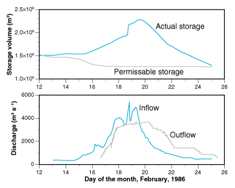

```{r setup, include=FALSE}
knitr::opts_chunk$set(echo = TRUE)
```

.center[

## Introduction to Watershed Analysis

### Geography - 441

<br><br>

.mb[**Streams and Floods (Part II)**]

<br><br><br>

Andrew Murray | University of North Carolina - Chapel Hill

April 6, 2020
]

---
background-image: url(NewHopeCreek.jpg)
background-size: 'cover'
.bigwhite[**Flood Routing in Rivers**]

???

So far we've discussed flood routing in reservoirs. Understanding changes in volume and outflow is a bit simpler in a reservoir as you have a uniform outlet and also a set storage space where there has (likely) been a bathymetric survey completed already so you can readily relate volume to a gauge height. Understanding flood routing through a river system is a bit more complex as it requires tracking peak discharge as it moves through a reach or river system and relating the changes observed over time. Not to mention, there are other factors such as contributing flow between stream gauges and infiltration.

Here, you can see a picture of the New Hope Creek, which is just west of Chapel Hill. I took this photo a couple of weeks ago. Notice the main channel of the reach to the left hand side of the photo. There is a small channel flowing from the bottom of the photo which connects to this small pond in the center-right. You can imagine that if a storm event occurred, and the water level rose, there would be additional storage in this pond. As the water starts to rise, this pond area stores more and more water, keeping it from flowing downstream, but only to a point. At some point, if the water rises high enough, an outlet will form and serve as an outflow from this pond, back into the main river channel. So here we have one specific tiny pond that will store water to a point and then become part of the main channel, simply allowing passage downstream. Now imagine how many of these small ponds and channels exist throughout this channel system and it is easy to imagine how flood outing can quickly become a very complex problem to solve.

---
### The Muskingum Method

.med[
To solve this problem, we use what is called the *Muskingum Method*.

$V=K_{t}[xI+(1-x)O]$

- $K_{t}$ is a travel time constant that weights the contributions of inflow and outflow on storage in the reach.

Basically here we are relating volume, and attenuation of the flood wave (the weakening of the flood wave)

An example:
  - The best values for $K_{t}$ and $x$ for a specific reach are obtained from inflow and outflow hydrographs.
  - Calculating the specific values for a reach is beyond the scope of this class so we use basic parameters

$x=0.2$

$K_{t}=\frac{L}{U}$ (L =length of the reach, U is velocity)
]

???
We use the muskingum method here, which related inflow, outflow and volume and we are going to sub in some basic values for x and k because getting at these specific values is beyond the scope of this course. As you might image, the values should be dynamic based on changes in storage at different discharge amounts. 

---
## Flood routing through a river

.med[
We take the muskingum method and essentially plug it into equation 5.3 which we used for the reservoir routing example which gives us:

$O_{n+1}=C_{0}I_{n+1}+C_{1}I{n}+C_{2}O{n}$

where:

$C_{0}=(-K_{t}x+0.5\Delta t)/(K_{t}-K_{t}x+0.5\Delta t)$

$C_{0}=(K_{t}x+0.5\Delta t)/(K_{t}-K_{t}x+0.5\Delta t)$

$C_{0}=(K_{t}-K_{t}x-0.5\Delta t)/(K_{t}-K_{t}x+0.5\Delta t)$
]

---
.med[
Again, we have the inflow hydrograph:
```{r}
df <- data.frame('time' = c(0,0.25,0.5,0.75,1,1.25,1.5,1.75,2,2.25,2.5,2.75,3,3.25,3.5,3.75),
'Q' = c(.7,.9,2,5,9,6.7,5,3.8,2.8,2.3,1.8,1.5,1.2,1,0.85,0.7))
```


Iterate through the rows for 6-hour time step:
```{r}
outDf <- data.frame()
t <- 6
k <- 6
x <- .2
O <- 0
for(n in 1:nrow(df)){
  row <- df[n,]
  nextrow <- df[n+1,]
  c0 <- ((-k*x)+(.5*t))/(k-(k*x)+(.5*t))
  c1 <- (k*x+.5*t)/(k-k*x+.5*t)
  c2 <- 1-(c0+c1)
  #c2 <-(k-(k*x)+.5*t)/(k-(k*x)+.5*t)
  O <- c0*nextrow$Q+c1*row$Q+c2*O
  outDf <- rbind(outDf,data.frame('time' = row$time,'Qin'=row$Q,
                                  'Qout6'=O,'C0'=c0,'C1'=c1,'C2'=c2,'timeOut'=row$time+.25))
}
```

]

???
---
# Again for a 12 hour prediction:

```{r}
outDf12 <- data.frame()
t <- 12
k <- 12
x <- .2
O <- 0
for(n in 1:nrow(df)){
  row <- df[n,]
  nextrow <- df[n+2,]
  c0 <- ((-k*x)+(.5*t))/(k-(k*x)+(.5*t))
  c1 <- (k*x+.5*t)/(k-k*x+.5*t)
  c2 <- 1-(c0+c1)
  #c2 <-(k-(k*x)+.5*t)/(k-(k*x)+.5*t)
  O <- c0*nextrow$Q+c1*row$Q+c2*O
  outDf12 <- rbind(outDf12,data.frame('time' = row$time,'Qin'=row$Q,
                                  'Qout12'=O,'C0'=c0,'C1'=c1,'C2'=c2,'timeOut'=row$time+.5))
}
```


---
.pull-left[
### Estimates:

```{r echo=FALSE, warning=FALSE}
library(ggplot2)
ggplot(outDf)+
  geom_line(aes(x=time,y=Qin),col='red')+
  geom_line(aes(x=timeOut, y=Qout6),col='blue')+
  geom_line(data = outDf12,aes(x=timeOut, y=Qout12))
```
]
.pull-right[
.med[

### The result:

So now we can see that it is possible to estimate the impact of inflow on outflow at a time in the future...

This is important because:

- We need to be able to plan for flooding events
  - This is especially true now:
    - Highly populated areas along rivers
    - Agriculture and food security
    - Dynamic levees and protection planning.
]
]

---
background-image: url(cincinnati97.png)
.bigwhite[Real World Examples:]

---
background-image: url(levee.jfif)
background-size: cover

???
Here is picture from the inside of the levee in Newport Kentucky. Notice the structural cracking.

It is really important for cities to understand when to prepare for an impending flood.

---
### Lake Dunlap
- Catastrophic Dam Failure


<iframe width="560" height="315" src="https://www.youtube.com/embed/ztXVshOW61o" frameborder="0" allow="accelerometer; autoplay; encrypted-media; gyroscope; picture-in-picture" allowfullscreen></iframe>

---
### Reservoir
```{r echo=FALSE}
time <- c(0,0.25,0.5,0.75,1,1.25,1.5,1.75,2,2.25,2.5,2.75,3,3.25,3.5,3.75)
A <- c(.7,.9,2,5,9,6.7,5,3.8,2.8,2.3,1.8,1.5,1.2,1,0.85,0.7)
B <- list()
for(n in 1:length(A)){
  a1 <- A[n]
  a2 <- A[n+1]
  b <- a1+a2
  B <- append(B,b)
}
C <- c((2*3700000)/(.25*24*60*60))
#C[1]
D <- list() # Create an empty list called D
D[1] <- as.numeric(B[1])+as.numeric(C[1]) # Add B1 and C1 together and assign to D1
O <- 2.2*(1.22^(3/2))*20
#O
D122 <- ((2*4930000)/(.25*24*60*60))+O
#D122
table5_1 <- data.frame("h" = c(10.1,10.4,10.7,11,11.3,11.6,11.9,12.2,12.5,12.8),
                       "Vol" = c(3690000,3980000,4300000,4610000,4930000,5270000,5600000,5950000,6290000,6640000))
table5_1$hweir <- table5_1$h-10.1
table5_1$O <- 2.2*(table5_1$hweir^(3/2))*20
table5_1$D <- ((2*table5_1$Vol)/(.25*24*60*60))+table5_1$O
E <- list()
E[1] <- (-2.64*10^(-6))*as.numeric(D[1])^(3)+.00408*as.numeric(D[1])^(2)-1.68*as.numeric(D[1])+202.6
#E[1]
table <- as.data.frame(time)
table$A <- A
table$B <- as.numeric(B)
C <- 342.6
tableComplete <- data.frame()
for(n in 1:nrow(table)){
  row <- table[n,]
  D <- row$B+C
  E <- (-2.64*10^(-6))*as.numeric(D)^(3)+.00408*as.numeric(D)^(2)-1.68*as.numeric(D)+202.6
  newRow <- data.frame("time"=row$time,"A"=row$A,"B"=row$B,"C"=C,"D"=D,"E"=E)
  tableComplete <- rbind(tableComplete,newRow)
  C <- D - 2*E
}
```

```{r echo=FALSE}
ggplot(tableComplete)+
  geom_line(aes(x=time,y=A))+
  geom_line(aes(x=time+.25,y=E),col='red')
```
---
## 'Flattening the curve'
.pull-left[

]
.pull-right[
.big[Often Connected:]
.mb[
- Proper reservoir management can protect from loss of life by controlling flood waves
- Accurate planning can give early warning to major flood events
]
]