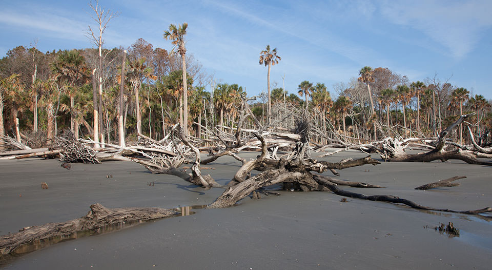
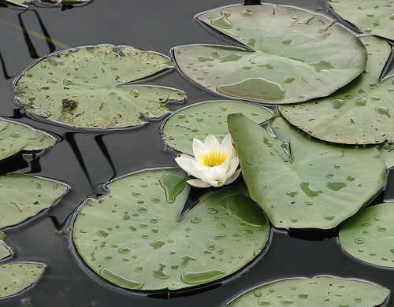
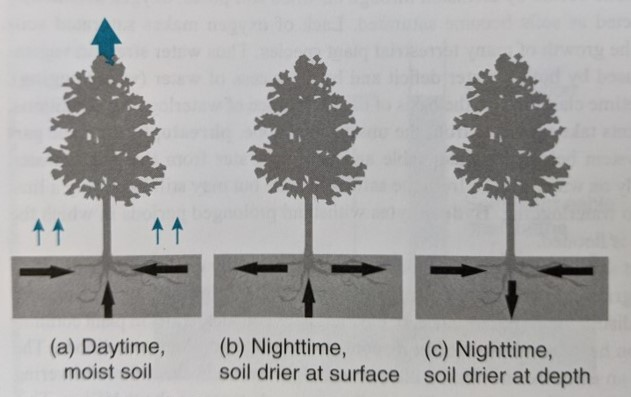
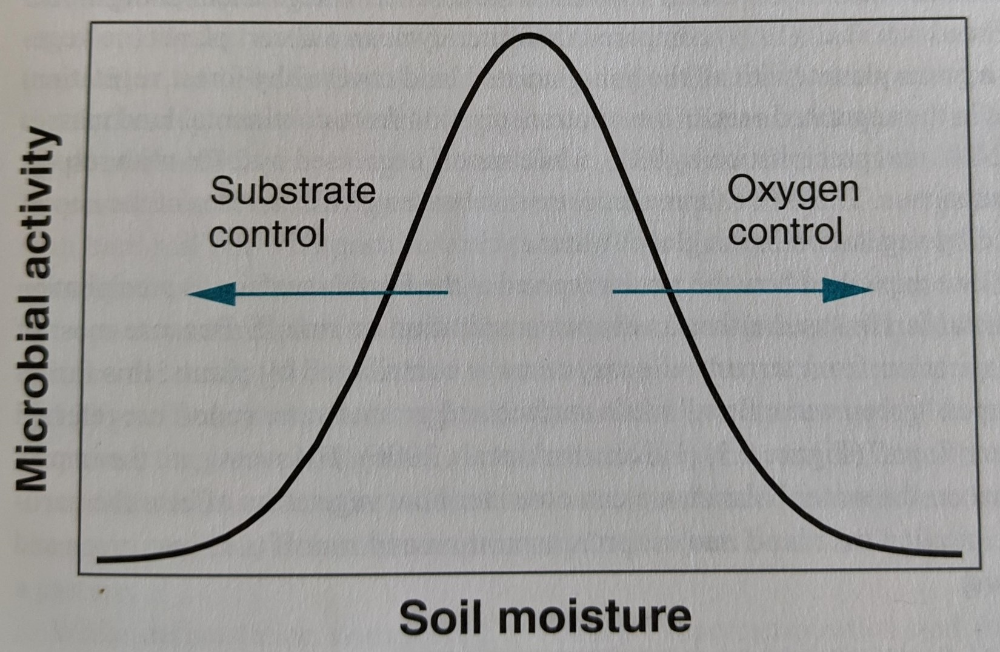
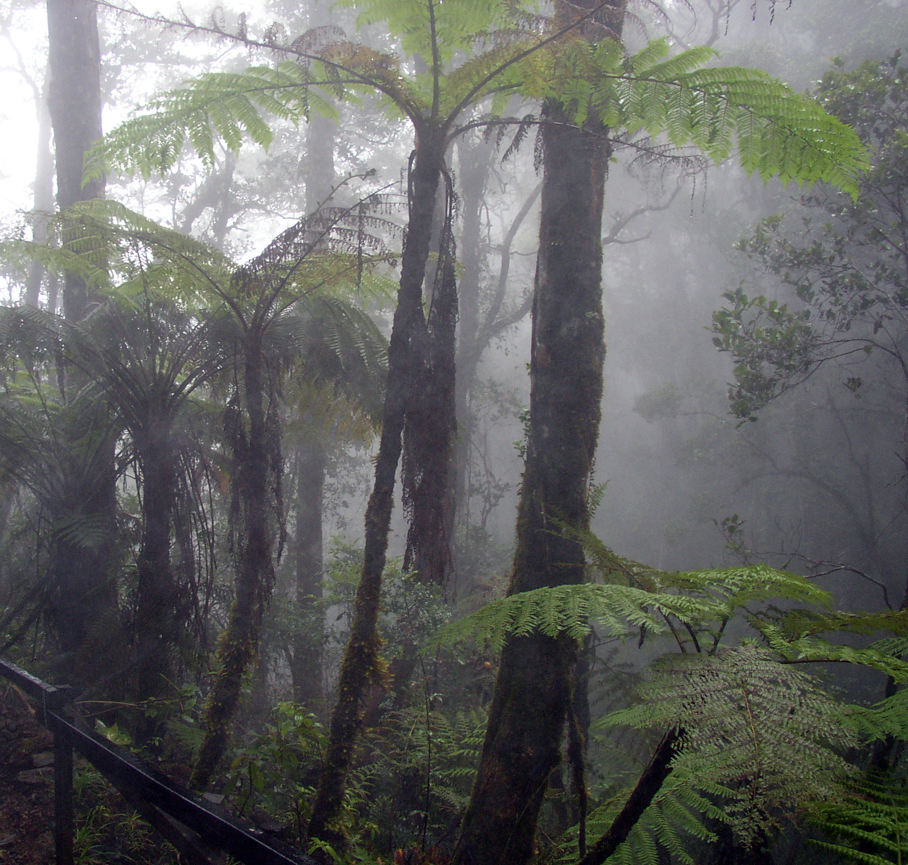
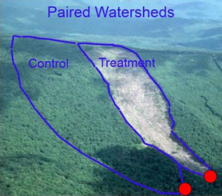

```{r setup, include=FALSE}
knitr::opts_chunk$set(echo = TRUE)
```

## Introduction to Watershed Hydrology
### Geog-441

### Lecture 8: Ecohydrology
#### Interactions Between Hydrological Processes and the Biota

Material:
- Hornberger Chapter 9

<br><br><br> .center[**February 17, 2020**]

---

##Amount of Water Controls Biota

$Ecology + Hydrology = Ecohydrology$

.med[**Ecology:** The branch of biology that deals with the relations of organisms to one another and to their physical surroundings.

**Hydrology:** The branch of science concerned with the properties of the earth's water, and especially its movement in relation to land.

SOOOO....

.center[.big[**Ecohydrologists investigate:**]

 The effects of water on plants

&

 The effects of plants on water]
]
---

###.center[ Hydrologic Controls on Plants and Soil Microorganisms]

How does water flow through a plant? [Video](https://www.youtube.com/watch?v=CmBDVIUB19g)

Key Terms:

- **Xylem:** Capillary tubes within the plant<br><br>
- **Stomata:** Tiny pores in the leaves of vascular plants by which gases (including $CO_{2}$, $O$ and $H_{2}O$) are exchanged with the atmosphere.
- **Osmosis:** The transport of water molecules through semipermeable membranes from lower to higher solute concentrations.
- **Xylem water potential:** The sum of the elevation head + capillary pressure head + osmotic potential

- **Osmotic Potential:** = zero in pure water / negative in the prescence of solutes (decreases with increasing solutions)

- .red[ In a steady flow, the rate of uptake = the transpiation rate]

- Plants regulate the opening of the stomata to control rates of transpiration and carbon assimilation (phtosynthesis)

.med[<br>The water and carbon cycles are strongly coupled through stomatal physiology (how stomata work)

- As Hydroligists, we consider water transport in soil, roots and xylem to be laminar
]

???

So what this means is that we assume the poors and pathways are so small, that forces are driven by hydraulic head / water potential.

Therefore, the flow rate is proportional to the hydraulic head, and we don't consider the width of these pathways, because how could we?
---
### .center[Capillary Pressure Head:]
- .med[Decreases with:
  - Increasing plant height
  - Increasing transpiration rate
  - Increasing osmotic potential

This is important because:
  - Water potential of intracellular water is in equilibrium with the xylem.
  - less pressure head means less water in the cells
  - less water in the cells means less stiffness in the plant
  - less stiffness in the plant means wilting
  
  Also...
  
  **Cavitation:** The formation of air bubbles in the xylem which leads to hydraulic failure
]

???
- This all ties into pressure head. lower pressure head means less water
- The existence of air bubbles within the xylem can lead to failure, just like you don't want air bubbles in your blood stream can cause a heart attack / or respiratory failure.
- Cavitation leads to the decrease in conductivity

---
### Plants may try to 'adjust' using:
.pull-left[
.med[**Osmotic Compensation** where plants change solute concentrations in the xylem water to create a higher gradient in osmotic pressure<br><br>

OR<br><br>

Plants may adjust the transpiration rate

Remember that as soil dries, the pressure head becomes lower, meaning it is harder to create an 'energy gradient' to get water to flow into root systems.

[Resource: U.S. Drought Monitor](https://droughtmonitor.unl.edu/)
]]

.pull-right[

.med[**Permanent wilting point:** The point of no return, when transpiration at the soil level reaches zero
]]
???
- Thinking back to the video we watched Friday, this gives us an example of when transpiration may not equal uptake... when plants are under stress.

- So what happens is when the soil dries, a plant will try to use osmotic compensation up to a point, but if the flow of water eally becomes tough, it will close the stomata to restrict transpiration.

- If a plant does this, then it also is restricting photosynthesis because $CO_{2}$ also uses the stomata as it's pathway into the plant.
---
### .center[There are two main categories of plants<br> based on how they deal with stress]

.pull-left[
.big[Isohydric Plants]

.med[Close the stomata and reduce photosynthesis as the soil becomes drier (More likely to starve)]
]

.pull-right[
.big[Anisohydric Plants]

Keep the stomata open to maintain higher rates of photosynthesis (More likely to suffer hydraulic failure)
]

???
These two strategies used by plants can have efects on survival, Do I starve or do I suffocate?

---
### .center[So Based on What We Know...]
<br>
.pull-left[

]

.pull-right[

]

.center[.big[Why does salt kill plants?]]

???

Adding salt creates a high osmotic gradient away from plants.

---

## .center[Waterlogging]

.big[Just as plants can die from drought, they can also<br> die from too much water.]

.pull-left[

]

.pull-right[
**Water Tolerance** refers to a plants ability to *tolerate* excess water.

**Phreatophytes** place part of their root system below the water table but may still have limited water tolerance

**Hydrophytes** can withstand long periods of time with the ground surface flooded.

.med[Spatial distributions of plants can often be explained by flooding sensitivity, especially in coastal areas.
]]
???
This can affect the landscapes ability to handle extreme precipitation

---
## .center[Hydraulic Redistribution]
.left-column[
.small[Water is redistributed based on time of day and recent weather

During a summer day with clear skies for example, you would see higher rates of evapotranspiration lead to **hydraulic lift**

Root systems also offer preferential pathways because they have higher conductiivty than dry soil.

**Hydraulic descent** on the other hand, can occur when deeper soil is sufficiently dry and a rain event occurs.
]]

.right-column[

]
???
Deep rooted lpants transport water downward via the root systems out of the reach of shallow plants 

---

### .center[Soil Moisture Controls Microbial Activity]

.pull-left[
.med[- When soil moisture is low, microbial activity declines because carbon and nutrients, which are transported by water, become unavailable

- Conversely, when soil is saturated oxygen becomes unavailable and the activity of aerobic communities declines.]
]

.pull-right[

]
???
- Decomposition of organic matter is performed by aerobic microorganisms
- This leads to the production of $CO_{2}$
- Waterlogging inhibits decomposition and organic matter accumulates
---
background-image: url(peatland.jpg)
background-size: cover

##Peatlands of the Ecuadorian Paramo

---
###The link Between Evapotranspiration and Vegetation

.med["Evapotranspiration from a vegetated landscape occurs at a faster rate than evaporation from bare soil."

- When vegetation is removed, green water flows decrease and runoff increases

**Green water flow:** water contributed to evapotranspiration from plants

**Blue Water Flow:** water contributed to runoff from the surface and groundwater

- [Deforestation](https://www.youtube.com/watch?v=Ic-J6hcSKa8) is a major contribtor to land cover change
]

--

.big[Where do we fit into this conversation?]

--

.med[Deforestation is altering the water cycle in ways that **decrease available freshwater** for the purpose of converting forests to land that **use more water**]

???
Of course irrigaation can reverse this and reduce blue water flows as well.

---
background-image: url(dryRiver.jpg)
background-size: cover

## Some Rivers Run Dry...

### [Colorado River](https://www.youtube.com/watch?v=SHkBAKLFZcs)

### [Rio Grande](https://www.youtube.com/watch?v=BoaUrtJq4uM)

---

## Impact of Vegetation on Infiltration and Runoff

.big[Forests are better for infiltration and groundwater recharge]
.pull-left[
.med[
- Soils transport more water more deeply via tree and plant root systems<br><br>
- Canopy cover protects the soil surface from rainsplash compaction <br><br>
- **Paired Watershed** experiments compare neighboring watersheds with similar features but differing vegetation
]]
.pull-right[

]
---
### Impact of Vegetation on Precipitation
.pull-left[
.med[
- Very hard to quantify because direct evidence is not available.

- Researchers use model based simulations to estimate these effects

- Most agree that:
  - regional-scale deforestation will cause decreases in both regional evapotranspiration and regional precipitation
  
**Occult Precipitation:** Water condensing directly onto tree canopy, which then drops to the ground. 
  - This obviously would not be possible without vegetation.
]]
.pull-right[

]
---
<br><br><br>
.center[
]