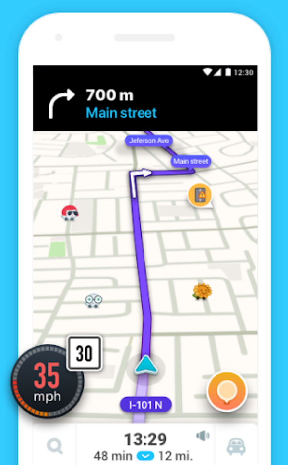
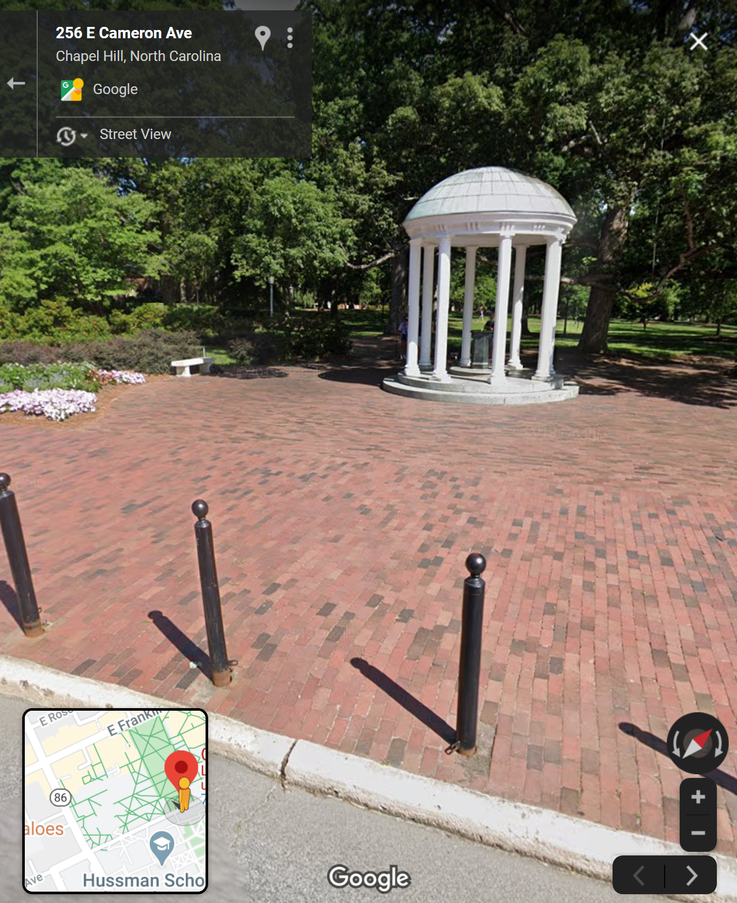
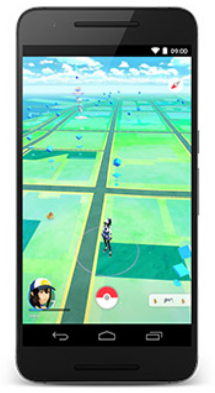
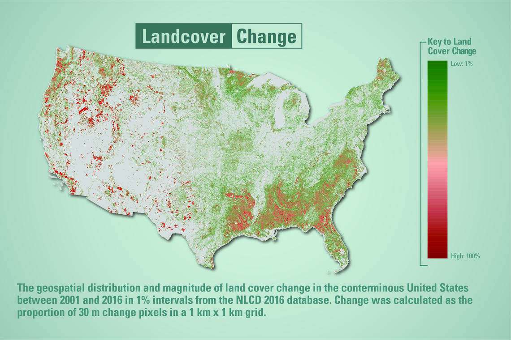
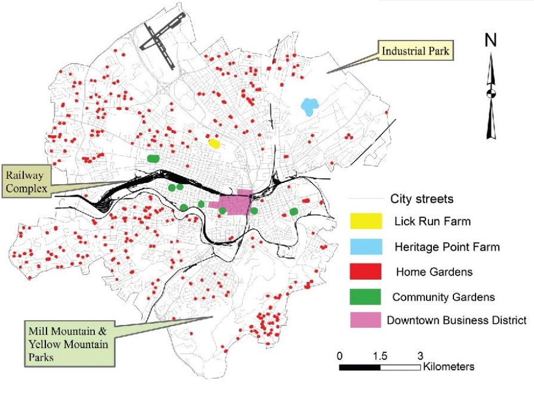

```{r setup, include=FALSE}
knitr::opts_chunk$set(echo = TRUE)
```

.center[

## Introduction to Geographic Information

### Geography - 370

<br><br>

.mb[**Welcome to the class!**]

<br><br><br>

Andrew Murray | University of North Carolina - Chapel Hill

March 25, 2020
]

---
.pull-left[
<video width="100%" height="100%" controls id="my_video">
    <source src="/mp4/Day_01_intro.mp4" type="video/mp4" preload>
</video>

Andrew Murray
PhD Candidate (Geography)
]

.pull-right[
## Welcome to Geography 370

Move through the slides at your own pace and I will provide commentary along the way.

- These slides are in a format called 'xaringan' and use the following [keyboard shortcuts](https://bookdown.org/yihui/rmarkdown/xaringan-key.html):

- Press 'f' to toggle fullscreen

- type a number + 'enter' to go to that slide

- press 'home' to return to the first slide

- press 'p' to access the text for the slide audio (useful for those who cannot use audio or need a an audio aid)

]
---

### Todays Roadmap

- Course Content & Goals
- Course Syllabus
- Software Introduction

<audio controls>
  <source src="/slides/intro_geographic_information/Day01/audio/slide_02.mp4" type="audio/mpeg">
  <track kind="captions" label="English SubTitles" src="/slides/intro_geographic_information/Day01/audio/slide02.srt" srclang="en" />
</audio>

???
Today we are simply going to talk about what you can expect to learn throughout this course and how we are going to learn it. I'm going to introduce some basic concepts to you and we will talk about the syllabus, and the materials (both reading and software).

---
<br><br><br>
##.center[What is Geographic Information?]

---

## .center[Important Questions for Class]
<br>
.mb[
- What do we mean by “geographic information”?

- What do we do with this geographic information?

- How do we represent geographic information digitally, not as traditional analog maps?

- How can we be sure that geographic information we create or use is of good quality?
]

???

---

## .center[What do you think of when you think about geographic information?]

.center[
<iframe src="https://docs.google.com/forms/d/e/1FAIpQLScfdKzsrqOKtXRCBaSKPOA5xN-axPJCs55zF4ahWTQyvxWWFg/viewform?embedded=true" width="640" height="450" frameborder="0" marginheight="0" marginwidth="0">Loading…</iframe>
]

---
.pull-left[
```{r echo=FALSE, out.height= 600, out.width= 400}

```
]

.pull-right[
```{r echo=FALSE, out.height= 600, out.width= 400}

```
]

???
Selecting a restaurant or finding a gas station. It helps us finding things in places we are not familiar. It helps us navigate and feel safe that we will get to our destination even if we take a detour.  It helps us finding so many important things such as….
---

.pull-right[
```{r echo=FALSE, out.height= 600, out.width= 350}

```
]

---
.center[
 Environmental Research
<div class="clear:both:margin-top:20px;margin-bottom:20px;float:left;width:100%;"><a href="http://visualoop.com/infographics/tracking-trouble-in-the-arctic"></a></div>
]

---

.center[
```{r echo=FALSE, out.height= 600, out.width= 900}

```
]

???

---

```{r echo=FALSE, out.height= 400, out.width= 450}

```
