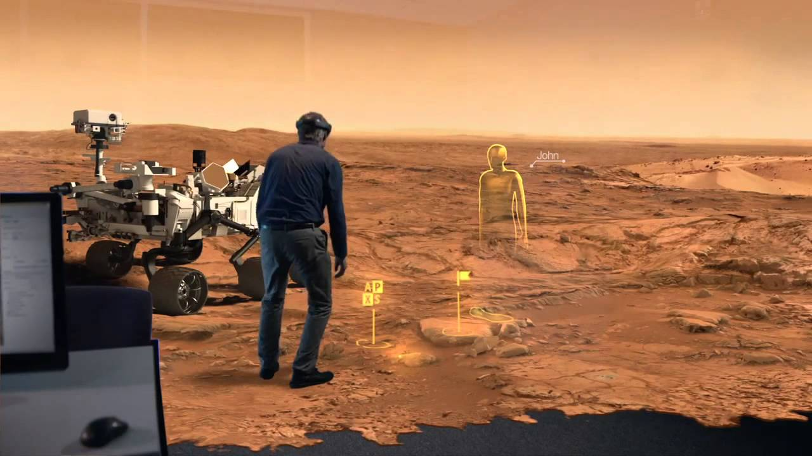
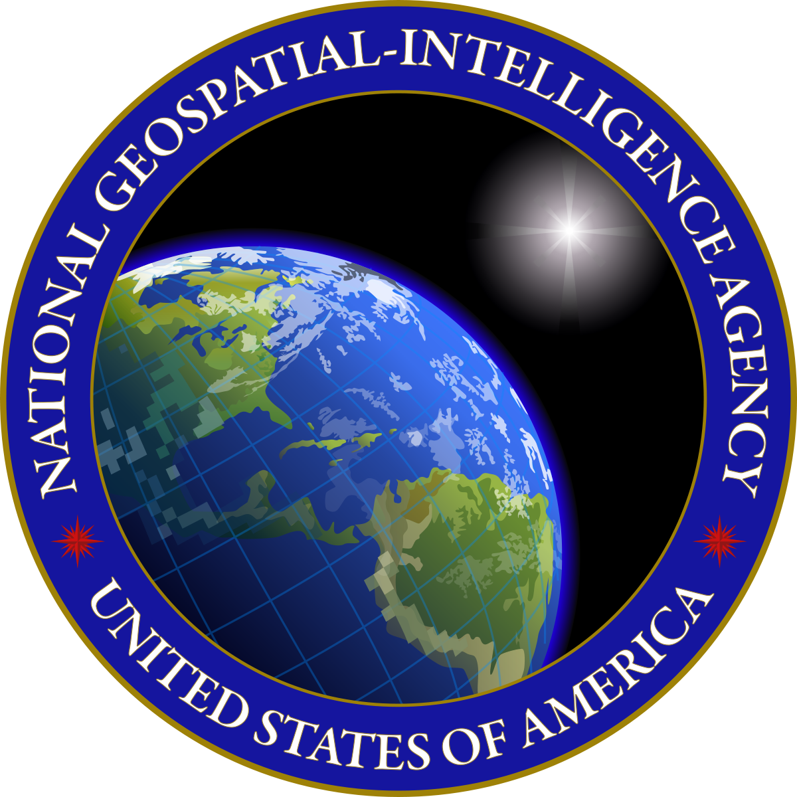
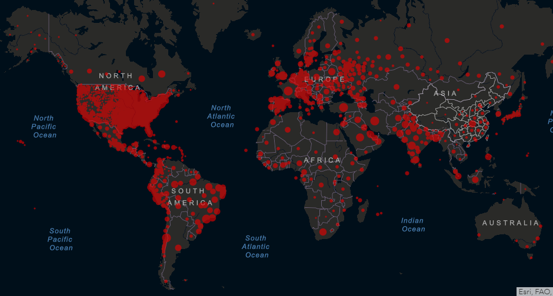
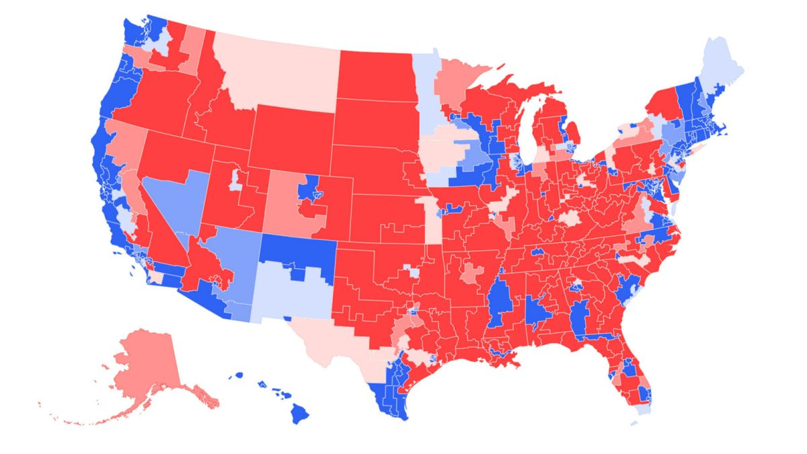

```{r setup, include=FALSE}
knitr::opts_chunk$set(echo = TRUE)
```

.center[

## Introduction to Geographic Information

### Geography - 370

<br><br>

.mb[**Welcome to the class!**]

<br><br><br>

Andrew Murray | University of North Carolina - Chapel Hill

March 25, 2020
]

---
.pull-left[
<video width="100%" height="100%" controls id="my_video">
    <source src="/mp4/Day_01_intro.mp4" type="video/mp4" preload>
</video>

Andrew Murray
PhD Candidate (Geography)
]

.pull-right[
## Welcome to Geography 370

Move through the slides at your own pace and I will provide commentary along the way.

- These slides are in a format called 'xaringan' and use the following [keyboard shortcuts](https://bookdown.org/yihui/rmarkdown/xaringan-key.html):

- Press 'f' to toggle fullscreen

- type a number + 'enter' to go to that slide

- press 'home' to return to the first slide

- press 'p' to access the text for the slide audio (useful for those who cannot use audio or need a an audio aid)

]
---

### Todays Roadmap

- Course Content & Goals
- Course Syllabus
- Software Introduction

<audio controls>
  <source src="/slides/intro_geographic_information/Day01/audio/d01_s03.mp3" type="audio/mpeg">
  <p>Your browser doesn't support HTML5 audio.</p>
</audio>

???
Today we are simply going to talk about what you can expect to learn throughout this course and how we are going to learn it. I'm going to introduce some basic concepts to you and we will talk about the syllabus, and the materials (both reading and software).

---

## .center[Important Questions for Class]
<br>
.mb[
- What do we mean by “geographic information”?

- What do we do with this geographic information?

- How do we represent geographic information digitally, not as traditional analog maps?

- How can we be sure that geographic information we create or use is of good quality?
]

<audio controls>
  <source src="/slides/intro_geographic_information/Day01/audio/d01_s04.mp3" type="audio/mpeg">
  <p>Your browser doesn't support HTML5 audio.</p>
</audio>

???

Consider these important questions which describe the most basic ideas around geographhic information. What does it mean to assign information to a place? How do we do that? What then? What more can we learn from information or data that has a spatial component? How will we make sure that we are being responsible and accurate with our use of this information?

---

## .center[What do you think of when you think about geographic information?]

.center[
<iframe src="https://docs.google.com/forms/d/e/1FAIpQLScfdKzsrqOKtXRCBaSKPOA5xN-axPJCs55zF4ahWTQyvxWWFg/viewform?embedded=true" width="640" height="450" frameborder="0" marginheight="0" marginwidth="0">Loading…</iframe>
]

<audio controls>
  <source src="/slides/intro_geographic_information/Day01/audio/d01_s05.mp3" type="audio/mpeg">
  <p>Your browser doesn't support HTML5 audio.</p>
</audio>

???
Please take a moment and reflect on what you think of when you consider the term 'geographic information'. Don't overthink it, just the first thing that pops into your head. You can write a word or a couple of sentences, doesn't matter. (These answers are anonymous)

---

.pull-left[
```{r echo=FALSE, out.height= 600, out.width= 400}
knitr::include_graphics("waze.png")
```
]

.pull-right[
```{r echo=FALSE, out.height= 600, out.width= 400}
knitr::include_graphics("streetview.png")
```
]

<audio controls>
  <source src="/slides/intro_geographic_information/Day01/audio/d01_s06.mp3" type="audio/mpeg">
  <p>Your browser doesn't support HTML5 audio.</p>
</audio>

???
I use waze all the time, and for me, it is one of the first things I think about when describing geographic information to others. Do you use google maps? then you already use GIS. Where's the closest place to get gas? What time do I need to leave if I have to be in Raleigh by 5:00? I want pizza. What level of hungry am I? Should I order pizza from that place down the street? Theirs another pizza place I really like, but it's much farther... is it worth that additional time? These are just some of lifes important questions that we solve by making use of geographic information.

---

.pull-left[
```{r echo=FALSE, out.height= 600, out.width= 350}
knitr::include_graphics("pokemongo.png")
```
]

.pull-right[
<br>
<br>
<br>
<br>
```{r echo=FALSE, out.height= 400, out.width= 650}

```
]

<audio controls>
  <source src="/slides/intro_geographic_information/Day01/audio/d01_s07.mp3" type="audio/mpeg">
  <p>Your browser doesn't support HTML5 audio.</p>
</audio>

???
In the past decade, we have seen geographic information used in all sorts of cool ways, from pokemon go to the rise of virtual reality. For example, microsoft and NASA are now working to be able to bring everyone to Mars (no spaceship required) using the microsoft hololense, an augmented reality system that uses spatial imformation to project images in relative space. 


---
.center[
 Environmental Research
<div class="clear:both:margin-top:20px;margin-bottom:20px;float:left;width:100%;"><a href="http://visualoop.com/infographics/tracking-trouble-in-the-arctic"></a></div>
]

<audio controls>
  <source src="/slides/intro_geographic_information/Day01/audio/d01_s08.mp3" type="audio/mpeg">
  <p>Your browser doesn't support HTML5 audio.</p>
</audio>

???

Tracking migratory patterns makes use of geographic information to learn more about bird behaviors. We can do this with ease now using GPS small enough to safely attach to the foot of a bird.

---

.center[
```{r echo=FALSE, out.height= 600, out.width= 900}
knitr::include_graphics("NLCD_Change.jpg")
```
]

???

We use data collected from sattelites to understand how humans are changing the planet. In this example we can see land cover change in the United states between 2001 and 2016. Dark green means that nothing has changed, whereas dark red means that area has changed entirely. A specific example would be clearcutting a forest to build a new stadium.

<audio controls>
  <source src="/slides/intro_geographic_information/Day01/audio/d01_s09.mp3" type="audio/mpeg">
  <p>Your browser doesn't support HTML5 audio.</p>
</audio>

---
.center[

## Food Security

```{r echo=FALSE, out.height= 500, out.width= 600}
knitr::include_graphics("food.png")
```
]

<audio controls>
  <source src="/slides/intro_geographic_information/Day01/audio/d01_s10.mp3" type="audio/mpeg">
  <p>Your browser doesn't support HTML5 audio.</p>
</audio>

???

We can use geographic information to investigate food security and help to identify food deserts, a term we use to describe an area that lacks physical access to healthy and diverse selections of food.

---

.pull-left[
.mb[ 

- National Geospatial-Intelligence Agency

- Mapping of Corona virus

- Election Mapping
]
.center[
```{r echo=FALSE, out.height= 250, out.width= 250}

```
]]
.pull-right[
```{r echo=FALSE, out.height= 300, out.width= 600}

```

```{r echo=FALSE, out.height= 300, out.width= 600}

```
]

???

Did you know the United States has an entire intelligence agency devoted to spatial information? Right now, geographers and public health officials are working aggressively to combat the spread of COVID-19 using geographic information. In just a few short months, we'll all be glued to the news cycle, carefully scrutinizing electoral maps to try and predict what the future will bring. The point is that geographic information is everywhere and we use it every day wether we're aware of it or not. These examples demonstrate just a tiny amount of the power of geographic information and it is powerful stuff and with great power, comes great responsibility.

---

## .center[Geographic Concepts & Questions]

.med[
.pull-left[
- **Questions about geographic location:**
  - Where is it?
  - Why is it here or there?
  - How much of it is here or there?

- **Questions about geographic distribution:**
  - Is it distributed locally or globally?
  - Is it spatially clustered or dispersed?
  - Where are the boundaries?

- **Questions about geographic association:**
  - What else is near it?
  - What else occurs with it?
  - What is absent in its presence?
]
.pull-right[
<br>
- **Questions about geographic interaction:**
  - Is it linked to someplace else?
  - What is the nature of this association?
  - How much interaction occurs between the locations?

- **Questions about geographic change:**
  - Has it always been here?
  - How has it changed over time and space?
  - What causes its movement, expansion, or contraction?

]]

???

The study of geographic or spatial information is as much about critical thinking as it is anything else. Consider these questions and try to apply them to things in the real world. Maybe a virus... these questions are all being asked currently about COVID-19. But hey, they are also all being asked about McDonalds... or a million other things. These are great starting points when pondering a question that has a geographic component.

---

