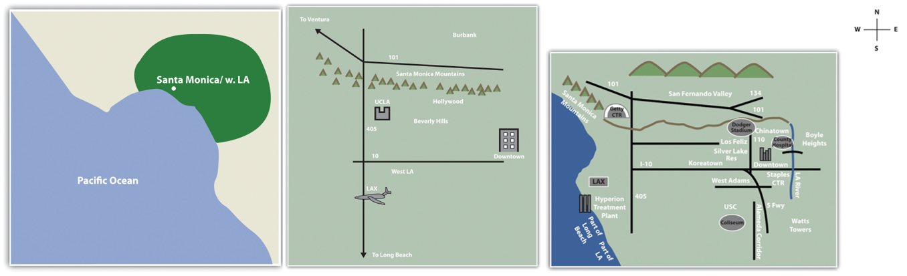

```{r setup, include=FALSE}
knitr::opts_chunk$set(echo = TRUE)
```

<br><br>
.center[
## Introduction to Geographic Information
### Lecture 2
.mb[
Spatial Thinking & Concepts
]
<br><br>
Andrew Murray | University of North Carolina - Chapel Hill
]

---

### A few notes

.med[
- Office Hours: Wednesdays & Fridays 2:00 3:00 or [by appointment](https://calendly.com/armurray-1/office-hours?month=2020-06)

   - Office Hours will be held on zoom at this permanent link: https://unc.zoom.us/j/97092252432 
   
Office Hours: A time where I am availabe to talk about anything. No issue is too small and in this virtual class I especially urge you to use them so that I can help you get the most out of this class.

- My website has been temporarily moved from Amurraygeo.com to Murraygeo.com so please use that url instead. Here is the link to the course page: https://murraygeo.com/courses/geog_info/
]
---
### Everything has a place...

.med[
- Everything exists in space

- Understanding the 'where' helps us understand the what/when/how

- However, 'where' is just the starting point.

### GIS...

- Allows us to leverage location into an infinite number of applications

- The last few decades have seen GIS technologies evolve exponentially

- A simple spatial analysis that took an hour ten years ago takes only seconds now
]

???

If you signed up for this class then I can only assume that you have an interest in the role that location plays in our everyday lives. From designing the layout of a grocery store to planning a city to understanding global climate change, geography and GIS are everywhere. Literally, the positions of items at grocery stores are decided very deliberately based on spatial information. Have you ever noticed that necessities like milk and eggs are at the back of the store? You have to walk through the whole store just to get there, which increases your chances of buying something you may not need. Some uses are more obvious, like the planning of the now doscontinued light rail project that was meant to connect Chapel Hill and Durham. Weaving a new rail system into two already developed urban areas takes a lot of knowledge about spatil information. What is the shortest route? Who owns what, and where can we build? Where should stations be located so we can serve the community in the most useful way? Are there animal populations already at risk that we need to condier? How will the noise from the trains affect the communities closest to the rails? There are hundreds of geographically based questions that go into conceptualizing a project like that. GIS allows us to tackle these questions and it is getting increasingly easy to do so. Thanks to the increased evolution of computer technology, there are things that take seconds or minutes now that used to take hours or days. My personal feelings are that in today's world and most certainly in the future, being data and geographically literate are going to be essential to success in the workplace. Learning GIS will absolutely make you a more attractive candidate for most fields, and it is more and more in demand.

---
.pull-left[
### Where did GIS start?

.med[
```{r echo=FALSE, out.height= 200, out.width= 200}
knitr::include_graphics("snow.PNG")
```

John Snow

- Epidemiologist
- 1854 Cholera outbreak in London
- 616 people killed
- Cholera was thought to spread through the air
- Snow's map lead to the discovery that it was actually the water
]
]
.pull-right[
```{r echo=FALSE, out.height= 600, out.width= 600}
knitr::include_graphics("snowmap_1854.jpg")
```
]

???
So where did GIS start? Many point to John Snow, an english epidemiologist who was trying to find the source of the 1854 Cholera outbreak in London. Originally thought to be an airborne disease that people were contracting simply by breathing, John Snow mapped the disease in an attempt to associate it spatially with other potential sources. What he found was that deaths were occuring close to the water pumps, and so hypothesized that it was ion fact the water which was mobilizing the bacteria causing cholera. John Snow is widely considered a pioneer in the field of epidemiology but you can clearly see the foundations of GIS here as well. 

---

<iframe width="100%" height="640px" src="https://yalemaps.maps.arcgis.com/apps/PublicInformation/index.html?appid=d7deb67f810d46dfacb80ff80ac224e9" frameborder="0" scrolling="no"></iframe>


---

## Mental Maps

.med[
In chapter 1 we read about mental maps.

- When you give directions, do you use North / East / South /West?
  - Do you use landmarks?

- If you asked everyone in your family to draw a mpa of your neighborhood, would they look the same?
]
.center[
```{r echo=FALSE, out.height= 300, out.width= 800}

```
]

---

### Mental Maps vs 'real' maps

.mb[
- Mental maps are how we reproduce our view of reality
  - They are unique to each individual
  
- When we use GIS to create maps, we use geometry to duplicate real-world positions of people/places/things etc...

  - At it's core, GIS is all about geometry... shapes / distances / relative locations...
  
]

---
.center[
## Location
]
.pull-left[
### What is location?

```{r echo=FALSE, out.height= 350, out.width= 300}

```
]

.pull-right[
.med[

**The Old well is located at:**

- 35.912050 degrees north, 79.051237 degrees west.
- On East Cameron Ave.
- Chapel Hill
- Orange County
- Earth...

### These are all correct...
]]
???

The earth is a 

---

### The old well is an example of a place which can be accurately represented by a single point.
.pull-left[
**What about...?**
.med[
- the Rocky Mountains

- The Mississippi river

- The Atlantic Ocean

]]

.pull-right[
```{r echo=FALSE, out.height= 350, out.width= 300}
knitr::include_graphics("rockies.png")
```

The google maps location of the Rocky mountains
]

---

### Global Positioning System
.pull-left[
```{r echo=FALSE, out.height= 450, out.width= 450}
knitr::include_graphics("gps.jpg")
```
]

.pull-right[
.mb[
- A set of 24 sattelites in constant orbit around the earth.

- Linking to at least **three** of them can give you a location on the planet

- Linking to **four** gives you altitude as well
]
]

---

.pull-left[
### Direction
.med[
The three norths

- Magnetic North
- True North
- Grid North

For most maps we use true north as the benchmark for direction.

However, we can also use landmarks as benchmarks
  - The movie theater is two blocks north of city hall

]]

.pull-right[
```{r echo=FALSE, out.height= 400, out.width= 400}

```
]

---

### Distance
.pull-left[

```{r echo=FALSE, out.height= 350, out.width= 550}

```

]

.pull-right[
.med[
- We measure distance all sorts of ways
  - Miles
  - Kilometers
  - Days
  - Number of flights

- What is the shortest distance?
  - straight line
  - great circle route
]
]

---

### Space
.pull-left[
```{r echo=FALSE, out.height= 200, out.width= 300}
knitr::include_graphics("underground.jpg")
```

```{r echo=FALSE, out.height= 250, out.width= 300}
knitr::include_graphics("classroom.jpg")
```
]

.pull-right[

.med[
*Space* might be the most ambiguous term we use in geography. 

- Space can refer to anything from a classroom to the universe (multiverse?)

- But typically we are talking about topological space 

*topological space is concerned with the nature of relationships and the connectivity of locations within a given space.*
]
]
---
### Navigation
.pull-left[
*Navigation is the destination-oriented movement through space.*

```{r echo=FALSE, out.height= 250, out.width= 300}
knitr::include_graphics("prime_air.jpg")
```
]

.pull-right[
.med[

- Discovering ancient Maya civilizations!

- Modern network routing!

- Getting to the grocery store!
]
]

---

## For Tomorrow...

.med[
We are starting our first lab, so make sure you can login to [ArcGIS Online](https://www.arcgis.com/home/index.html)

- Click 'Sign in'
- Under enterprise login enter 'UNC'
- Then use your ONYEN

More instructions tomorrow!

]