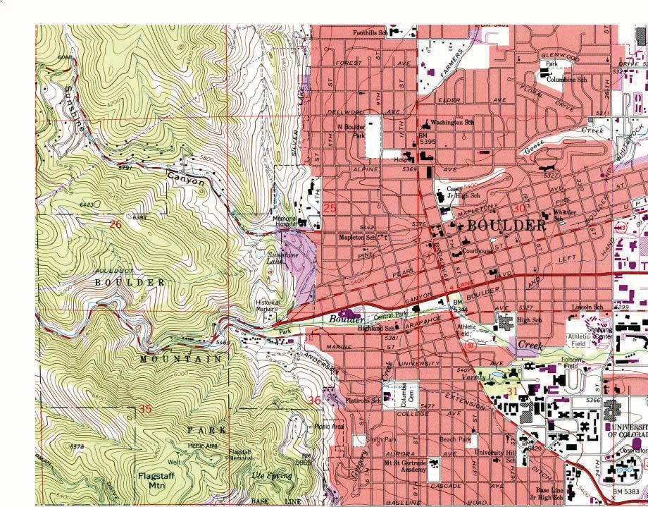
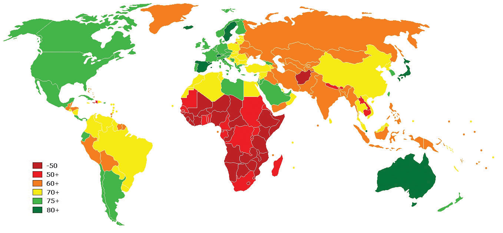
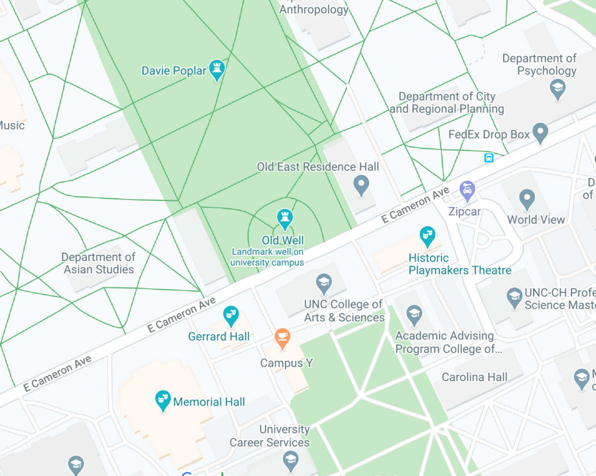
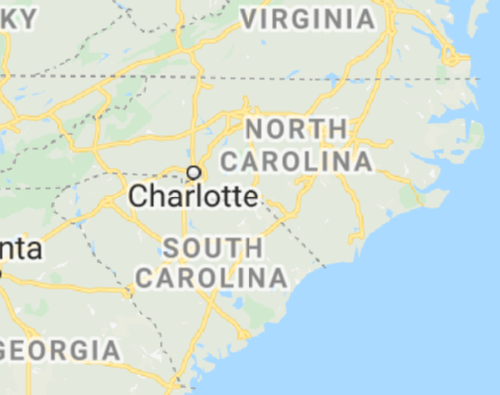
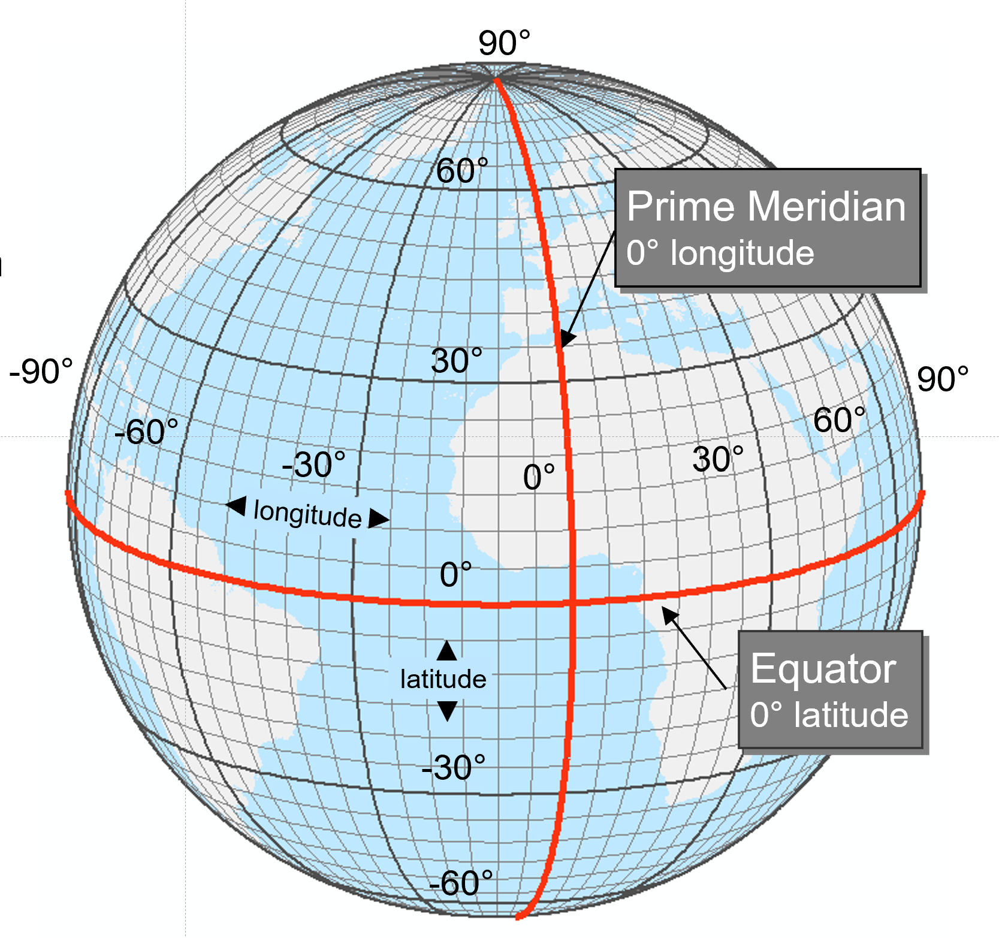

```{r setup, include=FALSE}
knitr::opts_chunk$set(echo = TRUE)
library(leaflet)
```

<br><br>
.center[
## Introduction to Geographic Information
### Lecture 4
.mb[
<br>
*Map Anatomy*

<br><br>

Andrew Murray | University of North Carolina - Chapel Hill

June 25, 2020
]]

---
.center[
### Topics For Today:
]
.mb[
- Basic map types
  - Reference
  - Thematic
  - Dynamic

- Coordinate Systems
- Projections 

]

<audio controls>
  <source src="/slides/intro_geographic_information/Day04/audio/d04s02.mp3" type="audio/mpeg">
  <p>Your browser doesn't support HTML5 audio.</p>
</audio>

???

Today I'm going to introduce you to some popular types of maps that users of GIS often create. I am then going to talk about coordinate systems and projections, which are probably some of the most foundational pieces of GIS that often go overlooked.

---

### Reference Maps

.pull-left[
.med[
- Represent geography as accurately as possible
- Are used for navigation
  - Hiking
  - Aviation
  - Navigation at sea

- Reference maps typically have a lot going on in the, because they are meant to convey a lot of information
]
]

.pull-right[
```{r echo=FALSE, out.height= 400, out.width= 400}

```
]

<audio controls>
  <source src="/slides/intro_geographic_information/Day04/audio/d04s03.mp3" type="audio/mpeg">
  <p>Your browser doesn't support HTML5 audio.</p>
</audio>

???

Many people think of reference maps when they first consider cartography. After all, the origination of the art was to try and map the world as accurately as possible. Reference maps are what most people over the age of, let's say 35 think about when they consider the word map. It is how our parents and grandparents navigated the many roads and highways when they were our age. That is not to say that we don't use reference maps anymore, on the contrary we use them a lot. We use them for hiking, fishing, precision navigation in both flying and sailing and more. We also use reference maps for city planning and management, for example when we need to map property lines for locating utilities in our neighborhoods.

---
.center[
### Thematic Maps
]

.med[
- Convey Information about places other than relative location

- For example, the map you are making for Lab 1 would be considered a thematic map.

- Used often to visualize things like Census data, or election data etc...
]
.center[
```{r echo=FALSE, out.height= 300, out.width= 700}

```
]

<audio controls>
  <source src="/slides/intro_geographic_information/Day04/audio/d04s04.mp3" type="audio/mpeg">
  <p>Your browser doesn't support HTML5 audio.</p>
</audio>

???

Where as reference maps are for navigation and being able to accurately determine distances and relative locations, thematic maps are more about conveying attribute data. For example, the maps you are creating in Lab 1 would be considered thematic maps because they are telling you something about the population within each administrative boundary. Probably the most popular source for thematic map data is the U.S. Census. If you have ever seen maps showing income, or race, or population, those data came from the U.S. Census. We also use thematic maps to convey political data. When you follow an election on the news and they show those maps of which county went for who, those are thematic maps. It is less about the location then it is about the numbers representing some other variable. Visualizing data in thematic maps helps us to investigate potential relationships. For example we can see hotspots start to become clear in a thematic map. You may have noticed that in your thematic map of Houston in lab one that the closer to downtown you get, the more people there are without cars. While that may seem fairly intuitive, there are plenty of times where you will use GIS where hotspots will appear that are confusing and then you have to figure out why those hotspots are where they are.

---

.center[
### Dynamic Maps
]

.med[
- Any map that the end-user has control over
- Examples:L Google Maps, Waze, Bing Maps etc...
- Users can often zoom, change layers and basemaps

]

```{r echo=FALSE,out.height=300, out.width=800}
leaflet()%>%
  addTiles()%>%
  addMarkers(lng=174.768, lat=-36.852, popup="The birthplace of R")
```

<audio controls>
  <source src="/slides/intro_geographic_information/Day04/audio/d04s05.mp3" type="audio/mpeg">
  <p>Your browser doesn't support HTML5 audio.</p>
</audio>

???

Dynamic maps are sort of just what they sound like... they are just maps where the user can manipulate them at will. They most likely can zoom in and out, and the things tat are displayed on the map probably change when you zoom, like in google maps. You might be able to add or remove layers. You might be able to change the basemap. A basemap by the way, is the default background map. For example, when you open google maps, it shows a basic map background, but you can change it to satellite imagery. There are a lot of different basemaps that exist, like USGS topo maps, satellite maps, gray scale maps, even lord of the rings styled basemaps. Dynamic maps are great and they are flashy and they are useful but it is important to consider when to use them. If you are trying to convey a very specific message through a map, you probably don't want to use a dynamic map because the user is just going to mess around with it and look at different stuff. On the other hand, dynamic maps are fantastic if you want to present a lot of data and let the user explore the things they are personally interested in. This map by the way is an example of a dynamic map, you should be able to interact with it directly on this slide. 

---
.center[
### Scale
]

When we describe scale in cartography, we often use a representative fraction, which is unit less. For example, you may see something on a map that says 1:100 which would mean that 1 inch on the map = 100 inches in the real world. It also means that 1 meter on the map = 100 meters in the real world. The units don't matter, just the ratio. 
.pull-left[
.center[
.mb[
**Large Scale**
]
 **Less Area / More Detail**
```{r echo=FALSE, out.height= 300, out.width= 400}

```
]]

.pull-right[
.center[
.mb[
**Small Scale**
]
  **More Area / Less Detail**
```{r echo=FALSE, out.height= 300, out.width= 400}

```
]]

<audio controls>
  <source src="/slides/intro_geographic_information/Day04/audio/d04s06.mp3" type="audio/mpeg">
  <p>Your browser doesn't support HTML5 audio.</p>
</audio>

???

Scale is obvious and confusing at the same time. In cartography we always have to show units of distance so that someone reading a map can have a frame of reference. Sometimes when we look at maps we don't need them because we can figure something out from context. For example, you might say that you never look at the scale bar on google maps. That is probably for two reasons. first, google has done a great job of providing dynamic maps which have things embedded that are of relatively constant size. Second, you are probably usually looking at geographic areas you are somewhat familiar with. So when you look at a map on google, you can see the street layout and you have a pretty reasonable idea of how long a city block is for example. However this i not always the case and it is important for us to provide a reference scale for those who are unfamiliar with a specific area. This is especially true in large scale maps.

---

### Geographic Coordinate Systems (GCS)

.pull-left[
```{r echo=FALSE, out.height= 450, out.width= 500}

```
]

.pull-right[
.med[
The Earth **IS NOT A SPHERE**

- We refer to the shape of the earth as a GEOID

- We use latitude and longitude to describe points on the earths surface

- There have been many different GCSs to describe points on the earth. No two are the same because the earth is not a perfect sphere.

- The two most common ones in use today are NAD83 and WGS84
]
]

<audio controls>
  <source src="/slides/intro_geographic_information/Day04/audio/d04s07.mp3" type="audio/mpeg">
  <p>Your browser doesn't support HTML5 audio.</p>
</audio>

???

Okay so now we are getting into geographic Coordinate systems. These describe latitude and longitude. It is important to remember that the earth is not a perfect sphere. We call the shape of the earth a geoid and it is irregular. Therefore it is very difficult to determine exact locations and thus there have been hundreds of attempts at the creation of accurate GCSs. Latitude refers to degrees north or south of the equator. Longitude refers to degrees east or west of the prime meridian, which is the north/south line that runs through Greenwich, England. I should point out that a lot of people get mixed up with latitude and longitude (including me on a regular basis). You see, in math we often refer to X,Y coordinates, however when we refer to geographic coordinates we often say lat/lon. This would imply that X is latitude and y is longitude but it is actually the opposite. We refer to degrees of longitude as the x coordinate and degrees of latitude as the y coordinate. It's sort of backwards but that's the way it is. The two coordinate systems you will most often encounter are NAD83 and WGS84. The NAD83 coordinate system is specifically for data that exists in North America. Most of the time when you download data from local or state agencies in the United States, the coordinate system will be NAD83. WGS84 is a worldwide coordinate system. If you download international data, it will most likely come in WGS84. Geographic coordinate systems tell us where something is on the globe, but the globe is three dimensional. Maps are two-dimensional, meaning you have to be able to print them out an display them on a sheet of paper. This brings us to projections...

---
### The GEOID
.pull-left[
```{r echo=FALSE, out.height= 350, out.width= 500}
knitr::include_graphics("geoid.jpg")
```
]

.pull-right[
.mb[
Did You know that gravity varies across the globe?

We Have satellites that measure the changes in earths gravitational field and the surface of the 'geoid'

Read about it [here](https://earthobservatory.nasa.gov/features/GRACE/page3.php)
]
]
---
### Projections

Projections are how we take a globe and make it flat:

<iframe width="860" height="500" src="https://www.youtube.com/embed/kIID5FDi2JQ" frameborder="0" allow="accelerometer; autoplay; encrypted-media; gyroscope; picture-in-picture" allowfullscreen></iframe>

<audio controls>
  <source src="/slides/intro_geographic_information/Day04/audio/d04s08.mp3" type="audio/mpeg">
  <p>Your browser doesn't support HTML5 audio.</p>
</audio>

???

Your textbook does a really nice job of explaining the differences between geographic coordinate systems and projections but honestly, I think this video is even better. Projections are complicated but they are important. I'm not kidding when I say I think you should watch this video two or three times. It is loaded with good information but it moves very quickly. 

---
.mb[
I strongly suggest you take a lot of time and explore these links to try and understand how projections really affect the way we view maps:

[The True Size of...](http://thetruesize.com/)

[Interactive Projections](http://metrocosm.com/compare-map-projections.html)

[Projection Transitions](https://bl.ocks.org/mbostock/3711652)

[Mercator Puzzle](http://hive.sewanee.edu/ldale/maps/10/06-LOCAL.html)

[Gravity Map of the U.S.](https://mrdata.usgs.gov/gravity/map-us.html)
]

<audio controls>
  <source src="/slides/intro_geographic_information/Day04/audio/d04s09.mp3" type="audio/mpeg">
  <p>Your browser doesn't support HTML5 audio.</p>
</audio>

???

Here are the links mentioned in the previous video, along with a couple of extras. I really think you should take the remaning class time and just spend it exploring these links and learning about projections. Tomorrow, we will start on the second lab so if you have not finished lab 1 already, make sure you do so by tomorrow. 