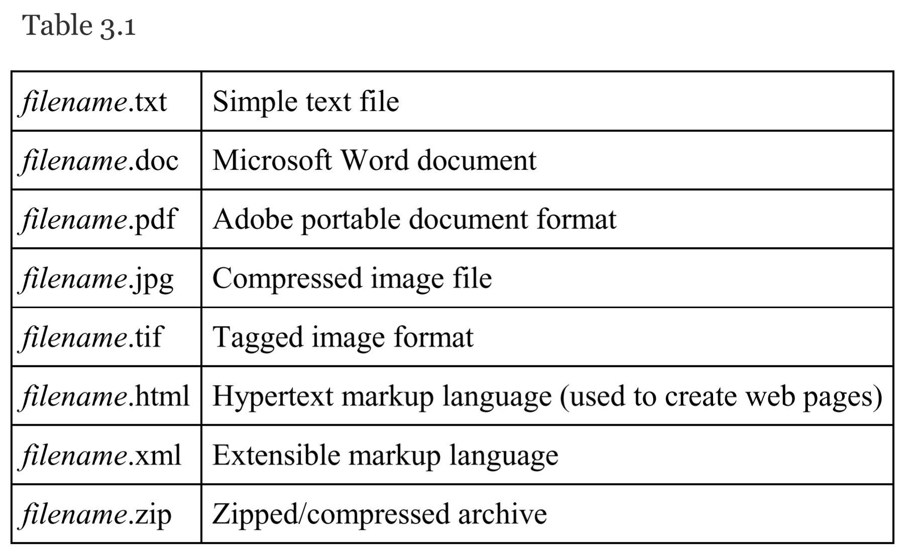
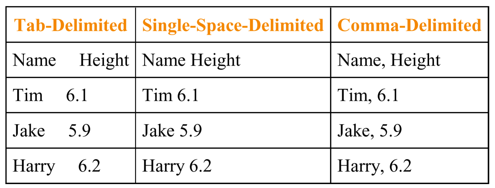
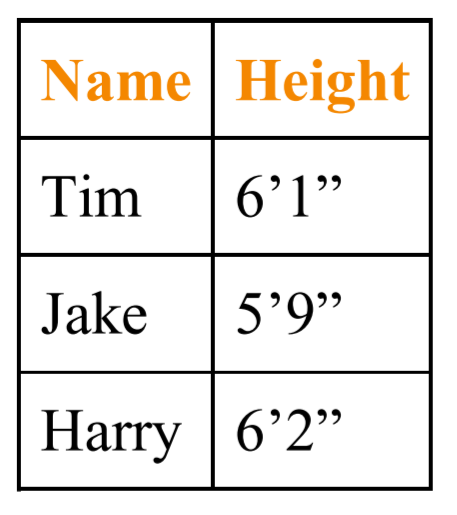
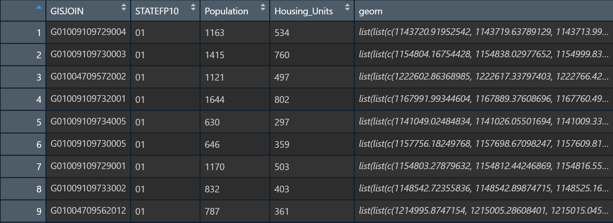

```{r setup, include=FALSE}
knitr::opts_chunk$set(echo = TRUE)
```

<br><br>
.center[
## Introduction to Geographic Information
### Lecture 6
.mb[
Data & Where to Find Them<br>
+<br>
Lab #2

<br>

Andrew Murray | University of North Carolina - Chapel Hill

June 29, 2020
]]

<audio controls>
  <source src="/slides/intro_geographic_information/Day06/audio/d06s01.mp3" type="audio/mpeg">
  <p>Your browser doesn't support HTML5 audio.</p>
</audio>
---

.mb[
.center[
*Geographic or spatial data refer to geographic facts, measurements, or characteristics of an object that permit us to define its location on the surface of the earth*]

.pull-left[

.center[
**Location**
]

- Where is your home?
  - Latitude / Longitude
  - A series of projected coordinates pairs representing a building footprint
  - A zip code
]

.pull-right[
.center[
**Attributes**
]
- About your home:
  - What year was your home built?
  - How many bedrooms does it have?
  - Does it have Central heating / air?
]]

<audio controls>
  <source src="/slides/intro_geographic_information/Day06/audio/d06s02.mp3" type="audio/mpeg">
  <p>Your browser doesn't support HTML5 audio.</p>
</audio>

???

Remember that there are two main components to geographic data. There is the geography part, which tells us where something is, and then the attribute data that tells us details about that something. For example, if we were talking about your home we would need a location, perhaps in the form of lat/lon coordinates or a series of projected coordinate pairs representing a polygon which represents the footprint of your house or apartment building, or even a zip code. Linked to that location would be attributes, for example when the home was built, whether it has public water, how many bedrooms, whether or not is has central heating or air... whatever...

---
.center[
## File Formats
]
.pull-left[
.med[
- You can tell the type of a file by it's extension which is a 3 or 4 letter code followng the '.' in the filename.

- Common formats are pdf, doc, docx, html etc...

- The most common format for geographic data is the shapefile (.shp) however the .shp file is useless without other file formats which are necesarry to use it.
]
]

.pull-right[
```{r echo=FALSE, out.height= 300, out.width= 600}

```
]

<audio controls>
  <source src="/slides/intro_geographic_information/Day06/audio/d06s03.mp3" type="audio/mpeg">
  <p>Your browser doesn't support HTML5 audio.</p>
</audio>

???

This brings us to the format of data files and how we read them or create them. If you are not familiar with file formats, the simplest way to think about them is in terms of languages. Each file format has to be read a different way, and the file extension tells the computer how to try to read it. The file extension is represented by the 3 or 4 characters after the period in a filename. Not all software can read all filenames. For example, opening a .pdf file in excel would not work. Some common file types you may be familiar with are .doc, .docx, .pdf, .html amoong others. Geographic data make use of many different types of files such as .txt, .csv, .shp, .prj, .dbf, .gdb and more. 

---
.center[
## Delimited Files
]
.pull-left[
```{r echo=FALSE, out.height= 200, out.width= 500}

```

.center[
```{r echo=FALSE, out.height= 200, out.width= 200}

```
]]

.pull-right[
.med[
- Text files are really the simplest files you can encounter

- When you use programs like excel, you may open a text file into a spreadsheet or export a spreadsheet to a text file.

- To do this, excel has to be able to figure out where one column ends and the next one begins.

- This is done using a 'delimiter'... a character that means the separation of columns.

- You must make sure not to use delimiters that appear in your attribute data. For example if you use a space, then your data cannot contain spaces.
]
]

<audio controls>
  <source src="/slides/intro_geographic_information/Day06/audio/d06s04.mp3" type="audio/mpeg">
  <p>Your browser doesn't support HTML5 audio.</p>
</audio>

???

We use text files as the simplest form of data storage. A text file could be a .txt file but could also refer to other types of files such as a .csv, which stands for comma separated values. A delimiter is the way that a computer program can figure out where one column ends and a new one begins. You have to be careful which delimiters you are using though because it can wreak havoc on your attribute data. For example, if you were using a space as your delimiter, then you could not have a column of addresses because it would try to separate all of the different words into different columns. This might also cause trouble with comma separated values. It is for these reasons that the tab is often used as a delmiter. We call that tab-delimited text and that is typically stored in a .txt file. I use excel as an example since most people have at least some experience with that program but this is true for all software wether it is another spreadsheet program like google sheets or a coding language like python or R.

---
.center[
### Layout of Tables

```{r echo=FALSE, out.height= 400, out.width= 900}

```

]

<audio controls>
  <source src="/slides/intro_geographic_information/Day06/audio/d06s05.mp3" type="audio/mpeg">
  <p>Your browser doesn't support HTML5 audio.</p>
</audio>

???

Here is an example of a table that is also storing geographic information. Each row of the table refers to a single feature, in this case, a polygon that represents a Census block group. We refer to the first row of a table as the 'header' where information about that column is stored. Each entry in the header row refers to the rest of the column below it. Each column represents an attribute associated with that feature. The columns we see here are an ID layer called 'GISJOIN' which has a unique value for every feature, we have a state fips code which is associated with the State the block group is in. We have the population of that block group and the number of housing units in that block group. The last column is called 'geom' and stores the geometry of the feature. In this case it contains instructions for the computer to draw polygons which will show the Census block groups. If this table was showing attributes of point data, we might instead have lat and lon values, or two seperate columns (one for latitude and one for longitude).

---
.center[
.big[
**Rarely if ever, however, will you work with one and only one file or file type. More often than not, and especially when working with GISs**
]]

.med[
- It is important to make sure your data descriptions are thorough when constructing a dataset... otherwise others may not be able to interpret what you are trying to convey.

.pull-left[
**Primary Data**
  - Data collected by you and synthesized into a dataset
]

.pull-right[
**Secondary Data**
- Data obtained from someone else, like the national weather service or the Census
]

**Codebook:** A file which typically accompanies a dataset and provides addtional details for how the dataset was constructed and what each column means.
]

<audio controls>
  <source src="/slides/intro_geographic_information/Day06/audio/d06s06.mp3" type="audio/mpeg">
  <p>Your browser doesn't support HTML5 audio.</p>
</audio>

???

The examplke on page 67 of your textbook is a great example of how confusing it can be to try and use data created by someone else. It is for this reason that you must always be very deliberate about column naming conventions. Writing files and data so that someone else who has no idea what you are working on is able to interpret it is a great practice, even if you never plan on sharing your data. For example, life often happens in such a way that we stop working on a project and come back to it week, months even years later. Your future self will thank you for making data as easy to interpret as possible. One way of achieving this is by providing what is called a README file or a codebook. A readme file is typically a simple .txt file that provides a narrative of the data and how it was collected and synthesized. A codebook is usually a detailed listing of filenames and column names, and conveys as specifically as possible what they mean. Often, README and codebook files can be found inside of the metadata for a datasource, but sometimes they are provided as separate files. 

---
.center[
### Finding Data
]

.mb[
** Four Major Questions:**

- What is the purpose of the data you seek?

- What data exist and do we already have what we need?

- What is the cost of the data?

- What format is the date in?
]

<audio controls>
  <source src="/slides/intro_geographic_information/Day06/audio/d06s07.mp3" type="audio/mpeg">
  <p>Your browser doesn't support HTML5 audio.</p>
</audio>

???

Finding data is one of the most underrespected skills of getting good with GIS. It takes practice and experience to understand what is out there and where to look. The four major questions laid out in the book revolve around identifying purpose, being familiar with what is available, estimating the cost, both financial and personal labor, and whether the format is accessible. What this really all boils down to is being able to think about how to narrow your search down as much as possible. Are you looking for environmental data? Well if you are studying something just within North Carolina you may start with the North Carolina Department of Environmental Quality. If you are looking for something national, you may look at the EPA. Federal agencies are usually a great place to start looking for data but local and state agencies are also great, especially the more localized your study. Data organization is also key. I keep a folder of datasets on my computer that I use a lot, like the 2010 U.S. Census, road networks and some satellite imagery I use for my research. What is the cost of the data? Satellite data is a good example of data that can cost a ton in both money and labor, and this ties into format. There are several agencies like NASA, USGS and ESA (the european space agency) which provide free and public satellite imagery data. This is what most scientists use. However there are also private satellites which have much better resolution, which means their data is much better. This data is typically inaccessible to the sientific community because of the cost of imagery. Often, only big corporations like Google can afford to obtain it.

---
.center[
### Types of Data
]

.med[
.pull-left[
.center[**Public Data**]

- Typically free and available to use (with some restrictions such as you cannot resell it or pass it off as your own)
- Commonly associated with government data

Examples:
  - [NASA](https://data.nasa.gov/browse)
  - [U.S. Census](https://data.census.gov/cedsci/)
  - [U.S. Geological Survey](https://earthexplorer.usgs.gov/)
  - [U.S. Department of Agriculture](https://www.usda.gov/content/usda-open-data-catalog)
]

.pull-right[
.center[**Private Data**]

- Often associated with private business or areas such as Public Health
- Could be proprietary data or personally sensitive

Examples:
- Customer locations for a telecom company
- Personally Identifiable healthcare data
- Credit Card Spending Data
- Geologic Surveys for oil and gas sector companies.

]
]

<audio controls>
  <source src="/slides/intro_geographic_information/Day06/audio/d06s08.mp3" type="audio/mpeg">
  <p>Your browser doesn't support HTML5 audio.</p>
</audio>

???

Data basically fall into two broad categories: public and private data. Public data is typically free and available to use at your discretion with a few exceptions such as trying to earn money from it or passing it off as your own primary data. This is often associated with government data. Many federal and state agencies make data available to the public... as they should since it is all paid for with tax payer money. Most of the data that you will encounter will likely come from a government agency in some form or another. Here on the slide are a few examples of sources I often use. The Census provides demographic data. NASA provides specialized remotely sensed data, USGS provides water data for the nation, as well as landsat, which is the most widely used satellite in the world over the last three or so decades, not to mention a large maount of geologic data. The US department of agriculture tracks crop growth, soils and other variables accross the nation. Private data on the other hand are typically restricted and you won't just find them lying around the internet. There are a lot of reasons why data might be private. For example, businesses keep their data guarded closely to keep their edge over competitors. Utility companies like oil and gas may want to keep geographic data private, such as pipeline routes for a multitude of reasons. The public health sector routinely works with PID which stands for personally identifiable information such as health conditions of patients which are illegal to release to the public. 

---

.center[
## Lab #2
]

.mb[

Lab 2 is sort of an intro to a bunch of useful things all at once. I will introduce you to ArcGIS Pro, the connection between ArcGIS Pro and ArcGIS Online, and how to obtain and share data between the two.

You can find the full lab 2 Assignment [Here](https://docs.google.com/document/d/1CH-on4t3JTHt1ktIy04U4U0k_Y5U-yzz_3yqJScE0oQ/edit?usp=sharing) and you can find the video tutorial [Here](https://unc.zoom.us/rec/share/-fZ0KrKg8mNJRp3862P5BZA4AJjJX6a80SlM_6EOn0ohlJXxYLSgGgfDEo9V2IIo?startTime=1593401626000)

The video tutorial is a recorded zoom video that is much to large to be hosted here on the website so please let me know if you gave any trouble accessing it. 
]

<audio controls>
  <source src="/slides/intro_geographic_information/Day06/audio/d06s09.mp3" type="audio/mpeg">
  <p>Your browser doesn't support HTML5 audio.</p>
</audio>