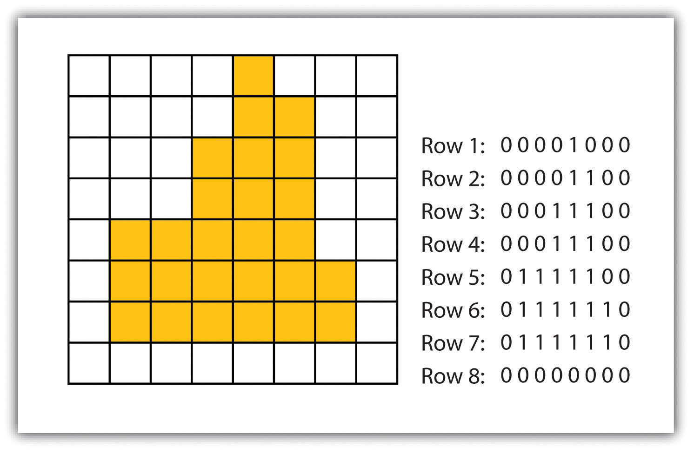
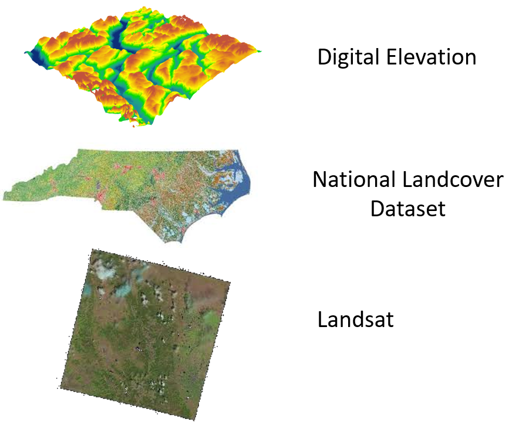

```{r setup, include=FALSE}
knitr::opts_chunk$set(echo = TRUE)
```

<br><br>
.center[
## Introduction to Geographic Information
### Lecture 6
.mb[
Data Models for GIS<br>


<br>

Andrew Murray | University of North Carolina - Chapel Hill

June 30, 2020
]]

---

.center[
## Rasters
]

.pull-left[
```{r echo=FALSE, out.height= 350, out.width= 450}

```
]

.pull-right[
.med[
- Rasters are made up of pixels
- Each square in the image to the left represents a single pixel
- All pixels within a raster are always the same size
- We refer to the the length of one side of a pixel as the resolution. So when we say a raster has a resolution of 30 meters, we mean that each pixel is 30m x 30m
- Satellite imagery is the most common form of raster data
]
]

???

Before a raster is projected, it is composed of squares of equal size. You will often hear people talk about rasters in terms of their resolution. the resolution of the raster refers to the length of one side of a pixel square. Rasters are considered simple because of the way they are stored. As I have already mentioned, points, lines and polygons are composed of coordinate pairs that tell us how to draw them. Rasters are similar. Rasters have a y-min, a y-max an x-min and an x-max. These represent the bottom, top, left and right borders respectively. That is the only imformation you need to draw a raster. Beyond that, a raster is just a matrix that stores values. You can think of this as a spreadsheet where each cell has a specific value. There are many types of rasters which determine the types of values that can be stored.

---

## Example: Watershed Delineation

.pull-left[
```{r echo=FALSE, out.height= 350, out.width= 450}
knitr::include_graphics("dem17n.jpg")
```

This Raster shows elevation and is referred to as a Digital Elevation Model (DEM)

]

.pull-right[
```{r echo=FALSE, out.height= 250, out.width= 450}
knitr::include_graphics("flowdirection.png")
```

Each Pixel reflects the elevation of a pixel, and using GIS we can figure out the flow direction of water over the surface

]

???

One of my personal focus areas of research is on water resources. One of the foundational things that hydrologists or people who study water need to do is understand how water travels accross the earths surface. The way we figure this out is by using a digital elevation model (DEM). A DEM is a raster file where each pixel represents the elevation of the earths surface. We can take this and use GIS to figure out the steepest slope from every single pixel to every other pixel immediately next to it. This then tells us the flow direction of water. From this, we can figure out where water flows over the entire surface of the earth as long as we have elevation data. Without this, things like flood planning would be impossible.

---

## Pros and Cons of Raster Data

.med[
.pull-left[

**Pros**
- Rasters are efficient for visualizing data over large geographic regions
  - Like data for the tnire U.S.
- Continued advances in technology have made advanced operations on Rasters more accessible
- Remote sensing data is delivered using rasters because that is how it is aquired (The same way a camera creates a raster by taking a picture)
]

.pull-right[
**Cons**
- Cannot have various spatial scales within a single file
- limited to a single attribute per raster
- Very large
- Creating a Raster, by definition, means a loss of data by averaging or some other mathematical operation.
]
]

???

There are many pros and cons to the use of raster data. A lot of the historical 

---

## Popular Raster Data

.pull-left[
```{r echo=FALSE, out.height= 450, out.width= 500}

```
]

.pull-right[

## Demo.med[
Now I want to take you through some actual examples of using raster data and how to view some basic pixel operations.

Please follow the link here to watch the tutorial:

[LINK]()
]


]