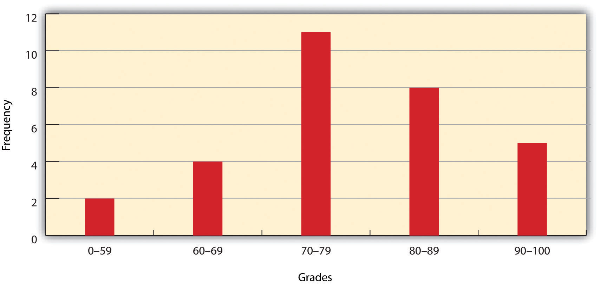
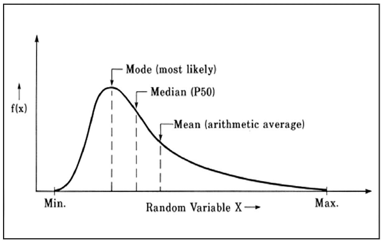

```{r setup, include=FALSE}
knitr::opts_chunk$set(echo = TRUE)
```

<br><br>
.center[
## Introduction to Geographic Information
### Lecture 12
.mb[
Data Characteristics and Visualization<br>
<br>
.med[
Andrew Murray | University of North Carolina - Chapel Hill

July 8, 2020
]

]]

---
.center[
## Data Characteristics and Visualization

]
.med[
.pull-left[
While GIS is all about effective visualization of data, you need to understand your data first...

.mb[
Some Important Terms:
]

**Variable:** A symbol used to represent any given value or set of values. Often used interchangeably with 'attribute'. (A column)
  
**Value:** An individual observation of a variable/ Often used interchangeably with 'record'. (A single cell within a single column)
  
]

.pull-right[

**Population:** The universe of all possible values for a variable

**Sample:** A subset of the population

**n:** The number of observations for a variable

**Array:** A sequence of observed measures (in a GIS this is also called a field and is represented in an attribute table as a column)
  
**Sorted Array:** an ordered, quantitative array

]
<audio controls>
  <source src="/slides/intro_geographic_information/Day12/audio/d12s02.mp3" type="audio/mpeg">
  <p>Your browser doesn't support HTML5 audio.</p>
</audio>

]

???

While much of GIS is about effectively visualizing data and telling stories through maps, before we get to that point we need to understand how our data is composed. Here are a few important terms to consider within GIS. A variable is simply a value or a set of values. For example, one variable that may drive plant growth could be amount of sunlight. Another might be average temperature. A value then is a single observation of a variable. For example, the hours of sunlight in Chapel Hill today will be 14.5.

The Population is a reference to the span of all possible values for a variable. A self-explanatory way of thinking of this is to simply consider human populations. As geographies get larger, populations become more diverse in every way. As geographies get smaller, populations become more homogenous. Think of a neighborhood in a big city. Within a few blocks you are likely to have homes that are worth relatively the same amount, owned by people who make around the same income, and their kids go to the same school. As you expand outwards and start to include more neighborhoods in your population, the entire city, and perhaps the suburbs, you will encounter greater variation. You will have all sorts of home values owned by people in all sorts of situations.
  A sample is then a subset of a population. This is useful if we have a huge amount of data and we want to figure out likely relationships without considering every single data point. For example, We get the full Census every ten years which has a small number of questions on it. However the Census bureau also administers a survey called the American Community Survey. This is sent out every year to a subset of americans and has many more questions on it. This survey provides us with important information about the composition of our country but because it is a subset, it also has a certain amount of error associated with it.
  n refers to the number of observations of a variable, so if you said that you had an n of 400 that simply means you considered 400 data points. An array is a fancy name for a field or column and a sorted array just means it has an ordered , quantitative attribute. 

---

### Distributions

.pull-left[
```{r echo=FALSE, out.height= 400, out.width= 450}

```
]

.pull-right[
.med[
Looking at a histogram of your data will help you undersand how to visualize it.

- Is the data normally distributed or is it skewed?

Leads to...

- What sort of color classifications will make the most sense?
]
]

<audio controls>
  <source src="/slides/intro_geographic_information/Day12/audio/d12s03.mp3" type="audio/mpeg">
  <p>Your browser doesn't support HTML5 audio.</p>
</audio>

???

Histograms are always useful to look at before trying to symbolize your data. They give you a starting point for class breaks, which are the values of your data where you will switch colors or symbols for a map.

---
.center[
### Measures of Central Tendency
]

.med[
.pull-left[
**Mode: **The most commonly observed value

**Median:** The value where the number of values greater than it are equal to the number of values less than it

**Mean:** The average value, or the sum of all the values divided by the number of values. 

In a perfectly normal distribution the mode, the median and the mean will all be the same. The degree to which they are different can you something about the distribution

]
]

.pull-right[
```{r echo=FALSE, out.height= 400, out.width= 450}

```
]

<audio controls>
  <source src="/slides/intro_geographic_information/Day12/audio/d12s04.mp3" type="audio/mpeg">
  <p>Your browser doesn't support HTML5 audio.</p>
</audio>

???

Measures of Central Tendency refer to a set of statistics that tell us about the distribution of our data by looking at some indicators about the middle of our data values. The mode is the value that appears the most often and because of this fact, will typically be close to the mean but not always. The median is the value that falls in the middle based on the number of observations. So if you had 21 observations which were ordered smallest to largest, the median would be the 11th observation as it would have ten observations greater than it and ten observations less than it. The mean is just the average, so the sum of all the values divided by the number of values. If you had a perfectly normal distribution, the mode, median and mean would all be identical.

---

### Measures of Dispersion

.med[
.pull-left[


**Range:** The range equals the largest value minus in the dataset the smallest. In our case, the range is 99 − 57 = 42

**Interquartile Range:** The medians of the top and bottom half ot the datset as determined by it's median. The difference between these two is the interquartile range. 
]

.pull-right[
**Variance:** The variance gives you a measure of how much the data points themselves deviate from the mean of the population (or subset)

**Standard Deviation:** The square root of the variance, perhaps the most common metric to measure dispersion.

]
]

<audio controls>
  <source src="/slides/intro_geographic_information/Day12/audio/d12s05.mp3" type="audio/mpeg">
  <p>Your browser doesn't support HTML5 audio.</p>
</audio>

???

We use measures of dispersion to figure out how tightly distributed our data is. The range tells us how far our values extend. The Interquartile range and the standard deviation both tell us how the data is distributed relative to the range. Variance on the other hand tells us how far data points deviate from the mean. For example, if you had a perfect relationship between two variables, with an r squared of 1, your variance would be zero, but this does not happen in nature. Measures of variance tell us a lot about relationships between two variables. 

---

### Filtering and Selecting Data

.med[
To tell a visual story with data we need to identify patterns within it...

**We do this with selections and Queries**

**Select by Attribute:** Filter data based on a set of conditions to be met.

**Select by Geography:** Draw a shape to select features or use proximity such as:
  - 2 features overlap
  - features within certain distances of other features
  - feature that do not touch
  - MANY MANY more

]

<audio controls>
  <source src="/slides/intro_geographic_information/Day12/audio/d12s06.mp3" type="audio/mpeg">
  <p>Your browser doesn't support HTML5 audio.</p>
</audio>
---

## Demonstration of Selections and Statistics

.pull-left[
.med[
For the rest of this lecture, please watch the video posted  below. I will walk you through selecting data in ArcGIS and also how to create basic charts. You do not need to duplicate my steps but if you are interested ni doing so I am also providing the data sources.

[North Carolina Crash Data](https://connect.ncdot.gov/resources/safety/Pages/Crash-Data.aspx)

[Open Street Map Road Data](http://download.geofabrik.de/north-america/us.html)
]
]

.pull-right[
.mb[
Also check out this page for an in-depth guide of selecting data by attributes:

[Common ArcGIS SQL Expressions](https://pro.arcgis.com/en/pro-app/help/mapping/navigation/sql-reference-for-elements-used-in-query-expressions.htm)
]
]

.mb[
.center[
[Walk-Through Video](https://unc.zoom.us/rec/play/6JwrIrqgqm83GNyStgSDV_ItW9XrJqishygYqPBemknjUSJVMACjYudBZFVgP8sa7gIrVMqM19oMzbc)
]
]

<audio controls>
  <source src="/slides/intro_geographic_information/Day12/audio/d12s07.mp3" type="audio/mpeg">
  <p>Your browser doesn't support HTML5 audio.</p>
</audio>