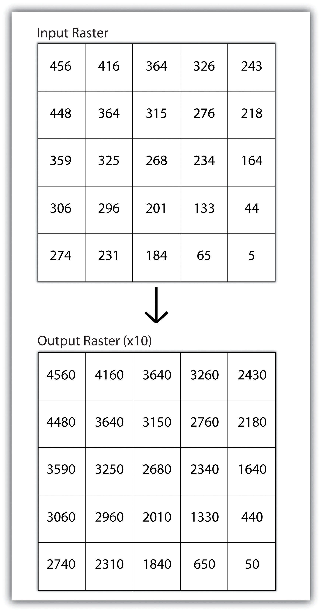
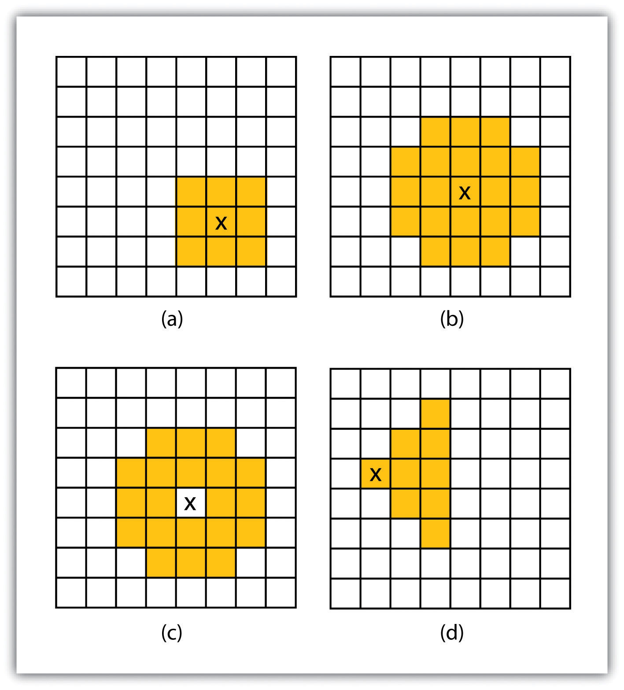
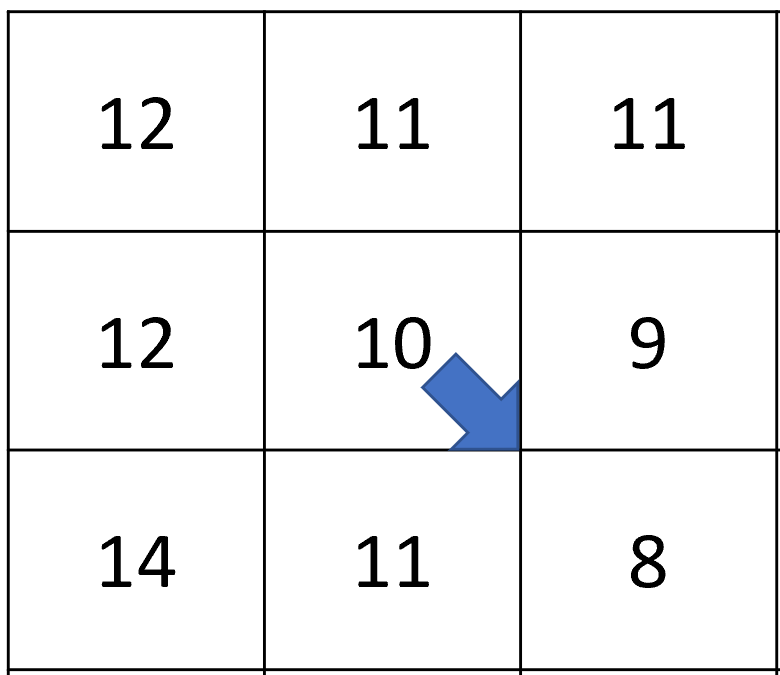
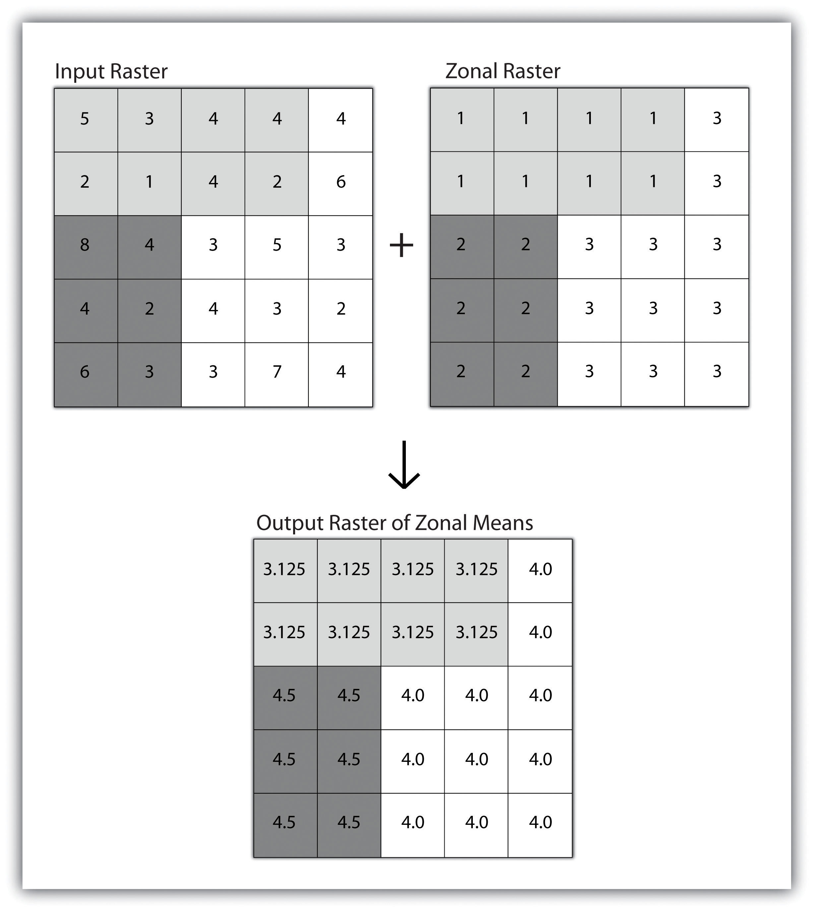
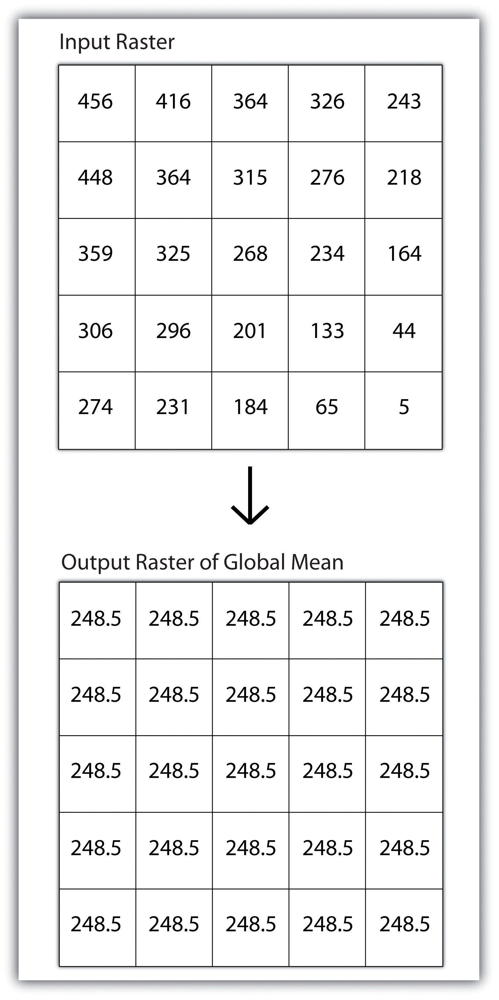
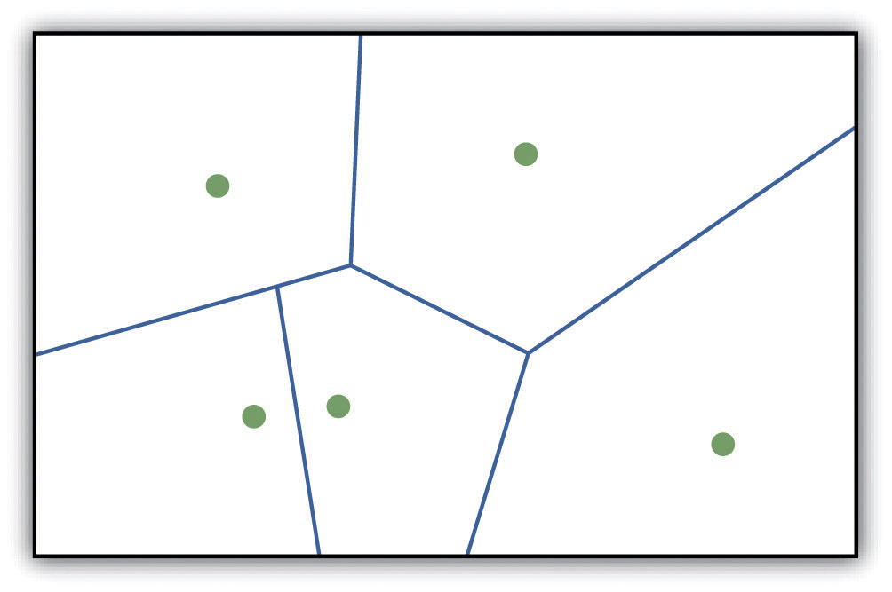
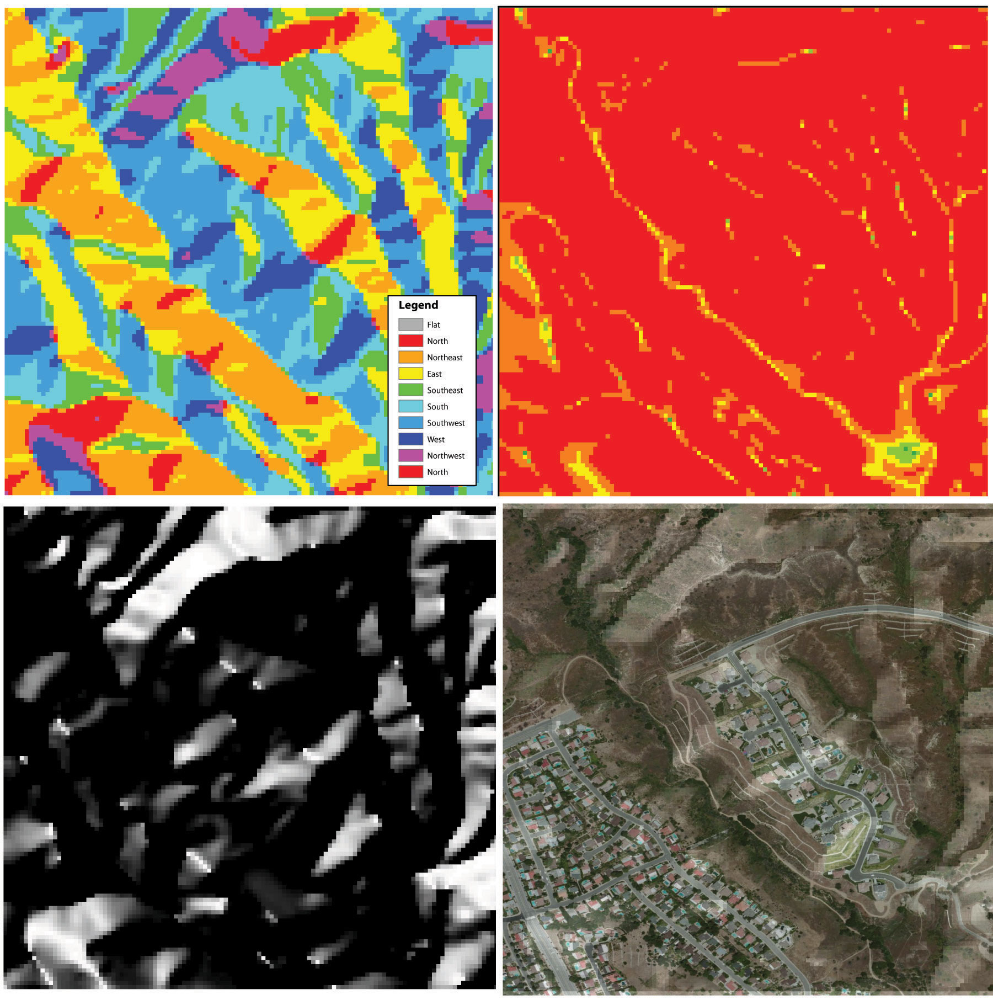

```{r setup, include=FALSE}
knitr::opts_chunk$set(echo = TRUE)
```

<br><br>
.center[
## Introduction to Geographic Information
### Lecture 17
.mb[
Geospatial Analysis: Raster Data Continued...<br>
<br>
.med[
Andrew Murray | University of North Carolina - Chapel Hill

July 15, 2020
]

]]

---
.center[
### Scale of Analysis
]

.med[
**Local**
- Mathematical transformation to each individual cell in the grid

**Neighborhood**
- Examine the relationship of an object with similar surrounding objects.

**Zonal**
- Employed on groups of cells of similar value or like features

**Global**
- Operations on the entire dataset

]
.pull-right[
<audio controls>
  <source src="/slides/intro_geographic_information/Day17/audio/d17s02.mp3" type="audio/mpeg">
  <p>Your browser doesn't support HTML5 audio.</p>
</audio>
]
???

Scale is a reference to how we apply functions to a raster and they can be broken down into four major categories. LocAL, NEIGHBORHOOD, ZONAL  and global. Local is one pixel at a time, neighborhood is a cluster of neighboring pixels, zonal is groups based on zones from another raster and global is the entire raster all at once. 
---

## Scale of Analysis: Local 

.pull-left[
.center[
```{r echo=FALSE, out.height= 450, out.width= 250}

```
]
]

.pull-right[
.med[
Local operations apply a function to each cell individually
- Most often used for conversions

- Converting an elevation from meters to feet means you would individually multiply every pixel by 3.28084

- Also used for reclassification - e.g. If pixel Value is > 20 & <40 then new pixel value = 1
]
<audio controls>
  <source src="/slides/intro_geographic_information/Day17/audio/d17s03.mp3" type="audio/mpeg">
  <p>Your browser doesn't support HTML5 audio.</p>
</audio>
]

???

Local analysis refers to operations that are done to each pixel individually. This does not mean that each pixel gets a different function. For example, if you wanted to convert a raster which represents elevation from meters to feet, you would multiply each pixel by 3.28. local operations can be used for other things as well, like reclassification. For example you could write an if then statement to redefine a pixel value. an if/then statement is a query that asks each pixel if it satisfies a set of criteria, and if it does, it get's a value. For example, you could write a statement that says if the pixel value is between 20 and 40, then the new value should be 1. Reclassification can also be done using other scales such as zonal.

---
.center[
## Scale of Analysis: Neighborhood

*“Everything is related to everything else, but near things are more related than distant things.”*
]

.pull-left[
.med[
Neighborhood scale refers to operations done on a cluster of pixels. This can be done using a variety of spatial extents but is most often used with a square (a)
- Local statistics
- path of least resistance.

In watershed delineation, we use a moving window to figure out flow paths of water
]
]

.pull-right[
```{r echo=FALSE, out.height= 350, out.width= 350}

```
]
<audio controls>
  <source src="/slides/intro_geographic_information/Day17/audio/d17s04.mp3" type="audio/mpeg">
  <p>Your browser doesn't support HTML5 audio.</p>
</audio>

???

The neighborhood scale is one that I probably use the most as it is applied in a lot of terrain and watershed analyses. In a neighborhodd, you consider groups of pixels around each individual pixel. For example you could reduce the resolution of a raster by taking the mean value of each 3x3 set within the raster. You could also use this to identify relationships between pixels and their neighbors such as slope.
---

## Example: Neighborhood

.pull-left[
.center[
```{r echo=FALSE, out.height= 350, out.width= 350}

```
]]

.pull-right[
.med[
Hydrologist need to delineate watersheds to know where water flows. One step in this process is determining flow direction.
- This image shows a neighborhood of 3x3 pixels
- In each neighborhood, the function determines flow direction by figuring out which pixel represents the largest drop in elevation from the center pixel
- The center pixel is reassigned a value that represents the direction of flow.
]
<audio controls>
  <source src="/slides/intro_geographic_information/Day17/audio/d17s05.mp3" type="audio/mpeg">
  <p>Your browser doesn't support HTML5 audio.</p>
</audio>
]

???

Here is an example of a moving window neighborhood analysis used in watershed delineation. A watershed represents the geographic area where all water that falls onto the land surface eventually flows to a single point, which is usually a large river, depending on the area you are focused on. In order to determine a watershed, you must first determine for every single pixel, what direction water is most likely to flow. We do this by using a 3x3 moving window. For each pixel, we look at it's elevation and compare it to the elevation of each neighboring pixel. We then find the biggest difference between the center pixel and all of it's neighbors. Whereever we find the biggest difference, that represents the steepest slope, and the center pixel is then reassigned a value which represents the direction of that slope.


---
## Scale of Analysis: Zonal

.pull-left[
.med[
Employed on groups of cells of similar value or like features (zones).

- Just like with vector data

- Zones are represented by specific pixel values instead of polygons

- Example: Using NLCD as zone raster to calculate mean elevations
]
]

.pull-right[
```{r echo=FALSE, out.height= 450, out.width= 350}

```
]
<audio controls>
  <source src="/slides/intro_geographic_information/Day17/audio/d17s06.mp3" type="audio/mpeg">
  <p>Your browser doesn't support HTML5 audio.</p>
</audio>

???

We should be fairly familiar with zonal operations by now as we have done them with vectors in a previous lab. Using zonal neighborhoods with rasters works exactly the same way, and in fact uses the same exact tool in ArcGIS Pro. Instead of polygons and an attribute however, rasters just use pixel values to define zones. An example of an application of this would be using the National land cover data set to calculate average elevation for each land cover type. You might see different vegetation types have different mean elevations over the United States. Try to think of some other examples of ways you might utilize zonal neighborhoods.

---
## Scale of Analysis: Global
.center[
.pull-left[
```{r echo=FALSE, out.height= 450, out.width= 250}

```
]
]

.pull-right[
.med[
Global simply refers to operations on the entire raster all at once.

Examples:
- Mean value of the raster
- Standard Deviation of the Raster
- Max Value of the Raster
- etc...
]


<br><br>

<audio controls>
  <source src="/slides/intro_geographic_information/Day17/audio/d17s07.mp3" type="audio/mpeg">
  <p>Your browser doesn't support HTML5 audio.</p>
</audio>

]

???

Global scale is the simplest of them all and just refers to operations done on the entire raster all at once. These are typically global statistics with examples being average pixel value... min, max, standard deviation and others. Global stats can be informative but they are not going to give you anything at high resolution since by definition they are a simplification of the entire raster. 
---
## Surface Analysis: Spatial Interpolation

.pull-left[
```{r echo=FALSE, out.height= 300, out.width= 350}

```

<audio controls>
  <source src="/slides/intro_geographic_information/Day17/audio/d17s08.mp3" type="audio/mpeg">
  <p>Your browser doesn't support HTML5 audio.</p>
</audio>
]

.pull-right[
.med[
Spatial Interpolation is the process of taking information measured at known points, and estimating the information at all points in between them...

Examples:

- Elevation & Surface mapping
- Precipitation amounts
- Solar Radiation
]
]
???

Spatial interpolation refers to taking data at known locations and estimating values between those known locations. We do this often for things like precipitation mapping. There are hundreds of rain gauges accross North Carolina, and their daily values can be plugged into an interpolation algorithm to estimate rainfall over the entire land surface. Eseentially interpolation means the conversion from points to a raster surface. 
---
## Surface Analysis: Terrain Mapping

.pull-left[
```{r echo=FALSE, out.height= 300, out.width= 350}

```

<audio controls>
  <source src="/slides/intro_geographic_information/Day17/audio/d17s09.mp3" type="audio/mpeg">
  <p>Your browser doesn't support HTML5 audio.</p>
</audio>
]

.pull-right[
.med[
Terrain Mapping makes use of various spatial scales to tell us information about specific patterns in our data.

Examples:
- Aspect (What direction the slope is facing)
- Flow direction of water 
- Slope

]
]
???

Like I mentioned before, terrain analysis typically refers to us applying functions at various scales. For these examples they are typically moving window functions telling us about the local neighborhood. 

---

## Tutorial: Spatial Interpolation and 3D visualization in ArcGIS Pro. 

.med[
For the rest of the lecture, I want to show you how to create a three dimensional surface from point data and use basic 3d visualization tools in ArcGIS Pro. 
]

.mb[
[Video Link Here](https://unc.zoom.us/rec/play/6JMvI-n5rTk3TtGd4wSDCvYrW9XoLa2s0yYb_aALyR62AnEBNgH3NbNAMOtJn0P6GJ9tRU0ZMwQwN5bl)
]

<br><br>
<audio controls>
  <source src="/slides/intro_geographic_information/Day17/audio/d17s10.mp3" type="audio/mpeg">
  <p>Your browser doesn't support HTML5 audio.</p>
</audio>