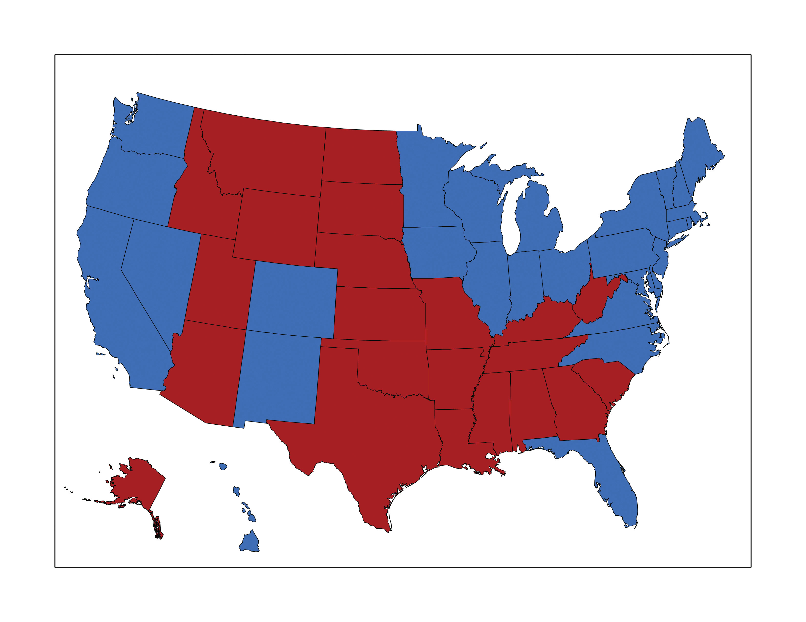
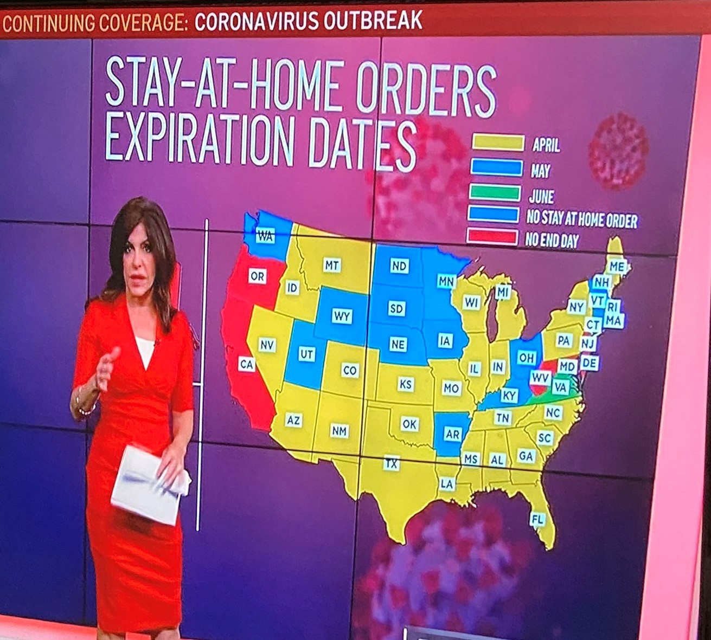
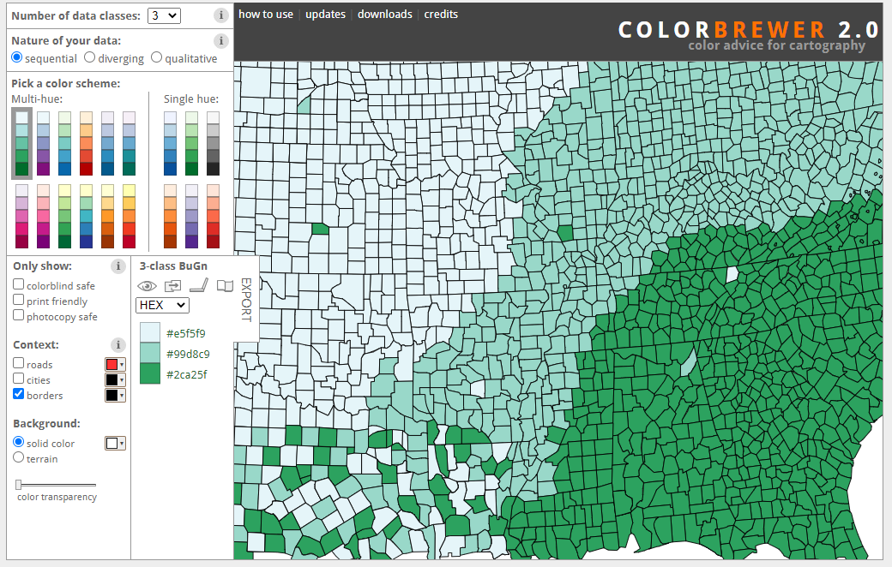

```{r setup, include=FALSE}
knitr::opts_chunk$set(echo = TRUE)
```

<br><br>
.center[
## Introduction to Geographic Information
### Lecture 19
.mb[
Cartographic Principles<br>
<br>
.med[
Andrew Murray | University of North Carolina - Chapel Hill

July 17, 2020
]

]]

---
.center[
### Cartography

```{r echo=FALSE, out.height= 500, out.width= 850}
knitr::include_graphics("Minard.png")
```
]

<audio controls>
  <source src="/slides/intro_geographic_information/Day19/audio/d19s02.mp3" type="audio/mpeg">
  <p>Your browser doesn't support HTML5 audio.</p>
</audio>


???

We have spent most of this course talking about data, spatial operations and how to run analysis, but do not forget from where GIS originated and that is cartography, which is process of making maps. Map making exists at the intersection of art and science. It requires precision and accurate representation while also needing to be not only aesthetically pleasing but also easily interpretable. Making maps can be a frustrating venture because you need to put a lot of work into tweaking a lot of minor details all in order to make your map as simple as possible while conveying the maximum amount of information. I used to get really frustrated because I would spend a lot of time on a map and then I would show it to someone, desperate for a WOW response but was usually met iwht, oh yeah... a map... cool I guess. The reality though is that this is exactly what you want from most maps. For example I usually tell peolpe when they are concerned if their map is good enough to hand it to someone that has no idea what they are working on, like a family member or a roomate and ask them to tell you what the map is for. If they can tell you quickly, without any guidance, then it is probably a good map. The map you see displayed here is not your typical map, but once you realize how to read it you can appreciate the amount of thought that went into it's design. This map was created by Charles Minard in 1869 to depict Napolean's march into Russia in 1812. The march began from the west, in the city of Kovno and proceeded east to Moscow. The tan line represents the advancement to Moscow whereas the black line represents the retreat from Moscow. The width of the line shows the size of the army in total number of soldiers... more than 422,000 at the start and less than 10,000 at the end of the retreat. The harsh Russian winter hit , forcing the retreat, and so Minard added temperature at the bottom, shown with lines linking temperatures to soldier losses due to freezing temperatures along the retreat. This is a really sad map to look at from the perspective of human life, but it is dramatically powerful to visualize just how great Napolean's losses were. To me, this is one of the most impactful examples of symbology demonstrated in cartography.

---

.center[
## Color
]

.pull-left[
.med[
Color is probably the first thing that people notice when looking at a map.

Color conveys meaning:
- Red = Danger
- Green = Money
- Blue = Water
- White = Snow
- etc... etc...
]
<audio controls>
  <source src="/slides/intro_geographic_information/Day19/audio/d19s03.mp3" type="audio/mpeg">
  <p>Your browser doesn't support HTML5 audio.</p>
</audio>
]

.pull-right[
```{r echo=FALSE, out.height= 350, out.width= 500}

```
]

???

Color is the most obvious aspect of map styling and is typically the first thing you notice when looking at one. We associate colors with specific meaning and it is important to consider the initial reaction of someone who will view your map. For example, during the cold war, news organizations would often show World maps in a mercator projection with the Soviet Union colored red. This would invoke a sense of fear and danger in viewers who would see the soviet union as this big red, imposing figure. There are several considerations when choosing color such as variation, meaning and contrast.

---
.pull-left[

## Color


```{r echo=FALSE, out.height= 350, out.width= 500}

```

<audio controls>
  <source src="/slides/intro_geographic_information/Day19/audio/d19s04.mp3" type="audio/mpeg">
  <p>Your browser doesn't support HTML5 audio.</p>
</audio>

]

.pull-right[
<br>
.med[
There are **absolutely** wrong ways to use color...

- Using same color for multiple categories
  
- Using too many shades of the same color 
  - The human eye can only detect about 6 different shades of a single color at a time

- Not considering color-blin friendly palletes
  - Color blindness affects 1 in 12 men and 1 in 200 women worldwide.
  
- Incorrectly conveying safety / danger

]
]

???

There are plenty of wrong ways to use color so it is important to consider what you are going to use to convey your information. For example, you would not want to convey information in a way that is confusing, like coloring land blue and water green, or symbolozing democrats as red and republicans as blue. Speaking of red and blue by the way, one of the most common forms of color blindness includes the inability to differentitate red and blue. There are more than 300 million color blind people in the world and it affects 1 in 12 men and 1 in 200 women. Look at this map here on the left. This map clearly has multiple categories using the same color. Also the colors do not make much sense. Is green the best? Green shows states with stay at home orders in June, but earlier end dates are in yellow and later are in red. I would think that red would be used to show the first end date for the stay at home order, and green with the last, although I guess that depends on your view of the pandemic. 

---

## Color Selection
.pull-left[
```{r echo=FALSE, out.height= 350, out.width= 500}

```

.mb[
[Color Brewer]()
]
]

.pull-right[
<blockquote class="twitter-tweet"><p lang="en" dir="ltr">How to create a T-Rex <a href="https://twitter.com/hashtag/TerribleMap?src=hash&amp;ref_src=twsrc%5Etfw">#TerribleMap</a> <a href="https://twitter.com/hashtag/TerribleMaps?src=hash&amp;ref_src=twsrc%5Etfw">#TerribleMaps</a> <a href="https://twitter.com/hashtag/Trex?src=hash&amp;ref_src=twsrc%5Etfw">#Trex</a> <a href="https://twitter.com/hashtag/dinosaur?src=hash&amp;ref_src=twsrc%5Etfw">#dinosaur</a> <a href="https://twitter.com/hashtag/Maps?src=hash&amp;ref_src=twsrc%5Etfw">#Maps</a> <a href="https://twitter.com/hashtag/Map?src=hash&amp;ref_src=twsrc%5Etfw">#Map</a> <a href="https://t.co/W7LkaAp3Pm">pic.twitter.com/W7LkaAp3Pm</a></p>&mdash; Terrible Maps (@TerribleMaps) <a href="https://twitter.com/TerribleMaps/status/1125164510958977026?ref_src=twsrc%5Etfw">May 5, 2019</a></blockquote> <script async src="https://platform.twitter.com/widgets.js" charset="utf-8"></script>

<blockquote class="twitter-tweet"><p lang="en" dir="ltr">Yikes <br><br>-use a legend, not giant floating numbers <br>-the colors could be better<br>-where is the rest of Russia?<br>-center your title <a href="https://t.co/53MeGQxIBk">https://t.co/53MeGQxIBk</a></p>&mdash; ILoveBadMaps (@bad_maps) <a href="https://twitter.com/bad_maps/status/1232723191484649472?ref_src=twsrc%5Etfw">February 26, 2020</a></blockquote> <script async src="https://platform.twitter.com/widgets.js" charset="utf-8"></script>

<audio controls>
  <source src="/slides/intro_geographic_information/Day19/audio/d19s05.mp3" type="audio/mpeg">
  <p>Your browser doesn't support HTML5 audio.</p>
</audio>

]

???

There are a lot of great resources for choosing colors out there, but here is one I use a lot called color brewer. You can use this tool to create color palettes that are clear and you can also make sure that they are color-blind friendly. They will also hel you create different scales such as a sequential scale or divergent scale or also qualitative scales. I'm also embedding a couple of tweets here. These two twitter accounts are good places to find how not to create a map and should provide for some amusement. Yesterday I assigned the Final project and I really left it open for you to adapt it to something you're interested in. This project will take you longer than you think it will so I urge you to start on it today. Consider what story you want to tell with your final map and how you might get there. I have opened up a few forums on Piazza with links to data sources and a poll for topics you would like me to dive deeper into. On Monday I will go over more aspects of Map-making but I want you to take our last week as an opportunity to work on your final project in synchronicity with class. I am not assigning another lab and I want our last few classes to be helpful for you to be able to navigate the entire process of getting data, processing it in GIS and creating a polished product and I want you to voice if you think you need more instruction in a particular area. Proposals are due Monday so make sure you spend time looking around the internet for your data and considering what you want to do with it. If you are stuck, post thoughts or questions on Piazza. Other than that, make sure to submit Quiz 4 by tonight and have a great weekend. 

