```{r setup, include=FALSE}
knitr::opts_chunk$set(echo = TRUE)
library(raster)
library(here)
library(whitebox)
library(rayshader)
library(mapview)
```

.center[<br><br>
## Watershed Delineation in R<br><br><br><br><br><br>
.mb[Introduction to Watershed Systems

Andrew Murray | University of North Carolina-Chapel Hill]
]
---
### .center[Watershed Delineation]

.pull-left[
.med[
- What is a Watershed?
  - An area that drains to a certain point
- How do we delineate it?
  - It all comes down to some simple math and a bit of geometry.
- Steps for delineating a waterhsed from a Digital Elevation Model (DEM):
  - Fill the DEM
  - Delineate a stream network
  - Determine your pour point (outlet)
  - Create a flow direction raster
  - Delineate the Watershed
]]

.pull-right[

]
---
## Digital Elevation Model (DEM)
.med[
- Raster data (Continuous Surface)
- Resolution:
  - Depends where it comes from... 1 inch to 30 meters...
  - Entire U.S. available at 10 meters
  - Some of U.S. available at 3.4 meters
  - Some of U.S. available at 1 meter

- Recall the difference between a vector and a raster:
  - All vectors at their most basic definition are defined by points
  - Rasters are continuous and defined by a 'bounding box'. They have cells which are always the same size
]  
???
- 3DEP program is 8 years in and supposed to be finished in 10 years... not gonna happen!
- goal is to map entire U.S. with LiDAR within 10 years

---
## Introducing Whitebox:

.med[
[Whitebox](https://jblindsay.github.io/ghrg/Whitebox/) is a free and open source GIS software package, like QGIS or GRASS, that is currently having all of it's tools implemented in R.
]

 This package is not on cran at the moment so installing it is slightly trickier
```{r installWhitebox, eval=FALSE}
if (!require(devtools)) install.packages('devtools')
devtools::install_github("giswqs/whiteboxR")
```

Check out all of the available GIS tools [HERE](https://giswqs.github.io/whiteboxR/#available-tools)

---
### Create a new project and download the data:

.mb[Whitebox tools will crash if you have spaces in the filepath
    - 'tool("C:/My Documents/Geog 441 folder/data.tif")' *will not work*
    - 'tool("C:/My_Documents/Geog_441_Folder/data.tif")' *will work*
]

- Make sure to create your .rproj in a file folder with no spaces, such as on your desktop.
  - You can always check this by using the 'here' command from the 'here' library which will show you the filepath of your project.

```{r here, warning=FALSE, eval=FALSE}
here::here()
```

```{r here2, warning=FALSE, eval=TRUE, echo=FALSE}
print("C:/Users/HP/Desktop/delineation")
```
.med[
- Create a folder within this folder and name it 'data'
- [Click Here to Download the Raster](https://drive.google.com/open?id=1QPXzZMXR7vLOvAE-IiuPEkGGKPMF5J2M)
  - Make sure to put the raster in your data folder you just created
]

---
## Creating an R-Markdown Document

- Create a new R-Markdown document and title it 'Watershed Delineation Part 1'
- Make sure to put your first and last name in the 'Name' space.

.pull-left[
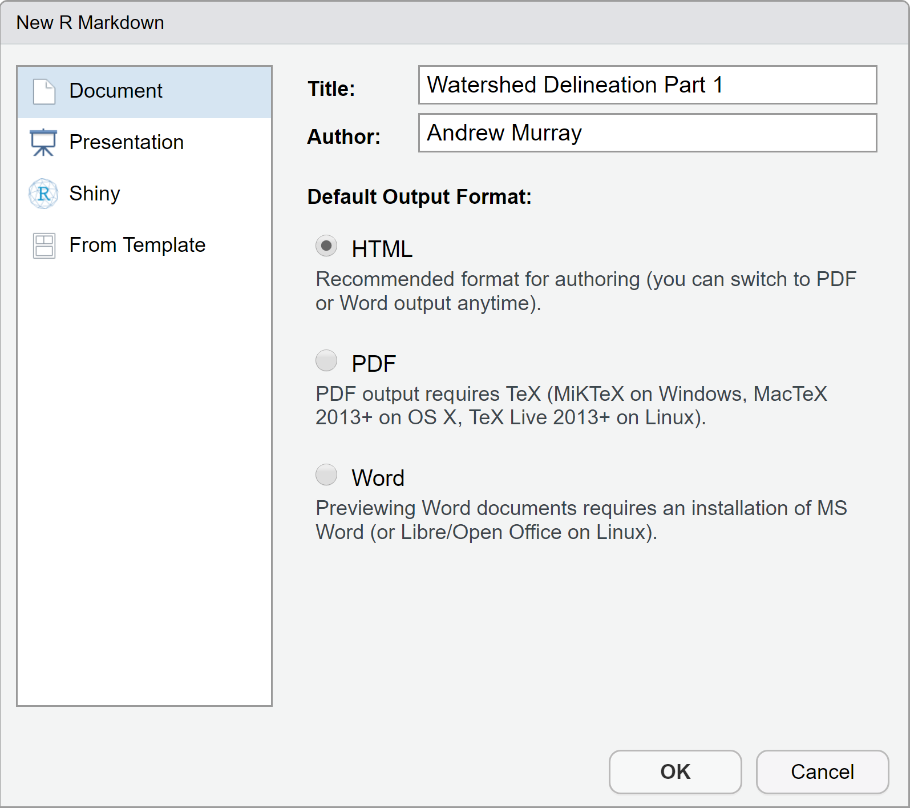
]

.pull-right[
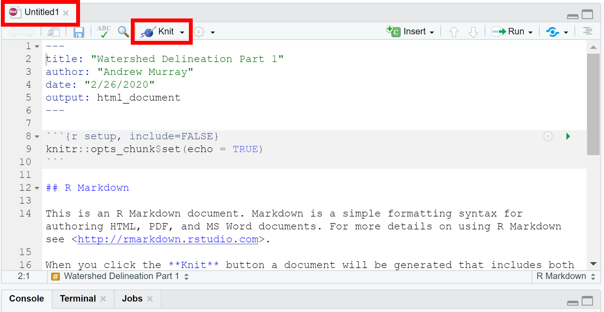

You can see your new rmarkdown file is named 'untitled' meaning it isn't saved yet, so save it as YOURONYEN_delineation.rmd
- Next, click the knit dropdown and select 'knit to html'

]
---
.pull-left[
### What just happened?

.med[
When you click knot, RStudio is taking your code and converting it to a webpage (html document). Once it finishes you will notice a new file has appeared in your project folder with the same name as your r markdown document but ending in the extension .html. RStudio will automatically open this file in a new windown but you can also open it with a web browser like chrome or firefox etc...

This makes your code more readable / shareable and you'll notice it automatically resizes.

- There are tons of things you can do to customize the look and feel of an R Markdown Document.

]]

.pull-right[
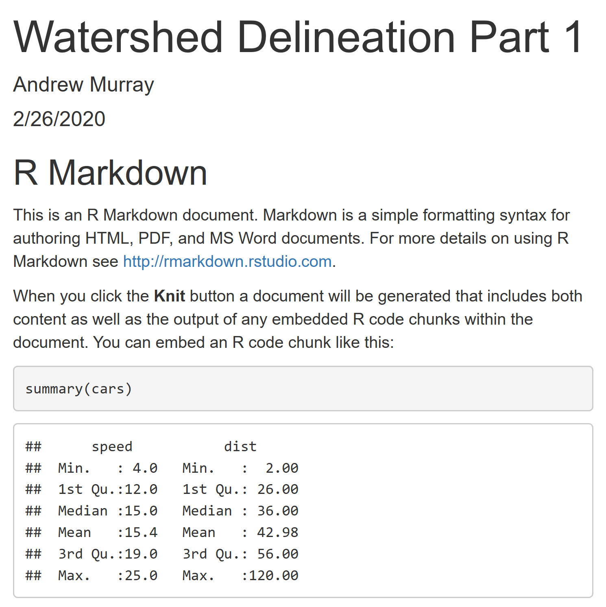
]
---
.pull-left[
.mb[You can use ## to make text bigger]

\# These

# These

\## Are

## Are

\### All

### All

\#### Different

#### Different
]

.pull-right[
.med[You can also use * to italicize and bold font.

\*This is italics*

*This is italics*

\**This is bold**

** This is bold**

You should look at the code of your r markdown document side by side with the output of the html document that was 'knitted' to understand what code makes what output.

Remember to check out the [R Markdown Cheatsheet](https://rstudio.com/wp-content/uploads/2015/02/rmarkdown-cheatsheet.pdf) for a lot more stuff you can add in.
]
]

---
.med[
The top portion of your R-Markdown file contains YAML metadata, which is constrained by '---'. This is basic information for the document when it gets converted to html.

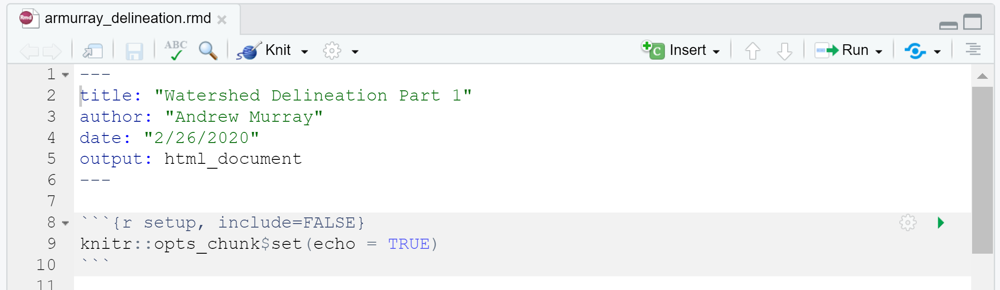

Blocks of code in an R Markdown document are called 'chunks'.
  - The first chunk is called the 'setup' chunk and should not be deleted
  - You can set default options here, like wether or not you want code to be run, or visible or not etc... This is also a good place to load your libraries
    - Go ahead and delete everything below the setup chunk now
]
---
### The Assignment:
  For this assignment, you will go through all of the steps to delineating a watershed. You will write the assignment in r-markdown and submit with your .rmd and .html files. 
  - Each step should be started with a new heading using '#'. 
    - (1) Import Data
    - (2) Fill DEM
    - (3) Create Flow Direction Raster
    - (4) Create Flow Accumulation Raster
    - (5) Create and Snap Pour Point
    - (6) Delineate Watershed
    - (7) Make awesome 3D Watershed
  - You can add subheadings '##' to describe intermediate steps
  - Make sure you label your chunks and use the environment settings correctly:
  
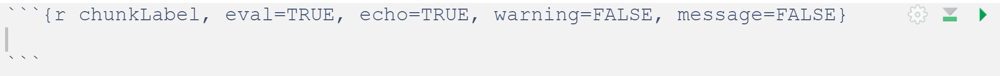

**TIP: ** The whitebox tools take a long time to run, so once you have run a tool succesfully, change eval = TRUE to eval = FALSE. This will save a lot of time when knitting the R-Markdown to html, keep chunks with plots in them as EVAL = TRUE or they won't show up in your finished document.  


---
### Your Setup Chunk

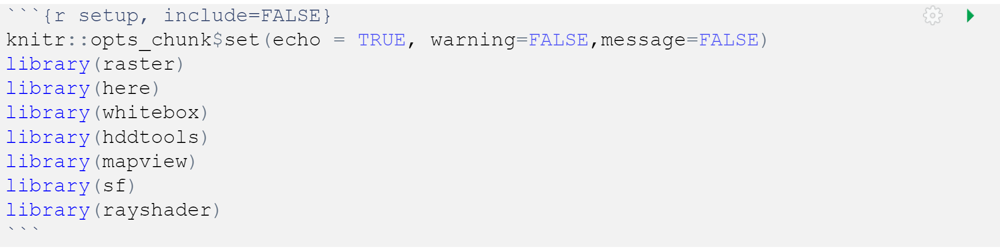

---
.pull-left[
## Step #1: Import and project raster data
```{r, message = FALSE, warning = FALSE, eval=FALSE}
dem <- raster(here("DEM_34.tif")
plot(dem)
```


.mb[**TIP: **].med[This is a very big dataset because it has very fine spatial resolution. Try to be patient as these tools will take several minutes to run, but if you find that your computer just cannot handle it, you can reduce the resolution of the raster using aggregate. The first argument is the dem, and the second argument is the number of pixels you want to merge into one.]
```{r aggregate, eval=FALSE}
course <- raster::aggregate(dem, 8)
```

]
.pull-right[
.med[** Project the raster to UTM 17N**]
```{r project, eval=FALSE}
dem17N <- projectRaster(dem,crs = "+proj=utm +zone=17 +ellps=GRS80 +towgs84=0,0,0,0,0,0,0 +units=m +no_defs")
writeRaster(dem17N,here("data/dem17N.tif"))
```
<br><br>
.center[


Notice the units on the x and y axes are now in meters instead of degrees
]


]

.pull-right[
.med[
]]

---
## Step 2: Filling a DEM

.med[
DEMs often can have what we refer to as 'sinks' which are typically artifical potholes that show up in the data. When we delineate a watershed, we are only accounting for the flow of water and not the volume of water...

- If the DEM thinks water flows into a sink, it will not allow it to flow out, which can mess with our watershed delineation.
- A 'fill' tool will find a cell that is surrounded on all sides by higher elevation cells and move it's elevation upwards so that it is no longer a sink.
]
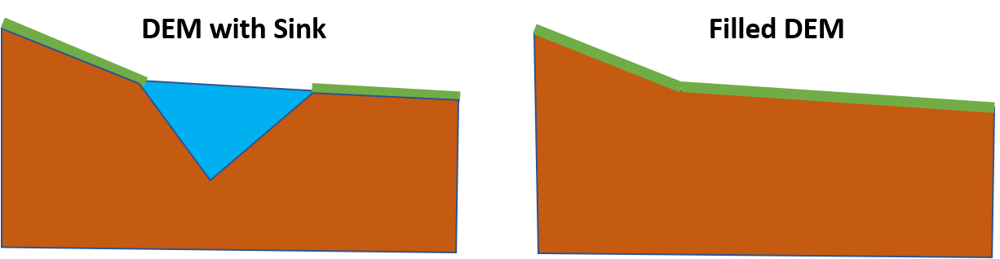
---
.pull-left[
### Fill Depressions:
Here we use the wbt_fill_depressions tool. Whitebox tools do not assign results to vectors, they simply write a new raster to you file folder
```{r demFill, eval=FALSE}
wbt_fill_depressions(here("data/DEM_34.tif"),here("data/demFill.tif"))
```
.mb[Check to see if filling did anything:]
Here we simply subtract the original DEM from the filled DEM and plot it to see what the difference looks like.
```{r rastDiff, eval=FALSE}
demFill <- raster(here("data/demFill.tif"))
demDif <- demFill-dem
plot(demDif)
```
]

.pull-right[
.mb[ <br><br><br>
Here we can see the difference between the original and the filled DEMs:<br><br>]
```{r demDiffimg, out.width = '600px',out.height='400px', echo=FALSE}
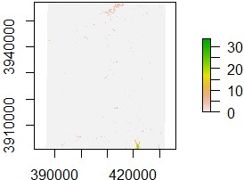 
```

]
]
---
.center[## Flow Direction]
.med[The next step is flow direction, where we look at each raster cell and figure out the steepest gradient. There are two types of flow direction rasters : D8 and D-Infinity]
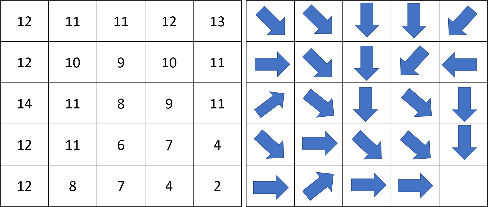
---
## Flow Direction
.pull-left[
.mb[
We Use D8 flow direction for most applications in hydrology because it is simpler and works well with high resolution data. The output of a flow direction raster is usually in the following discrete numbers:

- East: 1
- Southeast: 2
- South: 4
- Southwest: 8
- West: 16
- Northwest: 32
- North: 64
- Northeast: 128

]]
.pull-right[
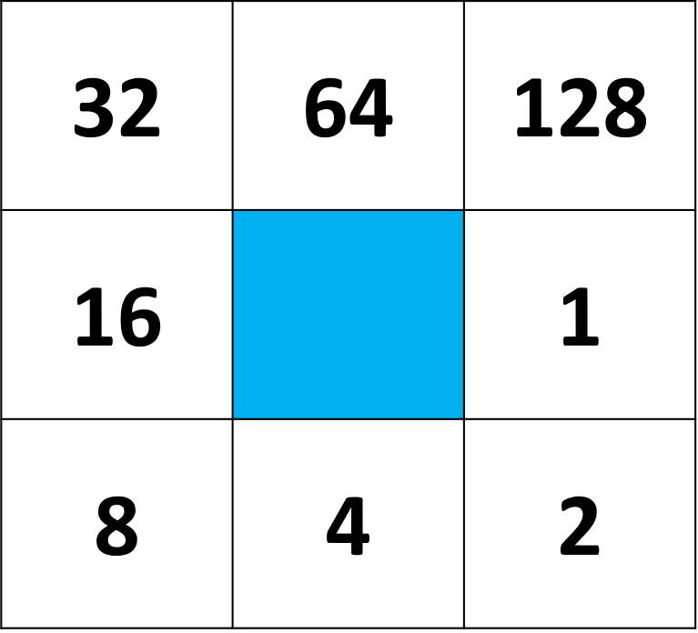
]
---
### Step 3: Flow Direction
Using the filled DEM, calculate a flow direction raster:
```{r flowDirection, eval=FALSE}
wbt_d8_pointer(here("data/demFill.tif"),here("data/flowDir.tif"))
```
.pull-left[
### Plot your result!
```{r flowDirPlot, eval=FALSE}
flowDir <- raster(here("data/flowDir.tif"))
plot(flowDir)
```
]
.pull-right[
```{r flowDirPlotimg, out.width = '600px',out.height='400px', echo=FALSE}
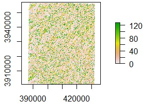 
```
]
---
### Step 4: Flow Accumulation
.med[Just like flow direction told us which cell water would flow into, flow accumulation tells us how many cells upstream of that cell will flow into it and is helpful for finding streams]

- In watershed delineation, flow accumulation is used to *snap* our pour points to the stream network so that we get a properly defined network. This is important since the contributing area of a point 50 feet away from the stream may have a much smaller contributing area than a point within the stream.

Create a flow accumulation raster **using the filled DEM**
```{r flowAccum, eval=FALSE}
wbt_d8_flow_accumulation(here("data/demFill.tif"),here("data/flowAccumulation.tif"))
```

---
### Step 4: Flow Accumulation Continued
.pull-left[
.big[Plot your flow accumulation data]

.med[Here I plot the flow accumulation using a log scale because the range of values is so uneven. This is because there are **a lot** of cells with very tiny flow accumulation values, but there are some with huge flow accumulation values closer to the outlet.]

```{r flowAccumPlot, eval=FALSE}
flowAccum <- raster(here("data/flowAccumulation.tif"))
plot(log(flowAccum))
```
]
.pull-right[
```{r flowAccumPlotimg, out.width = '600px',out.height='400px', echo=FALSE}
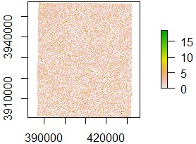 
```
]
---
### Step 5: Create and Snap Pour Points

.mb[**Pour Point: ** The outlet of the watershed. You can choose any point, but things to consider:
  - It should be in a stream, preferably as large a stream as possible
  - It should be close to the bottom of where you think the watershed is
  - If you are going to do further hydrological analysis, you could try to put it at a point where you know a gauge exists.

We are going to use our DEM and overlay it onto a simple web map to find the coordinates of our pour point. Then we will use the coordinates to make a spatial point and we will *snap* the point to the stream network using our flow accumulation raster.

```{r mapview, eval=FALSE}
# Create a polygon from the extent of the DEM
bbox <- bboxSpatialPolygon(raster::extent(dem)) 

# Make a map of the polygon and have the map show the coordinates of your mouse location
mapview(bbox,alpha.regions=0.1)%>%
  addMouseCoordinates()
```
]
---

### This map shows coordinates in the top-left as you move the mouse.
.pull-left[
You can also change the basemap by clicking the layers icon
```{r pourFind, echo=FALSE,include=FALSE, message=FALSE, warning=FALSE}
# Create a polygon from the extent of the DEM
bbox <- sf::st_read(here("shp/bboxx.shp"))
```


```{r pourFind2, echo=FALSE, message=FALSE, warning=FALSE, out.height='400px'}
# Make a map of the polygon and have the map show the coordinates of your mouse location
mapview(bbox,alpha.regions=0.1)%>%
  addMouseCoordinates()
```
]
.pull-right[
I chose the coordinates: -81.98964 ,35.29505
- Next we need to convert these to a point and snap it to the stream network:

```{r pourSnap, eval = FALSE}
# Create the point
pts <- data.frame(x = -81.98964, y = 35.29505)
pointSF <- st_as_sf(pts, coords = c("x","y"),crs=4030)

# Project the point to UTM 17N
pointSF17N <- st_transform(pointSF, crs = 2958)
st_write(pointSF17N, here("data/pour17N.shp"))

# Snap the point and save it
wbt_snap_pour_points(here("data/pour17N.shp"),here("data/flowAccumulation.tif"),here("data/pourSnap"),snap_dist = 200)
```

Here, we are creating the point, projecting it to match the coordinate system of our rasters, then saving a new shapefile called 'pourSnap.shp'. I use a snap distance of 200m
]
---
### Let's see where it snapped too
Here I color the original point red and the snapped point is the default purple
```{r snapCheck, eval=FALSE}
snap <- st_read(here("data/pourSnap.shp"))
mapview(snap)+
  mapview(pointSF17N, col.regions = 'red')
```

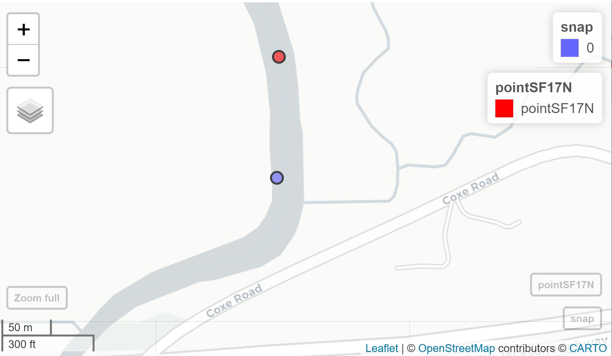
---
### Step 6: Watershed Delineation

.big[
We now have:
  - A flow direction raster built from a corrected DEM
  - A pour point correctly located along a stream network

We're now ready to delineate the watershed:
]
The arguments here are: the floe direction raster, the pour point shapefile, and the output.
```{r watershed, eval=FALSE}
wbt_watershed(here("data/flowDir.tif"),here("data/pourSnap.shp"),here("data/watershed.tif"))
```

---
### The result is a raster of the watershed area:

```{r watershedLook, eval=FALSE}
watershed <- raster(here("data/watershed.tif"))
mapview(watershed)
```

```{r delineatedimg, out.width = '600px',out.height='400px', echo=FALSE}
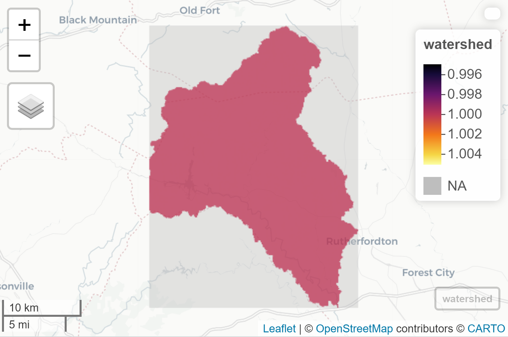 
```

---
### Mask the original DEM to the watershed you created

.med[
- The watershed you created is just a boundary, so let's use it to mask the orignal DEM (**the projected one!**)

```{r mask, eval=FALSE}
mask <- mask(dem17N,watershed)
plot(mask)
```

]
```{r maskimg, out.width = '600px',out.height='370px', echo=FALSE}
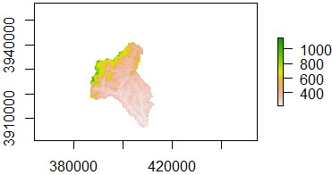 
```
---

## Step 7: Make awesome 3D model of your watershed

The [Rayshader](https://github.com/tylermorganwall/rayshader) package converts rasters into 3D models. This step is computationally intensive and you may need to use raster::aggregate to reduce the spatial resolution before you run it,

The first step is to convert our raster to a matrix that rayshader can interpret:
```{r rayshader, eval=FALSE}
## If you need to reduce the resolution
course <- raster::aggregate(mask,20)

## Convert to matrix
elmat = raster_to_matrix(course)
```

---

### Convert matrix to 3D model and export a movie

Next, we convert the matrix to a 3D model and export it as a movie:
```{r rayshader2, eval=FALSE}
elmat %>%
  sphere_shade(texture = "imhof1") %>%
  add_water(detect_water(elmat), color = "imhof1") %>%
  add_shadow(ray_shade(elmat, zscale = 3), 0.5) %>%
  add_shadow(ambient_shade(elmat), 0.5) %>%
  plot_3d(elmat, zscale = 10, fov = 0, theta = 135, zoom = 0.5, phi = 45, windowsize = c(1000, 800))
Sys.sleep(0.2)
render_movie(here("movie"))
```

For this block of code, you should only need to copy and paste it. The only argument you are inputting is 'elmat', which you defined in the previous chunk of code. The last line 'render_moview()' sets the output location of the movie file, which I will have the name 'movie.mp4'

---
## Embed your movie into your R-Markdown document:

You can embed a video in your r markdown document using this html code:
.pull-left[
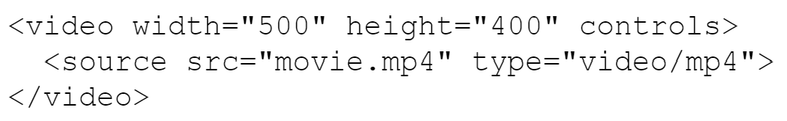

The code above will look for a movie called 'movie.mp4' in your project folder and will play it in a window with a height of 400 pixels and a width of 500 pixels. html code **DOES NOT** go inside of a code chunk, just type it in like you would regular text in the white area of your r-markdown document. 
]
.pull-right[

<video width="500" height="400" controls>
  <source src="/mp4/movie.mp4" type="video/mp4">
</video>
]
---
### What you need to submit:

An r-Markdown (.rmd) **AND** an html (.html) document that shows the following:
- Your code for each step
- the resulting plots for each step
  - Plot of the projected DEM (Step 1) - 10 pts
  - Plot of the Filled DEM (Step 2) - 10 pts
  - Plot of the Original DEM subtracted from the Filled DEM (Step 2) - 10 pts
  - Plot of the Flow Direction Raster (Step 3) - 10 pts
  - Plot of the Flow Accumulation Raster (Step 4) - 10 pts
  - Map of your snapped pour point & your selected pour point (1 map with 2 points) (Step 5) - 10 pts
  - Plot of your projected raster masked to your watershed boundary - 20 pts
  - movie of your watershed. - 20 pts
  

**IF** you are unable to succesfully embed your movie into the r-markdown document to get it to show up in your html document, you can submit the .mp4 file along with your other files.

When you are finished, put your files into a zip file named YOURONYEN_Delineation.zip and upload it to SAKAI.
