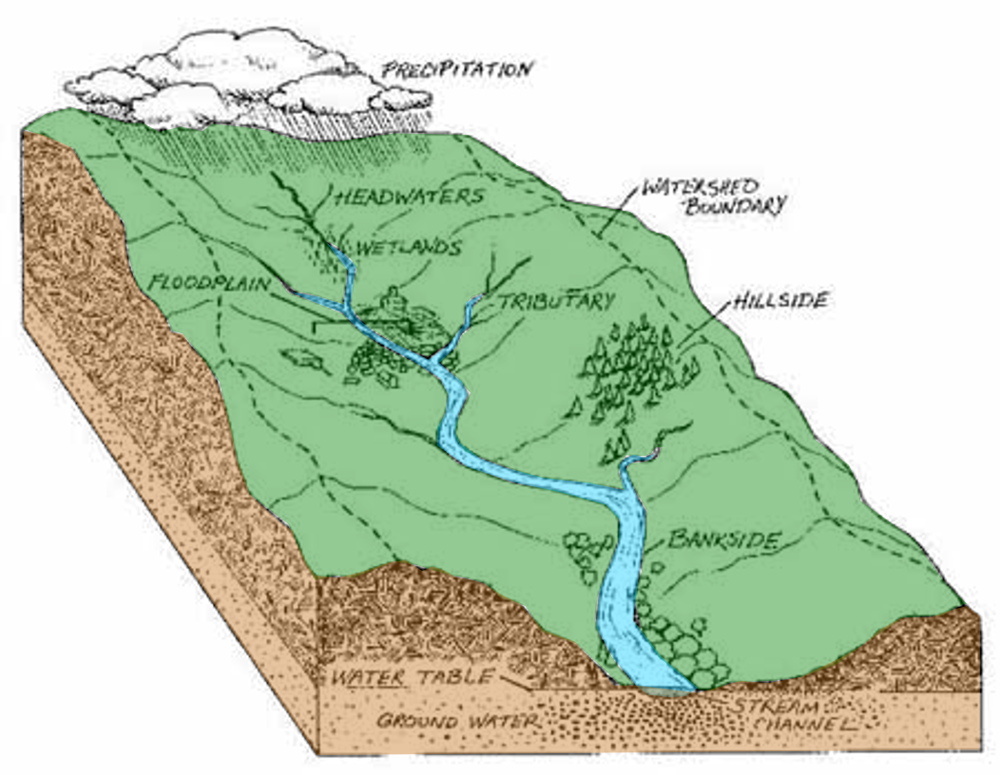

```{r setup, include=FALSE}
knitr::opts_chunk$set(echo = TRUE)
```

.center[<br><br>
## Watershed Delineation in R<br><br><br><br><br><br>
.mb[Introduction to Watershed Systems

Andrew Murray | University of North Carolina-Chapel Hill]
]
---
### .center[Watershed Delineation]

.pull-left[
.med[
- What is a Watershed?
  - An area that drains to a certain point
- How do we delineate it?
  - It all comes down to some simple math and a bit of geometry.
- Steps for delineating a waterhsed from a Digital Elevation Model (DEM):
  - Fill the DEM
  - Delineate a stream network
  - Determine your pour point (outlet)
  - Create a flow direction raster
  - Delineate the Watershed
]]

.pull-right[

]
---
## Digital Elevation Model (DEM)
.med[
- Raster data (Continuous Surface)
- Resolution:
  - Depends where it comes from... 1 inch to 30 meters...
  - Entire U.S. available at 10 meters
  - Some of U.S. available at 3.4 meters
  - Some of U.S. available at 1 meter

- Recall the difference between a vector and a raster:
  - All vectors at their most basic definition are defined by points
  - Rasters are continuous and defined by a 'bounding box'. They have cells which are always the same size
]  
???
- 3DEP program is 8 years in and supposed to be finished in 10 years... not gonna happen!
- goal is to map entire U.S. with LiDAR within 10 years

---
## Introducing Whitebox:

.med[
[Whitebox](https://jblindsay.github.io/ghrg/Whitebox/) is a free and open source GIS software package, like QGIS or GRASS, that is currently having all of it's tools implemented in R.
]

 This package is not on cran at the moment so installing it is slightly trickier
```{r installWhitebox, eval=FALSE}
if (!require(devtools)) install.packages('devtools')
devtools::install_github("giswqs/whiteboxR")
```

Check out all of the available GIS tools [HERE](https://giswqs.github.io/whiteboxR/#available-tools)

---
### Create a new project and download the data:

.mb[Whitebox tools will crash if you have spaces in the filepath
    - 'tool("C:/My Documents/Geog 441 folder/data.tif")' *will not work*
    - 'tool("C:/My_Documents/Geog_441_Folder/data.tif")' *will work*
]

- Make sure to create your .rproj in a file folder with no spaces, such as on your desktop.
  - You can always check this by using the 'here' command from the 'here' library which will show you the filepath of your project.

```{r here, warning=FALSE, eval=FALSE}
here::here()
```

```{r here2, warning=FALSE, eval=TRUE, echo=FALSE}
print("C:/Users/HP/Desktop/delineation")
```
.med[
- Create a folder within this folder and name it 'data'
- [Click Here to Download the Raster](https://drive.google.com/open?id=1QPXzZMXR7vLOvAE-IiuPEkGGKPMF5J2M)
  - Make sure to put the raster in your data folder you just created
]

---
## Creating an R-Markdown Document

- Create a new R-Markdown document and title it 'Watershed Delineation Part 1'
- Make sure to put your first and last name in the 'Name' space.

.pull-left[

]

.pull-right[


You can see your new rmarkdown file is named 'untitled' meaning it isn't saved yet, so save it as YOURONYEN_delineation.rmd
- Next, click the knit dropdown and select 'knit to html'

]
---
.pull-left[
### What just happened?

.med[
When you click knot, RStudio is taking your code and converting it to a webpage (html document). Once it finishes you will notice a new file has appeared in your project folder with the same name as your r markdown document but ending in the extension .html. RStudio will automatically open this file in a new windown but you can also open it with a web browser like chrome or firefox etc...

This makes your code more readable / shareable and you'll notice it automatically resizes.

- There are tons of things you can do to customize the look and feel of an R Markdown Document.

]]

.pull-right[

]
---
.pull-left[
.mb[You can use ## to make text bigger]

\# These

# These

\## Are

## Are

\### All

### All

\#### Different

#### Different
]

.pull-right[
.med[You can also use * to italicize and bold font.

\*This is italics*

*This is italics*

\**This is bold**

** This is bold**

You should look at the code of your r markdown document side by side with the output of the html document that was 'knitted' to understand what code makes what output.

Remember to check out the [R Markdown Cheatsheet](https://rstudio.com/wp-content/uploads/2015/02/rmarkdown-cheatsheet.pdf) for a lot more stuff you can add in.
]
]

---
```{r, message = FALSE, warning = FALSE, eval=FALSE}
library(raster)
library(here)
dem <- raster(here("DEM_34.tif")
plot(dem)
```
.pull-left[
```{r, message = FALSE, warning = FALSE, echo=FALSE}
library(raster)
dem <- raster("C:/Users/HP/OneDrive - University of North Carolina at Chapel Hill/Geog_441/data/DEM/DEM_34.tif")
plot(dem)
```

]

.pull-right[
.med[
]]

---
## Filling a DEM

.med[
DEMs often can have what we refer to as 'sinks' which are typically artifical potholes that show up in the data. When we delineate a watershed, we are only accounting for the flow of water and not the volume of water...
]
.big[This means...]

.med[If the DEM thinks water flows into a sink, it will not allow it to flow out, which can mess with our watershed delineation.
- A 'fill' tool will find a cell that is surrounded on all sides by higher elevation cells and move it's elevation upwards so that it is no longer a sink.
]

---

## Running the code:

.big[Whitebox is still new] .med[and so it does not 'play nicely' with all of the other packages. For example, your file path cannot have spaces in it, like they would if you are using OneDrive. Therefore I am placing all of my data on my desktop and pointing r to that folder]

```{r setwd, eval=FALSE}
setwd("C:/Users/HP/Desktop/data/")
```

Now you can just type file names instead of entire file paths. Although in my code here, I am still using full pathnames because of the format of these slides.

```{r, , eval = FALSE}
library(whitebox)
dem <-  "C:/Users/HP/Desktop/data/DEM_34.tif"
wbt_fill_depressions(dem, output ='C:/Users/HP/Desktop/data/demFill.tif')
```

.med[So after you run this code, you should have a *'filled'* DEM with no sinks]

---
.center[## Flow Direction]
.med[The next step is flow direction, where we look at each raster cell and figure out the steepest gradient. There are two types of flow direction rasters : D8 and D-Infinity]


---
.pull-left[

### D8 = 8 possible directions using 'queen contiguity'

]

.pull-right[
### D-Infinity = Infinite possible directions by calculating linear differences between gradients


]
---
### Calculate your flow direction raster:
.pull-left[
.med[ Now we need to call the filled raster we just created to run the flow direction tool]

```{r fill, eval=FALSE}
demFill <- "C:/Users/HP/Desktop/data/demFill.tif"
wbt_d8_pointer(demFill, "C:/Users/HP/Desktop/data/d8_Pointer.tif")
```
]
.pull-right[
```{r plotD8, echo=FALSE}
plot(raster("C:/Users/HP/Desktop/data/d8_Pointer.tif"))
```
]
---
.center[
### Flow Accumulation
]
.pull-left[
.med[Just like flow direction told us which cell water would flow into, flow accumulation tells us how many cells upstream of that cell will flow into it]
```{r accumulation, eval=FALSE}
wbt_d8_flow_accumulation(demFill, "C:/Users/HP/Desktop/data/d8_Accumulation.tif")
```
]

.pull-right[
```{r plotAccum, echo=FALSE}
plot(raster("C:/Users/HP/Desktop/data/d8_Accumulation.tif"))
```

]

---
## Finding Pour Points

- Pour points are the outlets of the watersheds you wish to delineate
- Your pour point has to be exact, or else you could end up with tiny watersheds
- We'll find a 


---

Watershed