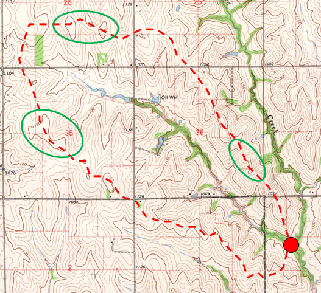
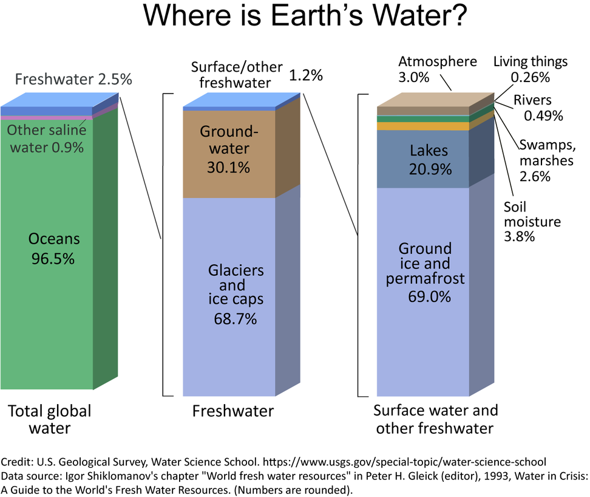
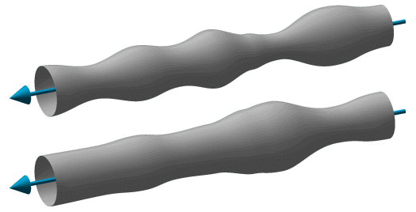
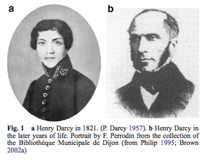
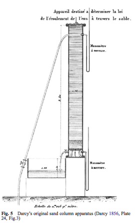
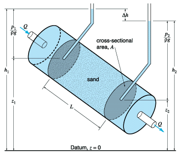
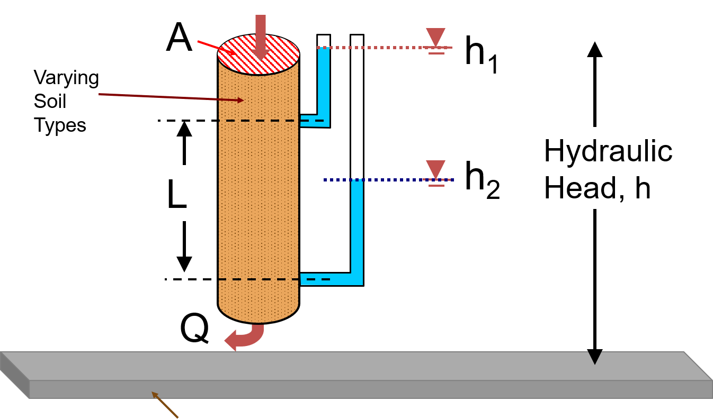
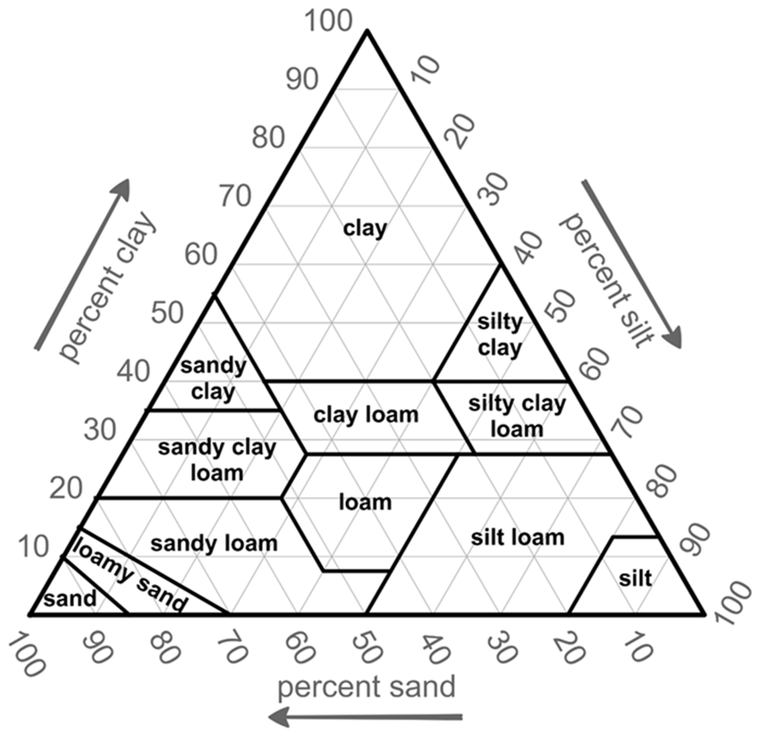
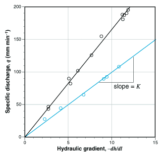
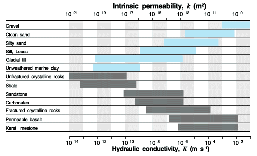

```{r setup, include=FALSE}
knitr::opts_chunk$set(echo = TRUE)
library(ggplot2)
```

.center[
##Introduction to Watershed Systems:<br>Lecture 9
<br><br><br><br>
.biggray[Groundwater Hydraulics]
]

<br><br><br><br><br><br><br>
.center[
.med[Andrew Murray | University of North Carolina - Chapel Hill]
]
---
.center[
## Exam #1
]

.pull-left[
```{r results, echo=FALSE}
scores <- c(57,54,56,44,51,49,28,50,44,29,48,58,25,54,53,52)
ggplot()+
  geom_histogram(breaks=c(seq(40,100,5)),aes(x=scores/60*100), colour = 'black',fill ='#4B9CD3')+
  labs(x="Score (%)", y="Count")+
  theme(axis.text=element_text(size=24),
        axis.title=element_text(size=24))
```

]

.pull-right[
.med[ <br>
Mean Score: 47/60 (78.3%)<br><br>
Median Score: 50.5/60 (84.2%)

If you want to bring up your grade, I am giving you the option to **resubmit questions you got wrong for half credit** by Friday, March 6 (Noon)
]
]

---

.center[
## Tip for Watershed Delineation
]
.pull-left[


]
.pull-right[
.big[<br><br>
Look for the tops of hills/mountains by finding circles in the contours
]
]

---

### And Now Groundwater Hydraulics...

.left-column[
.med[
Recall the distribution of fresh water on the planet
<br><br>
- Groundwater constitues about 30% of 2.5% (0.75% of total water on earth)
]]

.right-column[
```{r barChart, echo=FALSE, out.height='500px', out.width='600px'}

```
]
???
- Groundwater lies mostly within soils and rocks, or actually between them, filling their pores.

- Irrigated agriculture all over the world relies on groundwater

- 60% of irrigated grain production in India relies on groundwater

---

.center[
## What Motivates us to Study Groundwater?
]
<br>
.big[
- Groundwater is interesting for several reasons:]
.med[
  - Groundwater feeds perrenial streams so that rivers flow, even without precipitation.
  - It gives us access to water in places where we might otherwise think there is none.
  - We're curious about where rain goes when it makes it to the earth's surface... as we know it does not all run off.
  - Because we use water from the ground, we're curious how contaminants enter groundwater and may get into our drinking water.
  ]
  
---
.center[
### What is different about the movement of groundwater vs. surface water (or flow inside of the xylem of plants)?]

.pull-left[


**Figure 6.1** Schematic of a thin section of a porous medium and the tortuous flow path of two water "parcels" (Note that a real medium is three-dimensional with flow through the open spaces within the three-dimensional matrix)
]
.pull-right[


**Figure 6.2** Straightened flow "tubes" representing flow in a porous medium
]

---

.pull-left[
## Henry Darcy

.med[
Henry Darcy was the Inspector General of Bridges and Highways in Dijon, France in the mid-1800's]


.med[
He was part of a team trying to supply water to the town using wells
  - This did not work and he needed an alternative solution
]
]

.pull-right[

]

???
As a member of the Corps, Henry Darcy built an impressive pressurized water
distribution system in Dijon following the failure of attempts to supply adequate fresh water by drilling wells. The system carried water from Rosoir Spring 12.7 km away through a covered aqueduct to reservoirs near the city, which then fed into a network of 28,000 meters of pressurized pipes delivering water to much of the city. The system was fully closed and driven by gravity, and thus required no pumps with just sand acting as a filter. He was also involved in many other public works in and around Dijon, as well as in the politics of the Dijon city government.

Darcy’s column experiment consisted of a vertical steel column with an inside diameter of 0.35 m and sealed on both ends by bolted flange plates. At the bottom, an outlet reservoir was created by supporting a set of screens above the bottom, which in turn supported the sand. An inlet reservoir was created by leaving a void between the between the sand and the column top. A tap at the top allowed air to be bled from the system. Water flow rate was determined by timing the effluent accumulation in a volumetric box. Supply and effluent lines were mounted on the column side, and both had valves to allow control. Water was supplied directly from the hospital house line, which induced considerable oscillations as users elsewhere turned faucets on and off. Mercury U-tube manometers were connected to both reservoirs to provide pressure measurements. At low-flows they were read to + 1 mm, while at high flow oscillations only allowed reading
to within + 5 mm. Darcy reported this represented knowing the water pressure within
26.2 mm and 1.30 m for low and high flows respectively.
---
.pull-left[
```{r darcyExp, echo=FALSE, out.height='450px', out.width='600px'}

```
]
.pull-right[
.big[
- Change in elevation head could be done simply by tilting the apparatus
- Also could add or remove soil
- Soil was kept inside the tube using screens that were fine enough to keep sand in but allow water to flow freely
]
]
---
## Darcy's Law
.pull-left[
.big[
$Q=KA\frac{h_{2}-h_{1}}{L}$
]

.med[
$Q$ = Discharge

$K$ = constant of proportionality called hydraulic conductivity

$h_{1}$ = $elevation head + pressure head$ **at the top**

$h_{2}$ = $elevation head + pressure head$ **at the bottom**
]]
.pull-right[
.big[<br>
So what Darcy found was that discharge varies in direct proprtion to *A* and &Delta;h and inverseley with *L*
]]

---

---
## The common derivitative which we use in hydrology from Darcy's law (Hornberger Equation 6.6):
.center[
.big[
$q=-K\frac{dh}{dl}$
]
.med[
Where $q=Q/A$ (specific discharge)
]]

.med[
Here, notice that K has a negative sign, which indicates that a positive specific discharge corresponds with a negative hydraulic gradient.

- Recall that water always wants to move from an area of higher to lower hydraulic head.
]
???
Something to also consider is that we obtained Q from calculating the cross-sectional area, which is technically wrong because water only flows through the pores, not all of the space
---
.left-column[
.mb[
**High K**: Very porpous and loose soils (Course Sand / Gravel)

**Low K**: Very tight, compacted soils (fine sand / silt / clay)
]
]
.right-column[
```{r soilTexture, echo=FALSE, out.height='500px', out.width='475px'}

```

]
---
.pull-left[
## Results of Darcy's Experiment:<br>


Figure 6.4: Darcy's (1856) original data showing a linear relationship between specific discharge and hydraulic gradient for two different sands.]
.pull-right[
.mb[
Here we see experiments conducted for two different types of sand using a variety of different lengths and hydraulic head values
- K (hydraulic conductivity) is the slope of each of the lines.
- The viscosity of fluid also makes a difference, which commes into play with modelling contaminant transport
]]
---
.left-column[
.biggray[<br><br>As permeability increases, so does conductivity
]]
.right-column[
```{r permBar, echo=FALSE, out.height='500px', out.width='700px'}

```

**Figure 6.5** Ranges of intrinsic permeability and hydraulic conductivity for a variety of rocks (gray bars) and sediments (blue bars).
]
---
## Limitations of Darcy's Law:
.big[
1) Invalid under turbulent flow

2) It requires steady-state conditions – no velocity head loss

3) The equation fails at very low values of hydraulic gradient in very low
permeability materials
]
.med[
Hornberger notes that while larger rock types such as crystalline and metamorphic rocks can hardly be envisioned to have capillary tube structures, darcy's law can still be succesffully applied, although this drops off once Reynolds numbers get very high
]
---

## Reynolds Number:
.big[
  Describes the flow of water through a porous medium]
  .med[
  low reynolds number = laminar / sheet like flow
  
  high reynolds number = turbulent flow
  
- Therefore, when the reynolds number is too low, Darcy's law would assume some flow is occuring that may not be because there is not enough inertia to intialize movement (create a tipping point)
]
???
Think back to the example of clays and not allowing the flow of water.